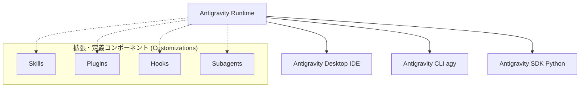

# 1. 概要 (Overview)

## 1.1 コンセプト
**Google Antigravity 2.0** は、Google が提供する「**エージェントファースト**」の次世代AI開発プラットフォームです。開発者の単なる補助ツール（コード補完やチャットUIなど）にとどまらず、自律的に動作するAIエージェントを中心に据え、開発者の意思決定や複雑なコーディングワークフロー全体をインテリジェントに自動化・最適化することを目的に設計されています。

従来のAI開発支援と異なり、開発プロジェクトの中に独立した専門役割を持った複数の「サブエージェント（Subagents）」や、特定の作業手順・規約を学習した「スキル（Skills）」を埋め込み、これらを柔軟に協調動作させることが可能です。

## 1.2 基本設計とアーキテクチャ
Antigravity 2.0 は、共有の「**Antigravity Runtime**（コア・エージェント・ハーネス）」を土台とする統合された3つの操作面（サーフェス）から構成されています。共通のランタイムを使用するため、どの製品から呼び出しても、同一のツールセット、安全サンドボックスポリシー、状態管理、セッション情報が完全に一貫して適用されます。

### 1.3 主要3コンポーネントの役割

1.  **Antigravity Desktop (Desktop IDE)**:
    VS Code をベースとしてフォーク・カスタマイズされた統合開発環境（IDE）です。視覚的なエージェントのオーケストレーション、プロジェクト構造の把握、デバッグ、エージェントとの対話をGUIから行えます。
2.  **Antigravity CLI (`agy`)**:
    Go言語で開発された、軽量で応答性に優れたターミナル用のコマンドラインインターフェースです。主にTUI（Terminal User Interface）を起動し、SSHセッション、コンテナ環境、キーボード中心の高速な開発ワークフローに最適化されています。Gemini CLI（旧製品）の後継として位置づけられています。
3.  **Antigravity SDK**:
    プログラムコードから Antigravity の自律エージェントを構築・実行・制御するためのSDK（Python版 `google-antigravity`）です。CI/CD パイプライン、バッチタスク、自動コード検証など、外部システムとエージェント環境をシームレスに統合するために使用されます。

## 1.4 プラットフォームの主要な特徴

*   **共有状態管理 (Stateful Session)**:
    CLI と IDE、あるいは SDK の間でセッション状態を共有でき、開発者がターミナルで行った指示の続きを IDE で引き取るなどの柔軟な連携が可能です。
*   **Progressive Disclosure (段階的開示)**:
    大規模なルールや多数のスキルを読み込む際、AIモデルの入力トークンコンテキストを圧迫しないよう、初期状態では「スキル名」と「概要説明 (description)」のみをモデルに提示し、モデル自身が必要と判断してスキルをトリガーした際に初めて詳細なコードや手順（本文）をコンテキストにロードする設計が採用されています。
*   **安全サンドボックス (Terminal Sandbox)**:
    エージェントがコマンドを実行する際、悪意ある操作や破壊的コマンドからローカルシステムを守るため、デフォルトでコンテインメント（隔離）バリアが作動します。これにより、信頼できない外部ライブラリを扱う場合でも安全にコード実行を行えます。
