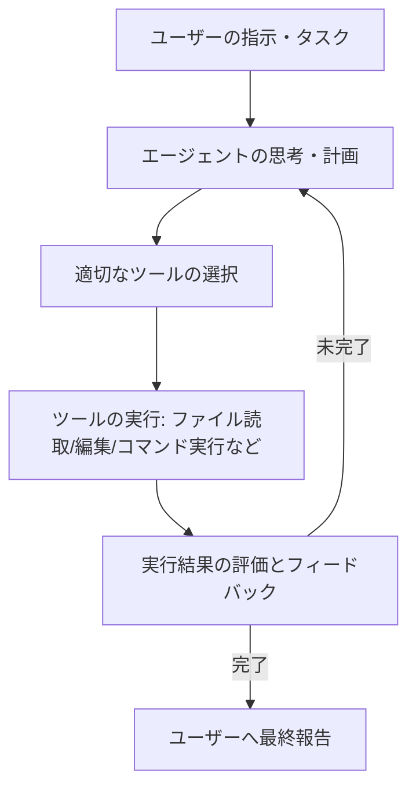

# 第1章 概要 (Overview)

## 1.1 コンセプトと基本設計

**Claude Code** は、Anthropic社が開発した、デベロッパーのターミナル（CLI）上で直接動作する自律型コーディング支援エージェントです。既存のチャット型AIや自動補完エディタ拡張機能とは異なり、開発環境のコンテキストを直接理解し、自律的に問題解決プロセスを実行するように設計されています。

基本コンセプトは**「ターミナルネイティブな自律的エージェントループ（Agentic Loop）」**です。ユーザーが曖昧または広範な指示（タスク）を与えると、エージェントは自律的に以下のステップを繰り返します。

## 1.2 主な特徴

- **自律的ツール操作**: ファイルの検索（`Glob`）、ファイル内容の表示（`Read`）、内容の編集（`Edit`/`Write`）、正規表現による検索（`Grep`）、シェルのコマンド実行（`Bash`）、Web検索（`WebSearch`）などの強力なシステムツールを、AIが必要に応じて自律的に選択し実行します。
- **ターミナルとの融合**: 開発者が普段使用しているシェル（bash, zsh, powershellなど）の中で直接起動するため、既存の Git ワークフローやビルドツール、テストランナーとシームレスに結合します。
- **progressive disclosure（段階的開示）**: 大規模なプロジェクトではコードベースすべてをコンテキストに含めるとトークン上限に達し、コストと遅延が増大します。Claude Code は、まずファイル構成やインデックスなどの「メタデータ」のみを読み込み、必要になったタイミングで必要なファイルだけをピンポイントで読み込む設計になっています。
- **高い拡張性**: プラグインマニフェスト（`plugin.json`）を置くだけで、スラッシュコマンド、カスタムサブエージェント、スキル、MCP（Model Context Protocol）サーバー、およびイベント駆動のフックを読み込ませることができます。

## 1.3 既存のコーディングアシスタントとの違い

| 項目 | 一般的なチャット型AI / エディタ拡張 | Claude Code |
| :--- | :--- | :--- |
| **インターフェース** | Webブラウザ / エディタのサイドパネル | ターミナル（CLI） / SDK経由の統合 |
| **作業範囲** | コード片の生成、質問への回答 | プロジェクト全体の自律的な修正・デバッグ |
| **自律性** | ユーザーがコードをコピペして反映する | エージェント自身がファイルを直接編集し、テストを実行する |
| **コンテキスト把握** | 開いているファイル、選択範囲のみ | プロジェクトディレクトリ全体の構造をインデックス化 |
| **外部連携** | 閉じられた環境 | MCP サーバーを介した外部API・サービスの自由な統合 |

## 1.4 セキュリティとプライバシー設計

Claude Code は強力なツール実行権限を持つため、セキュリティを最優先した安全設計が施されています。

- **明示的なパーミッションモード**: コマンドの実行や書き込みなどのツール使用時、ユーザーに承認（許可/拒否）を求めるプロンプトが表示されます。設定により「ファイル編集は自動承認し、コマンド実行のみ承認を求める（`acceptEdits`）」といった細かい制御が可能です。
- **最小権限の原則**: プラグインやカスタムエージェントを作成する際、そのエージェントに許可するツール（`allowed-tools`）を限定し、危険な操作のリスクを低減させることができます。
- **サンドボックスの考慮**: SDK や外部連携では、Bash コマンドを安全な分離環境で実行するためのサンドボックス設定（`sandbox`）などをサポートしています。
