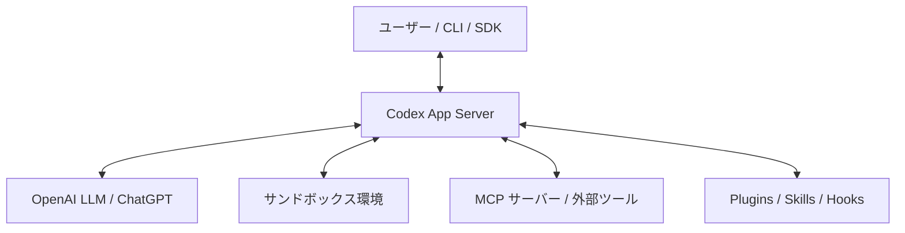

# 1. 概要 (Overview)

OpenAI Codex CLI（`codex` コマンド、パッケージ名 `@openai/codex`）および SDK は、開発者のローカル環境で自律的かつ安全にソフトウェア開発タスクをサポート・自動化するために設計された、現代的な**エージェント型開発プラットフォーム**です。

---

## 1.1 エージェントのコンセプト

### 自律性と安全性の両立
従来のコード補完モデル（2023年に非推奨となった古い Codex API など）とは異なり、新しい Codex CLI は**「自律的に動作するAIエージェント」**として設計されています。
（注: 本章以降のモデル名・承認モード用語・SDK API 等の旧記述の正誤は、第6章末尾の正誤一覧に集約しています。）

エージェントは、与えられたゴール（例: 「CIエラーをデバッグして修正してほしい」）を達成するために、自らファイル構造の調査、ソースコードの読み書き、テストの実行、および必要に応じた外部ツール（MCP経由など）の呼び出しを自律的に判断して行います。

### 人間との協働
エージェントは完全にブラックボックスで動作するのではなく、人間が定義した承認モードに従って「各ステップの実行前に人間の確認をとる」または「特定の危険なコマンドの実行だけを確認する」といった協働的な設計がなされています。

---

## 1.2 基本設計

Codex CLI / SDK のシステムアーキテクチャは、以下の4つの主要な設計思想に基づいています。

1. **Codex App Server (コアサーバー)**
   - クライアント（CLI、SDK、IDE拡張機能など）と通信するバックエンドプロセスです。双方向の JSON-RPC 2.0 プロトコルで通信し、会話状態の維持、エージェントの推論ループ、コンテキストの管理、ツール実行のオーケストレーションを担います。
2. **コンテキストの最適化 (Progressive Disclosure)**
   - コンテキストウィンドウ（プロンプトに送るトークン数）の肥大化を防ぐため、必要なデータのみを段階的にロードする「段階的開示（Progressive Disclosure）」を採用しています。初期状態ではスキルのメタデータ（名前と説明）のみをロードし、必要に応じて詳細な手順をプロンプトに注入します。
3. **サンドボックスとセキュリティ**
   - ローカル環境のファイルやシステムを不要な破損から保護するため、OSカーネルレベルのサンドボックス（macOSの Seatbelt、Linuxの Landlock/Bubblewrap など）を内蔵し、エージェントの行動範囲を物理的に制限します。
4. **拡張性の追求 (Extensibility)**
   - システムをモジュール化し、プロジェクトや個人の開発ワークフローに合わせてカスタマイズできるよう、Skills、Plugins、Hooks、Subagents などの拡張ポイントが用意されています。

---

## 1.3 特徴

* **TUI と CLI モードのシームレスな統合**
  - インタラクティブにエージェントとチャットやファイル変更を行いながら進める Terminal User Interface (TUI) モードと、CI/CD やバッチ処理での自動化に適した非インタラクティブな `exec` モードをサポートしています。
* **強力な Model Context Protocol (MCP) 統合**
  - 外部のデータソースやシステムと容易に連携できるよう、標準化された MCP 接続規格をデフォルトでサポートしており、データベース、Webブラウザ、ドキュメント検索などをエージェントに解放できます。
* **安全なローカルコマンド実行**
  - AIが提案したビルドやテストのコマンドを実行する際、サンドボックス内での検証に加えて、設定されたルールファイル（`AGENTS.md` や `config.toml`）に基づいて実行の可否を決定します。
* **ChatGPT連携**
  - ChatGPT Plus/Pro/Team などのサブスクリプションプラン、または OpenAI API キーのどちらの認証にも対応しており、用途に合わせて柔軟に切り替えることができます。
