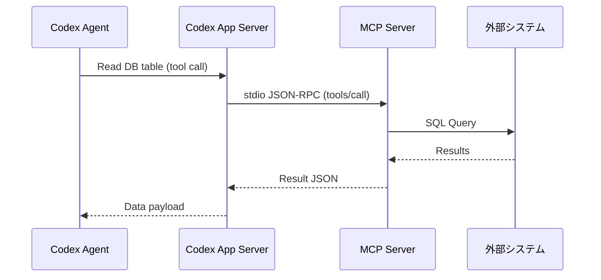

# 4. 拡張機能とアーキテクチャ (Extensibility & Architecture)

OpenAI Codex は、設計段階から「拡張性」が強く意識されており、開発者が好みのツールやルール、自動スクリプトをエージェントに組み込めるようにするための様々なアーキテクチャが用意されています。

---

## 4.1 Skills (スキル)

### 1. コンセプトと「段階的開示 (Progressive Disclosure)」
**Skills** は、特定のタスク（例: 「APIスキーマの検証」「メモリダンプの解析」「Gitリリースノートの生成」など）を実行するための「知識と手順」をエージェントに教える Markdown 形式の定義ファイル（`SKILL.md`）です。

エージェントのコンテキスト（プロンプト容量）を節約するため、Codex は**「段階的開示」**を行います。
* エージェントは通常時、すべてのスキル詳細をプロンプトに持ちません。スキルの「名前」と「短い説明（description）」だけをインデックスとしてロードします。
* エージェントは、ユーザーの指示を達成するために特定のスキルが必要であると判断した時点で、初めてその `SKILL.md` の詳細手順をコンテキストウィンドウへ動的にインポート（開示）します。

### 2. SKILL.md の構成と仕様
スキルは、`SKILL.md` を含む単一のディレクトリ（必要に応じてスクリプト等を含む）としてパッケージ化されます。

```text
my-custom-skill/
├── SKILL.md             # スキル定義（メタデータとMarkdown）
└── scripts/             # スキル内で実行される補助スクリプト
    └── validate_schema.py
```

#### `SKILL.md` の記述例
```markdown
---
name: api-schema-validator
description: JSONまたはYAML形式のAPI仕様書（OpenAPI規格など）を検証する際に使用します。
license: MIT
compatibility: Requires python3
allowed-tools: bash python
metadata:
  author: Dev Team
  version: "1.2.0"
---

# API Schema Validator

## 概要
プロジェクト内の OpenAPI / Swagger 等のスキーマ定義を検証し、矛盾や文法エラーを発見するためのスキルです。

## 使用条件 (When to Use)
* ユーザーから `swagger.yaml` などの API 定義ファイルの修正や確認を求められた場合。
* APIスキーマと実際のバックエンドコードに乖離がないか検証するよう指示された場合。

## 実行手順
1. プロジェクトルートにある `scripts/validate_schema.py` を使用して、検証対象ファイルの文法チェックを実行します。
2. エラーが検出された場合は、行番号とエラーメッセージを抽出し、修正方針をユーザーに提示します。
3. 修正の許可を得たら、該当箇所を修正して再検証します。

## 注意事項
* 外部の検証APIを叩く場合は、必ずユーザーの同意を得てください。
```

---

## 4.2 Plugins (プラグイン)

### 1. 構造とマニフェスト (`plugin.json`)
**Plugins** は、複数の Skills、Hooks、MCPサーバー設定などを1つにまとめて配布・インストールしやすくした「配信パッケージ」です。
プラグインのルートには、マニフェストファイルである `.codex-plugin/plugin.json` が必須です。

#### プラグインの一般的なフォルダ構成
```text
my-utility-plugin/
├── .codex-plugin/
│   └── plugin.json       # プラグインの定義（必須）
├── skills/
│   └── db-cleaner/
│       └── SKILL.md      # スキル1
├── .mcp.json             # このプラグイン専用のMCP設定（任意）
└── hooks/
    └── log_session.sh    # フック用スクリプト（任意）
```

#### `plugin.json` のマニフェスト仕様
```json
{
  "name": "developer-productivity-bundle",
  "version": "1.0.4",
  "description": "A collection of useful DB and testing tools for Codex.",
  "skills": "./skills/",
  "mcpServers": "./.mcp.json",
  "hooks": {
    "SessionStart": "./hooks/log_session.sh"
  }
}
```

### 2. 有効化手順とライフサイクル
1. **マニフェストの読み込み**: Codex CLI 起動時に、ローカルのプラグインキャッシュ（`$CODEX_HOME/plugins/cache/`）またはプロジェクト内のプラグイン定義を読み込みます。
2. **有効化**: `~/.codex/config.toml` にて、該当プラグインを有効にします。
   ```toml
   [features]
   plugins = true

   [plugins."developer-productivity-bundle@local"]
   enabled = true
   ```
3. **マーケットプレイスの登録**: ローカルのフォルダをプラグインソースとして CLI に追加できます。
   ```bash
   codex plugin marketplace add ./path/to/my-utility-plugin
   ```

---

## 4.3 Hooks (フック)

**Hooks** は、エージェントの特定のライフサイクルイベントに連動して実行される、決定論的な（AIの曖昧な判断を挟まない）スクリプトやプログラムです。

### 1. ライフサイクルイベントの種類
* **`SessionStart`**: 新しいセッションが開始、または再開された直後に実行されます。環境変数の検証や初期化ログの送信に適しています。
* **`PreToolUse`**: エージェントがツール（シェルコマンド実行、ファイルの編集、書き込みなど）を**呼び出す直前**に実行されます。主にセキュリティチェックやアクセス制御に使用されます。
* **`PostToolUse`**: ツール実行直後に呼び出されます。自動リンターやテストランナーの実行に便利です。
* **`PreCompact` / `PostCompact`**: 会話履歴が上限に達し、コンテキストが圧縮（要約）される前後に呼び出されます。

### 2. 入出力 JSON 契約 (JSON Contract)

#### `PreToolUse` の入力（標準入力 `stdin` に渡される JSON 構造）
ツールを実行する際、Codex は設定されたフックスクリプトの `stdin` に、実行しようとしているツールの情報と引数を JSON で流し込みます。

```json
{
  "event": "PreToolUse",
  "sessionId": "thread_abc123xyz",
  "tool": {
    "name": "Bash",
    "arguments": {
      "command": "rm -rf /tmp/test-dir"
    }
  },
  "context": {
    "projectRoot": "/Users/user/workspace/project"
  }
}
```

#### フックスクリプトの終了コードとブロック制御
フックスクリプトは、渡された入力を検証し、ツールの実行を許可するかブロックするかを終了コード（Exit Code）または JSON レスポンスでサーバーに返します。

* **終了コード `0`**: 許可。ツールの実行をそのまま進めます。
* **終了コード `2`（または出力 `{"decision": "block"}`）**: **ブロック（拒否）**。ツールの実行を物理的に禁止し、エージェントへ「この操作はセキュリティポリシーにより拒否されました」と通知します。
* **終了コード `1`**: 一般的なエラー。フックの処理自体が失敗したとみなし、警告を出しますがツール実行そのものはブロックしない場合があります。

---

## 4.4 Tools (ツール) と Model Context Protocol (MCP)

Codex エージェントは、デフォルトのファイル操作・シェルコマンド実行ツールのほかに、**Model Context Protocol (MCP)** を用いて拡張された外部ツールを利用できます。



### 1. 組み込みツールとカスタムツール
* **組み込み (Built-in)**: `bash` (コマンド実行)、`view_file` (読込)、`write_to_file` (新規作成)、`replace_file_content` (一部置換) などのセキュアな基礎ツール。
* **カスタム (Custom)**: MCP 経由で追加されるツール。

### 2. MCP サーバーの登録
MCP サーバーは、`config.toml` 内で登録して使用します。

```toml
# ~/.codex/config.toml
[mcp_servers.postgres-db]
command = "npx"
args = ["-y", "@modelcontextprotocol/server-postgres", "postgresql://localhost/mydb"]
```
上記のように設定すると、Codex エージェントは自動的に Postgres DB を検索、クエリするためのツール群を認識し、推論ループ内で使用できるようになります。

---

## 4.5 Subagents (サブエージェント)

### 1. 設計とコンテキストの隔離
**Subagents** は、巨大なタスクや並列して処理したいタスクを処理するために、メインスレッドとは**完全に切り離された独立したコンテキスト（サンドボックス）**で起動される「子エージェント」です。

* **課題**: メインスレッドで直接大量のテストを実行したり、巨大なファイルを複数読んだりすると、会話履歴（コンテキスト）がすぐにパンクします。
* **解決策**: 子エージェントに必要な指示を与えて別スレッドで実行させ、終わったらその「要約結果」だけをメインスレッドに持ち帰らせます。これにより、メインのチャットが不要な中間処理ログで汚れるのを防ぎます。

### 2. トリガー条件と通信
メインエージェントは、自身のプロンプト内で「このタスクは複雑なため、Subagent を作成して実行する」と判断したときに、内部ツール `delegate_to_subagent` を呼び出します。
* **入力**: 子エージェント用のシステムプロンプト、実行対象のタスク内容、参照するファイル。
* **出力**: 子エージェントがすべての作業を終了した時点で出力するマークダウン形式の報告レポート。

---

## 4.6 その他固有の機能

### 1. サンドボックス実行環境の詳細
エージェントが危険なコマンドを実行してマシンが破損するのを防ぐため、Codex は以下の OS 組み込みの隔離技術を利用してコマンドを実行します。

* **macOS: Apple Seatbelt (`sandbox-exec`)**
  - アプリケーションごとのアクセス権限をきめ細かく制御する macOS カーネルのサンドボックス機構です。エージェントがワークスペース外のファイルシステムを書き換えるシステムコールをフックして遮断します。
* **Linux: Landlock & Bubblewrap**
  - Linux カーネル 5.13 以降で導入された安全なアクセス制御 `Landlock` LSM、および Namespace を使って隔離する `Bubblewrap` を組み合わせ、ネットワークや特定ディレクトリへの書き込みを完全に制限した隔離環境を作成します。
* **Windows: Windows Restricted Tokens & ACLs**
  - Windows 上では、低いアクセス許可レベルを持つセキュリティ・トークン（Restricted Tokens）をプロセスに付与し、ローカルのファイルアクセス制限（ACL制御）や Windows Defender ファイアウォール API によるネットワーク遮断を組み合わせた擬似サンドボックスを形成します。

### 2. メモリ/状態管理 (`AGENTS.md`)
プロジェクトルートに置かれる `AGENTS.md` は、Codex エージェントを含むすべての AI 開発エージェントに対して共通して機能する「憲法」として扱われます。
* エージェントはセッション開始時に `AGENTS.md` を読み込み、その内容をシステムプロンプトの最上位レイヤーに配置します。
* 会話履歴が圧縮される `PostCompact` イベントが発生した際も、`AGENTS.md` 内の重要な指示（ビルドコマンドなど）は、要約によって失われないよう、自動的にプロンプトの先頭に再注入されます。
