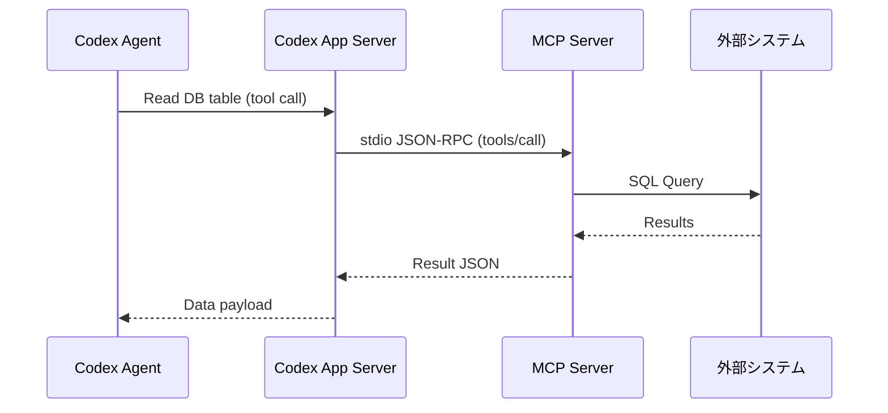

# 4. 拡張機能とアーキテクチャ (Extensibility & Architecture)

OpenAI Codex は、設計段階から「拡張性」が強く意識されており、開発者が好みのツールやルール、自動スクリプトをエージェントに組み込めるようにするための様々なアーキテクチャが用意されています。

---

## 4.1 Skills (スキル)

### 1. コンセプトと「段階的開示 (Progressive Disclosure)」
**Skills** は、特定のタスク（例: 「APIスキーマの検証」「メモリダンプの解析」「Gitリリースノートの生成」など）を実行するための「知識と手順」をエージェントに教える Markdown 形式の定義ファイル（`SKILL.md`）です。

エージェントのコンテキスト（プロンプト容量）を節約するため、Codex は**「段階的開示」**を行います。
* エージェントは通常時、すべてのスキル詳細をプロンプトに持ちません。スキルの「名前」と「短い説明（description）」だけをインデックスとしてロードします。
* エージェントは、ユーザーの指示を達成するために特定のスキルが必要であると判断した時点で、初めてその `SKILL.md` の詳細手順をコンテキストウィンドウへ動的にインポート（開示）します。

### 2. SKILL.md の構成と仕様
スキルは、`SKILL.md` を含む単一のディレクトリ（必要に応じてスクリプト等を含む）としてパッケージ化されます。

```text
my-custom-skill/
├── SKILL.md             # スキル定義（メタデータとMarkdown）
└── scripts/             # スキル内で実行される補助スクリプト
    └── validate_schema.py
```

#### `SKILL.md` の記述例
```markdown
---
name: api-schema-validator
description: JSONまたはYAML形式のAPI仕様書（OpenAPI規格など）を検証する際に使用します。
license: MIT
compatibility: Requires python3
allowed-tools: bash python
metadata:
  author: Dev Team
  version: "1.2.0"
---

# API Schema Validator

## 概要
プロジェクト内の OpenAPI / Swagger 等のスキーマ定義を検証し、矛盾や文法エラーを発見するためのスキルです。

## 使用条件 (When to Use)
* ユーザーから `swagger.yaml` などの API 定義ファイルの修正や確認を求められた場合。
* APIスキーマと実際のバックエンドコードに乖離がないか検証するよう指示された場合。

## 実行手順
1. プロジェクトルートにある `scripts/validate_schema.py` を使用して、検証対象ファイルの文法チェックを実行します。
2. エラーが検出された場合は、行番号とエラーメッセージを抽出し、修正方針をユーザーに提示します。
3. 修正の許可を得たら、該当箇所を修正して再検証します。

## 注意事項
* 外部の検証APIを叩く場合は、必ずユーザーの同意を得てください。
```

---

## 4.2 Plugins (プラグイン)

### 1. 構造とマニフェスト (`plugin.json`)
**Plugins** は、複数の Skills、Hooks、MCPサーバー設定などを1つにまとめて配布・インストールしやすくした「配信パッケージ」です。
プラグインのルートには、マニフェストファイルである `.codex-plugin/plugin.json` が必須です。

#### プラグインの一般的なフォルダ構成
```text
my-utility-plugin/
├── .codex-plugin/
│   └── plugin.json       # プラグインの定義（必須）
├── skills/
│   └── db-cleaner/
│       └── SKILL.md      # スキル1
├── .mcp.json             # このプラグイン専用のMCP設定（任意）
└── hooks/
    └── log_session.sh    # フック用スクリプト（任意）
```

#### `plugin.json` のマニフェスト仕様
```json
{
  "name": "developer-productivity-bundle",
  "version": "1.0.4",
  "description": "A collection of useful DB and testing tools for Codex.",
  "skills": "./skills/",
  "mcpServers": "./.mcp.json",
  "hooks": {
    "SessionStart": "./hooks/log_session.sh"
  }
}
```

### 2. 有効化手順とライフサイクル
1. **マニフェストの読み込み**: Codex CLI 起動時に、ローカルのプラグインキャッシュ（`$CODEX_HOME/plugins/cache/`）またはプロジェクト内のプラグイン定義を読み込みます。
2. **有効化**: `~/.codex/config.toml` にて、該当プラグインを有効にします。
   ```toml
   [features]
   plugins = true

   [plugins."developer-productivity-bundle@local"]
   enabled = true
   ```
3. **マーケットプレイスの登録**: ローカルのフォルダをプラグインソースとして CLI に追加できます。
   ```bash
   codex plugin marketplace add ./path/to/my-utility-plugin
   ```

---

## 4.3 Hooks (フック)

**Hooks** は、エージェントの特定のライフサイクルイベントに連動して実行される、決定論的な（AIの曖昧な判断を挟まない）スクリプトやプログラムです。イベント名・マッチャー・ハンドラの3層で構成され、セッション開始、ツール実行前後、プロンプト送信、圧縮処理などのタイミングに合わせて挿入できます。

> [!WARNING]
> Codex の Hooks は現在**実験的機能（Experimental）**で、活発に開発中です。**Windows では一時的に無効**化されています。利用には `config.toml` の機能フラグ `[features] hooks = true`（バージョンによっては旧名 `codex_hooks = true`）を有効にする必要があります。また後述のとおり、`PreToolUse` / `PostToolUse` が捕捉するのは**現状 Bash ツールのみ**で、MCP / Write / WebSearch 等の非シェルツールは捕捉されません（モデルがスクリプトをファイルに書き出して Bash で実行すれば回避できるため、完全な強制境界ではなく「ガードレール」として扱うのが適切です）。

### 1. 配置と構造
`hooks.json` を `~/.codex/hooks.json` または `<repo>/.codex/hooks.json` に置きます（`config.toml` にインライン TOML `[[hooks.PreToolUse]]` として書くこともできます）。複数箇所に存在する場合、一致するフックはすべて読み込まれ実行されます。構造は「**フックイベント**」「**マッチャーグループ**（いつ一致するか）」「**フックハンドラ**（実行される処理）」の3層です。ハンドラの `type` は現状 `command` のみ有効で、`prompt` / `agent` はパースされるものの実行時にスキップされます。

### 2. ライフサイクルイベントの種類
* **`SessionStart`**: 新しいセッションが開始、または再開された直後に実行されます。環境変数の検証や初期化ログの送信に適しています。
* **`PreToolUse`**: エージェントがツールを**呼び出す直前**に実行されます（現状 Bash のみ）。主にセキュリティチェックやアクセス制御に使用されます。
* **`PostToolUse`**: ツール実行直後に呼び出されます（現状 Bash のみ）。自動リンターやテストランナーの実行に便利です。
* **`UserPromptSubmit`**: ユーザーのプロンプト送信直前に実行され、コンテキスト追加やプロンプトのブロックができます。
* **`Stop`**: エージェントのターン終了時に実行され、`decision: "block"` を返すと継続プロンプトを生成してループを続行できます。
* **`PreCompact` / `PostCompact`**: 会話履歴が上限に達し、コンテキストが圧縮（要約）される前後に呼び出されます。

なお `PreToolUse` / `PostToolUse` / `UserPromptSubmit` / `Stop` は**ターンスコープ**で実行されます。

### 3. マッチャー (Matcher) の詳細
`matcher` フィールドは、そのイベントを**いつ発火させるか**を絞り込む**正規表現文字列**です。`"*"` / `""` / 省略はすべてに一致します。現状 Codex で `matcher` を解釈するイベントは限られます。

| イベント | matcher が絞り込む対象 | 備考 |
| --- | --- | --- |
| `PreToolUse` | ツール名 (`tool_name`) | 現行ランタイムは `Bash` のみを emit するため、実質 `Bash` にのみ一致 |
| `PostToolUse` | ツール名 (`tool_name`) | 同上（現状 `Bash` のみ） |
| `SessionStart` | 開始要因 (`source`) | 現行の値は `startup` と `resume` |
| `UserPromptSubmit` | 非対応 | 記述しても無視される |
| `Stop` | 非対応 | 記述しても無視される |

`matcher` 値の例: `Bash`、`startup|resume`、`Edit|Write`（後者は正規表現としては有効だが、現状 `PreToolUse`/`PostToolUse` は `Bash` しか emit しないため今日は何にも一致しません）。すべてのコマンドフックは stdin で1つの JSON オブジェクトを受け取り、共通フィールドとして `session_id` / `transcript_path` / `cwd` / `hook_event_name` / `model` を含みます（ターンスコープのフックは加えて `turn_id`）。

### 4. 入出力 JSON 契約 (JSON Contract)

#### `PreToolUse` の入力（標準入力 `stdin` に渡される JSON 構造）
ツールを実行する際、Codex は設定されたフックスクリプトの `stdin` に、実行しようとしているツールの情報と引数を JSON（**snake_case**）で流し込みます。

```json
{
  "hook_event_name": "PreToolUse",
  "session_id": "thread_abc123xyz",
  "cwd": "/Users/user/workspace/project",
  "model": "gpt-5.5",
  "turn_id": "turn_001",
  "tool_name": "Bash",
  "tool_use_id": "call_abc",
  "tool_input": {
    "command": "rm -rf /tmp/test-dir"
  }
}
```

#### フックスクリプトの終了コードとブロック制御
フックスクリプトは、渡された入力を検証し、ツールの実行を許可するかブロックするかを終了コード（Exit Code）または JSON レスポンスで返します。`PreToolUse` で Bash コマンドをブロックするには、次の hook 固有出力を返します。

```json
{
  "hookSpecificOutput": {
    "hookEventName": "PreToolUse",
    "permissionDecision": "deny",
    "permissionDecisionReason": "破壊的コマンドをフックでブロックしました。"
  }
}
```

* **終了コード `0`**（出力なし）: 成功として扱い、ツール実行をそのまま進めます。
* **終了コード `2`**: **ブロック（拒否）**。stderr に書いた理由がブロック理由として扱われます（上記 JSON、または旧形式 `{"decision": "block", "reason": "..."}` でも同義）。
* `PreToolUse` では `permissionDecision: "allow"` / `"ask"`、`updatedInput`、`continue: false` 等はパースされるものの**まだ未対応**で fail-open します。`PostToolUse` の `decision: "block"` は実行済みコマンドを取り消さず、結果をフィードバックで置き換えて継続します。

---

## 4.4 Tools (ツール) と Model Context Protocol (MCP)

Codex エージェントは、デフォルトのファイル操作・シェルコマンド実行ツールのほかに、**Model Context Protocol (MCP)** を用いて拡張された外部ツールを利用できます。



### 1. 組み込みツールとカスタムツール
* **組み込み (Built-in)**: シェル実行系を中心に構成されます。実体は機能フラグで管理され、`features.shell_tool`（`shell`）、`features.unified_exec`（ストリーミング stdin/stdout を扱う新しい実行機構）、およびファイル編集用の **Apply Patch** などが該当します。いずれも後述の OS レベルのサンドボックス環境下で実行されます。
  > [!NOTE]
  > 旧記述にあった `view_file` / `write_to_file` / `replace_file_content` というツール名は一次情報で確認できていません。正確な名称は `codex-rs` 実装を参照してください。
* **カスタム (Custom)**: MCP 経由で追加されるツール。

### 2. MCP サーバーの登録
MCP サーバーは、`config.toml` 内で登録して使用します。

```toml
# ~/.codex/config.toml
[mcp_servers.postgres-db]
command = "npx"
args = ["-y", "@modelcontextprotocol/server-postgres", "postgresql://localhost/mydb"]
```
上記のように設定すると、Codex エージェントは自動的に Postgres DB を検索、クエリするためのツール群を認識し、推論ループ内で使用できるようになります。

---

## 4.5 Subagents (サブエージェント)

### 1. 設計とコンテキストの隔離
**Subagents** は、巨大なタスクや並列して処理したいタスクを処理するために、メインスレッドとは**完全に切り離された独立したコンテキスト（サンドボックス）**で起動される「子エージェント」です。

* **課題**: メインスレッドで直接大量のテストを実行したり、巨大なファイルを複数読んだりすると、会話履歴（コンテキスト）がすぐにパンクします。
* **解決策**: 子エージェントに必要な指示を与えて別スレッドで実行させ、終わったらその「要約結果」だけをメインスレッドに持ち帰らせます。これにより、メインのチャットが不要な中間処理ログで汚れるのを防ぎます。

### 2. トリガー条件と通信
サブエージェント機能は `features.multi_agent`（既定で有効）が公開します。**Codex はサブエージェントを自動起動しません**。ユーザーが明示的に並列実行を要求した場合にのみ動作する点が、他エージェントとの重要な違いです。

内部ツールは単一の `delegate_to_subagent` ではなく、次の5つに分かれています。

* **`spawn_agent`**: 子エージェントを起動する（システムプロンプト・タスク内容・参照ファイルを渡す）。
* **`send_input`**: 実行中の子エージェントへ追加入力を送る。
* **`resume_agent`**: 中断した子エージェントを再開する。
* **`wait_agent`**: 子エージェントの完了を待ち、結果（マークダウン形式の報告）を取得する。
* **`close_agent`**: 子エージェントを終了・破棄する。

関連設定は `agents.max_depth`（既定 `1`）、`agents.max_threads`（既定 `6`）、`agents.job_max_runtime_seconds`（既定 `1800` 秒）です。読み取り主体（探索・テスト・トリアージ）の並列化は推奨される一方、書き込み主体の並列化は競合リスクがあるため慎重に行う必要があります。

---

## 4.6 その他固有の機能

### 1. サンドボックス実行環境の詳細
エージェントが危険なコマンドを実行してマシンが破損するのを防ぐため、Codex は以下の OS 組み込みの隔離技術を利用してコマンドを実行します。

* **macOS: Apple Seatbelt (`sandbox-exec`)**
  - アプリケーションごとのアクセス権限をきめ細かく制御する macOS カーネルのサンドボックス機構です。エージェントがワークスペース外のファイルシステムを書き換えるシステムコールをフックして遮断します。
* **Linux / WSL2: Bubblewrap (bwrap) + seccomp（既定）**
  - 実態は **Bubblewrap（`bwrap`）＋ seccomp が既定**です。読み取り専用ルートに `--ro-bind`、書き込み許可ルートに `--bind`、ネットワーク遮断に `--unshare-net`、権限昇格防止に `PR_SET_NO_NEW_PRIVS` を用いて隔離環境を構成します。**`Landlock` LSM はレガシーフォールバック**として残存する位置づけで、Bubblewrap と対等ではありません。
  > [!NOTE]
  > Ubuntu 24.04 では AppArmor の unprivileged user namespace 制限により、追加設定が必要になる落とし穴があります。
* **Windows: 専用ローカルユーザーアカウント方式**
  - AppContainer 方式は**明示的に不採用**です。独自実装として、専用の低権限ローカル Windows ユーザーアカウント（`CodexSandboxOffline` / `CodexSandboxOnline`）を作成し、**コマンドをそのユーザーとして実行**します。これにファイル ACL 境界・ファイアウォールルール・ローカルセキュリティポリシーを組み合わせて隔離を実現します（「Restricted Tokens & ACLs」という一般的説明は不正確）。

### 2. メモリ/状態管理 (`AGENTS.md`)
プロジェクトルートに置かれる `AGENTS.md` は、Codex エージェントを含むすべての AI 開発エージェントに対して共通して機能する「憲法」として扱われます。
* エージェントはセッション開始時に `AGENTS.md` を読み込み、その内容をシステムプロンプト相当の位置に固定配置します。この構築はセッション開始時に一度だけ行われるため、コンパクションによって失われにくい設計です。
  > [!NOTE]
  > 「`PostCompact` 時に AGENTS.md の重要指示が自動再注入される」という個別動作は一次情報で確認できていません（要確認）。ただし `PostCompact` は Hooks の対応イベントとして実在するため、フック経由でコンテキストを補完することは可能です。
