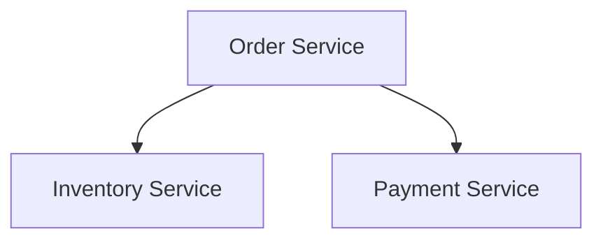

# Mermaidベストプラクティス

## 有効な図のタイプ

graph, flowchart, sequenceDiagram, classDiagram, stateDiagram, erDiagram,
journey, gantt, pie, mindmap, timeline, C4Context

## 非ASCIIテキスト

ラベルに非ASCIIテキスト（例：output_languageが"en"でない場合の日本語や他の非ラテン文字によるローカライズされたラベル）を含むノードは、引用符で囲む必要がある。
ラベルのテキスト自体は設定された出力言語に従うが、ノードIDはASCIIのままである：

## ノードIDの命名

- 短い英語の識別子を使用する：`OrderSvc`、`InventoryDB`
- ラベルには設定された言語を使用し、IDには決して使用しない
- IDは一意で記述的である必要がある

## 一般的な構文エラー

| エラー | 原因 | 修正方法 |
|-------|-------|-----|
| 括弧の不一致 | `[`と`]`の不均衡 | 開き括弧と閉じ括弧を確認する |
| 矢印の構文 | `-->`の代わりに`->`を使用している | 正しい矢印の構文を使用する |
| 特殊文字 | ラベル内の`(`、`)` | 引用符で囲む |
| 空のブロック | \`\`\`mermaidの直後に\`\`\`が続く | コンテンツを追加する |

## 複雑さのガイドライン

- 図あたり最大20ノードまで
- 複雑な図は分割し、相互参照を示す
- 論理的なグループ化にはsubgraph（サブグラフ）を使用する
