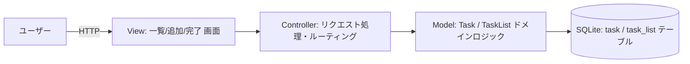

# アーキテクチャ統合（3ビュー + 技術適合性）

## 論理ビュー（MVCレイヤリング）

- **View**: 一覧・追加・完了の3画面（scope.md Must 要件に対応）
- **Controller**: HTTPリクエストを受け Model を呼び出し View へ結果を返す
- **Model**: `.spec/design/domain-model.md` の Task/TaskList を実装。永続化は `.spec/design/data-model.md` の SQLite スキーマに対応

## プロセスビュー

- 単一プロセス・単一ユーザーの同期リクエスト処理（scope.md 制約: 個人用途・単一ユーザー前提）
- リクエスト単位でDBトランザクションを開始・コミット

## 配置ビュー

- 開発機/個人環境にサーバープロセス＋SQLiteファイルを配置（クラウド配置は Non-Goal）

## 技術適合性評価

| レイヤー | 技術 | 適合性 | 根拠 |
|---|---|---|---|
| データ層 | SQLite | High | data-model.md の格納方式選定（Adopt） |
| Controller/View | 軽量Webフレームワーク（言語非指定） | Medium | scope.md に技術スタック指定なし。MVCパターンのみユーザー指定のため、具体的フレームワーク選定は実装フェーズの要件化が必要（Open Question） |

## ギャップ

- 具体的な言語・フレームワークの選定は本設計の対象外（要件が未確定のため `TBD`）。実装着手前に要件として明確化が必要
