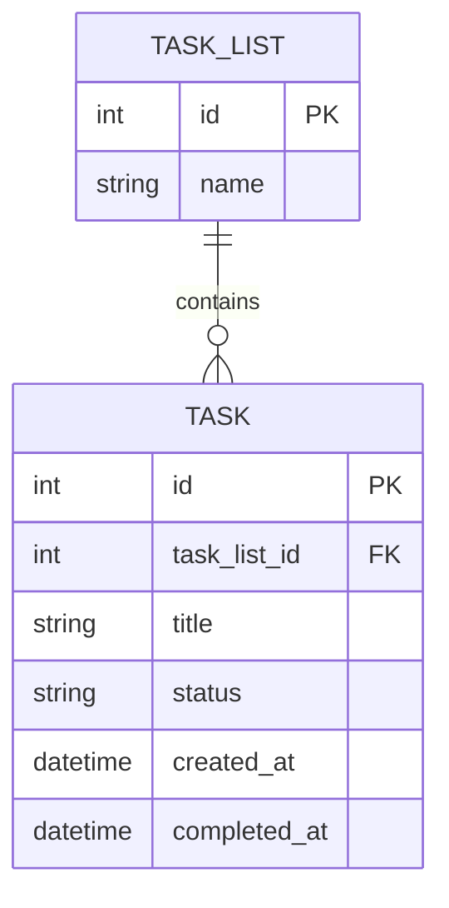

# データモデル（論理ER + 永続化戦略）

## 論理データモデル（ER図）

エンティティは `.spec/design/domain-model.md` の Task / TaskList に対応（発明なし）。

## 格納方式の選定（証拠駆動）

| 候補カテゴリ | 適合性 | 根拠シグナル | 判断 | 理由 |
|---|---|---|---|---|
| RDB（SQLite） | High | scope.md MoSCoW「Must: データの永続化」、domain-model.md の Task-TaskList は明確な1対多のリレーション構造 | Adopt | 個人用単一プロセスMVCで、複雑なクエリ（未完了一覧の絞り込み等）とスキーマ制約が必要。単一ユーザー・小規模データ量（scope.md「TBD」だが小規模仮定）のため、サーバー常駐型RDBMSではなくファイルベースのSQLiteで十分 |
| NoSQL（Document） | Low | 該当する根拠シグナルなし（スキーマは固定的で動的変更の要件がない） | Reject | Task構造は固定スキーマであり、ドキュメント型の柔軟性を要する要件がない |
| ファイル/オブジェクトストレージ | None | 該当なし | Reject | バイナリ・非構造化データを扱う要件がない |
| キャッシュ | None | 該当なし | Reject | 個人用途・低同時接続数のため、Read負荷軽減の必要性を示す根拠がない |

## 永続化戦略

- **トランザクション境界**: Task 1件の作成・更新は単一トランザクションで完結（TaskList をまたぐ複雑なACID要件はドメインモデル上存在しない）
- **整合性**: 単一プロセス・単一ユーザー前提のため、強整合性（SQLiteのデフォルトトランザクション）で十分
- **スキーマ**: 上記ER図のとおり。status は `todo` / `done` の2値
