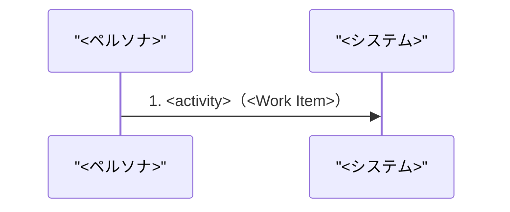

# ドメインストーリー: <ペルソナ> — <ジョブ>

（.spec/design/stories/story-<ペルソナ>-<ジョブ>.md にコピーして使う）

## 概要

<どのペルソナが、どのジョブを、どのジャーニー段階で達成するか。2〜3文>

## Actors

| Actor | 種別（Persona / Person / System） | 出典 | このストーリーでの役割 |
|---|---|---|---|

## Work Items

| Work Item | 用語（ジャーニー/ジョブの語彙をそのまま） | 対応エンティティ（あれば） | 説明 |
|---|---|---|---|

## Main Flow（ハッピーパスのみ・番号付き）

1. <ペルソナ> が <Work Item> を <動詞> → <相手 Actor/System>  _(根拠: <ジョブ/ジャーニー段階>)_
2. …

## Mermaid 図（番号を Main Flow と一致させる）

## 例外シナリオ（最大3件、ジャーニーのペイン由来）

### <例外名>

<簡潔な説明と由来>

## Open Questions

- [ ] <ジャーニー/ジョブが根拠にならず TBD としたステップ>
