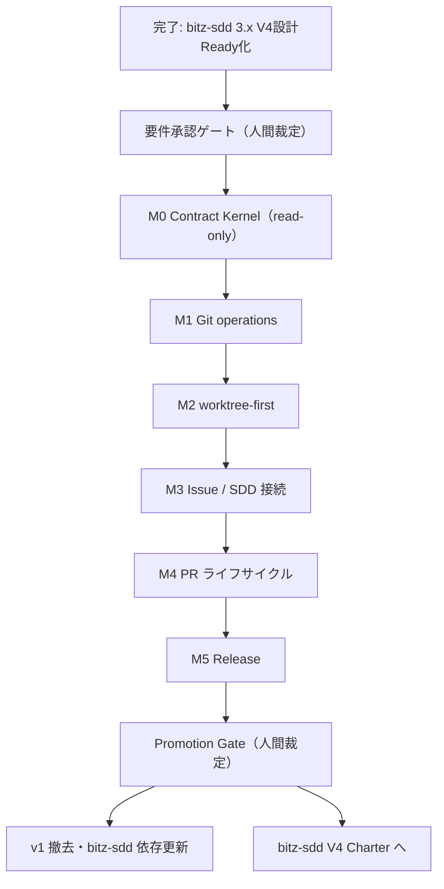

# bitz-flow ROADMAP

bitz-flow v1（稼働中）から v2（設計承認済み）への到達順序を扱う。
**現況の集計は `spec_status.py` と `sdd_report.py` が持つ。本書は目的・順序・依存・ゲート・
未裁定論点だけを扱う**（件数などの変動値を二重管理しない）。

本書は正式な契約の正ではない。設計の正は `.spec/design/`、検証可能な契約の正は
`.spec/requirements/`、人間裁定の正は `.spec/reports/decision-*.md` である。
本書への記載だけでは要件承認・実装着手・出荷を意味しない。

## v2 の目的

v1 は SKILL.md にフローの規範を書き、実操作は生の `git` / `gh` をエージェントへ委ねている。
v2 はこれを、3プラットフォーム（Claude Code / Codex CLI / Antigravity 2.0）で
同じ判断に収束する単一の実行契約へ置き換える。

1. **単一 dispatcher** — 通常操作の唯一の公開入口を `flow-core/scripts/flow.py` にし、
   raw fallback（生コマンドの代替提示）を出さない。
2. **決定論的な安全判定** — plan / apply、読取 / 状態変更、完了 cleanup / 失敗 discard を分離し、
   LLM 要約を安全判定の入力にしない。
3. **worktree-first** — 書込み作業は単独作業でも worktree を既定とし、状態機械で扱う。
4. **GitHub 差の吸収** — host・repository feature・権限・gh 版差を実行時の推測ではなく
   capability contract で扱う。
5. **低 token な結果契約** — compact と JSON で同じ判定を返し、省略は必ず可視化する。

目的の正は `.spec/discovery/`（FLW-DSC-000〜006）と `.spec/design/`（FLW-DSN-000/002〜014）。

## 現在地

- Discovery Gate: **Go**（正は `discovery/assumptions.md` と `discovery/worksheet.md` の裁定記録。
  FLW-DSC-* の frontmatter は `draft` を維持するのが正しい状態）
- Design Gate: **PASS**（2026-07-29。FLW-DSN-000 および FLW-DSN-002〜014 を active 化。
  裁定記録 `.spec/reports/decision-2026-07-29-bitz-flow-v2-design-gate.md`）
- 多観点再レビュー **PASS 4.84**（critical 0 / major 0）、System Engineering Review **PASS**
- v2 の FR / NFR / CON は EARS 形式で **draft 起票済み**
- 実装: **未着手**（v2 のタスクは 0）

次は **要件承認ゲート（人間裁定）** であり、その後に M0 だけをタスク分解する。
上流側の前提だった bitz-sdd 3.x の V4設計Ready化（`plugins/bitz-sdd/.spec/ROADMAP.md` の R0）は
2026-07-30 に完了しており、bitz-flow V2 の着手を妨げる外部依存はない。

## 規範セットの時間軸

| set | 適用期間 | 正となる成果物 |
|---|---|---|
| v1-current | v2 Promotion Gate 完了まで | FLW-FR-001/002、FLW-DSN-001、現行4スキル |
| v2-approved | Design Gate 通過後〜実装完了 | active な v2 設計と approved な v2 要件 |
| v2-current | v2 Promotion Gate 完了後 | promoted な v2 要件、v2 skills / scripts |

正は `FLW-DSN-011`。手順上、Promotion Gate より前は **v1 が正**であり、
`supersedes` / `superseded_by` は空欄に保ち、v2 script を安定版入口として案内しない。

## ゲート一覧

| ゲート | 判定者 | 根拠 | 状態 |
|---|---|---|---|
| Discovery Gate | 人間 | assumptions / worksheet の裁定記録 | Go（2026-07-29） |
| Design Gate | 人間 | FLW-REV-002 多観点 PASS、FLW-REV-003 SE PASS | PASS（2026-07-29） |
| **要件承認ゲート** | **人間** | FLW-REV-004 / FLW-REV-005 と draft 要件の diff | **未実施（次のアクション）** |
| M0 出口 | 機械（eval）+ 人間確認 | FLW-DSN-014 の M0 出口条件 | 未実施 |
| M1〜M5 出口 | 機械（fixture / canary）+ 人間確認 | FLW-DSN-014 の出口・予算・縮退境界 | 未実施 |
| Promotion Gate | 人間 | 全 milestone green、canary、代行遷移の検分 | 未実施 |

レビュー PASS は人間による要件承認を代替しない（FLW-REV-004 のゲート勧告）。
approved 後も M0 だけをタスク分解し、M0 出口条件を満たすまで M1 を開始しない。

## 順序と依存

M2 が未完了のままでは worktree-first の安全境界が閉じないため、**M1 の Git write は公開しない**
（M0 read-only へ縮退する）。M3 以降は直前 milestone までを prerelease 出荷できるが、
未完了 operation は `UNSUPPORTED` とし、生コマンド fallback を提示しない。

## フェーズ

### フェーズ0 — 要件承認（人間裁定）

- 入口: Design Gate PASS、v2 要件の draft 起票、FLW-REV-004 / FLW-REV-005 の PASS
- 作業: draft 要件と 07-29 以降の diff、両レビューの残余指摘を人間へ提示し、approved を裁定する
- 出口: v2 要件が approved（段階承認とする場合は承認範囲を裁定記録へ明記）
- 併せて扱う: 2026-07-29 の代行遷移（SI-FLW-002〜005 の accepted）の検分方法。
  GatePassage 機構は当該裁定より後に bitz-sdd へ導入されたため bitz-flow には未適用 → 未裁定論点6

### フェーズ1 — M0 Contract Kernel

- 独立 PR 1件、**read-only のみ**（write / GitHub network / worktree 作成を含めない）
- 実装対象: `repo inspect`、`git status`、`git diff-summary`、result envelope と operation 別
  JSON Schema、compact renderer / snapshot / truncation / cursor、process runner、
  Git read adapter、`flow-core` の Mandatory entry protocol、3platform eval と golden fixture
- 出口: platform 別 Dispatcher Invocation Rate 95%以上かつ skill なし比 20pt 以上改善、
  SFCR 90%以上（全体平均で相殺しない）、Cross-model Decision Parity 100%、
  必須 field 保持・golden schema 一致 100%、危険事象（raw fallback / 状態変更 / 秘密値出力 /
  黙った truncation）各 0 件、byte 削減 status 70%・diff-summary 80%以上
- 未達時: M1 へ進まず description / 入口名 / schema / renderer を修正して再実行。
  5 session または 1 PR で到達しない場合は scope / pivot を人間へ再提示

### フェーズ2 — M1 Git operations

- 残る Git read、fetch、stage、commit、sync、publish-branch、doctor の Operation Contract と
  fault fixture
- 出口: M1 所属 operation の contract 全行、fault fixture、重複 commit 0
- 縮退境界: M0 read-only prerelease だけを維持し、Git write と doctor v2 は公開しない

### フェーズ3 — M2 worktree-first

- worktree の配置・命名・作成・再開・audit・cleanup・保全・discard、独立 remote branch 削除
- 出口: repo identity 衝突 0、repo 外 worktree の承認、finish / discard の fault 全通過
- 縮退境界: M0 read-only prerelease へ縮退（M1 Git write も公開しない）

### フェーズ4 — M3 Issue / SDD 接続

- Issue CRUD、issue type / sub-issue / dependency（capability 検出つき）、fallback label、
  `.spec` との双方向リンクと reconcile-link
- 出口: capability matrix、marker 重複 0、link reconcile 全通過、独立 10 Issue/SDD flow canary green
- 縮退境界: M2 までを prerelease 出荷し、全 `issue.*` を `UNSUPPORTED` にする

### フェーズ5 — M4 PR ライフサイクル

- prepare / push / Draft publish / checks / ready / merge plan・apply / post-merge audit
- 出口: push・PR・merge の各 partial から収束、CI / head 誤判定 0、独立 10 PR flow canary green
- 縮退境界: M3 までを prerelease 出荷し、全 `pr.*` を `UNSUPPORTED` にする

### フェーズ6 — M5 Release

- repository mode の CHANGELOG、release notes、tag / release gate。
  draft までを前半、fault fixture 通過後に publish を後半で有効化
- 出口: changelog atomicity、tag / draft 収束後の段階的 publish 有効化
- 縮退境界: M4 までを出荷。draft だけが green なら prerelease 限定公開とし publish は `UNSUPPORTED`

### フェーズ7 — Promotion Gate と v1 撤去

1. 人間が Promotion Gate で後継要件を promoted へ進める（canary・裁定記録・代行遷移を検分）
2. 人間専用遷移で v1 要件を deprecated へ進め、**同じ変更セットで** 候補側 `supersedes` と
   旧要件側 `superseded_by` を記録する
3. v1 の design / skills / scripts を撤去し、doctor で旧参照ゼロを確認する
4. bitz-sdd の委譲先・依存宣言（現在 `bitz-flow>=0.2`）、README、migration note を
   同じ release 系列で更新する

候補の一部が Promotion Gate を満たさない場合は、v1 要件を deprecated へ進めず候補表を更新して再審査する。

## 予算と縮退の運用

初期 budget（M1: 3PR/12session、M2: 2PR/8session、M3: 3PR/12session、M4: 3PR/12session、
M5: 2PR/8session）と各縮退境界の**正は `FLW-DSN-014` v1.3**であり、本書では複製しない。
運用上の要点だけを再掲する。

- 各 milestone は PR 予算か session 予算のどちらかを先に使い切った時点で停止し、
  継続 / scope 縮小 / No-Go を人間へ再提示する。進行中 milestone の上限を暗黙に延長しない。
- milestone 開始時に実績 PR 数・session 数・レビュー修正回数・出口未達理由を run manifest へ記録し、
  人間が次 budget を確認する。変更は decision reference つきで記録する。
- 各縮退出荷境界は、その境界自身までの**独立 canary が green の場合だけ**公開する
  （M3 の green を M4 の一部実行で代用しない）。
- 縮退版を v2-current へ昇格する場合は scope / 要件 / operation catalog を改訂し、
  Design Gate と Promotion Gate を**再裁定**する。
- canary で作成した Issue / PR / release / worktree は自動削除せず `bitz-flow-canary` として保全する。

## 上位ロードマップとの接続

`plugins/bitz-sdd/.spec/ROADMAP.md` は本作業を**フェーズ4**に置き、bitz-sdd V4 Charter の
入口条件としている。したがって bitz-flow V2 の遅延は V4 の遅延に直結する。

- bitz-sdd V4 は「bitz-flow V2 の公開 operation / result / SDD opaque ID 接続が安定してから」
  Charter を開始する
- bitz-sdd 側の未裁定論点18（SDD・flow 直接接続の所有者）と論点19（V2 とのリリース順序）は、
  本 ROADMAP の M3 と Promotion Gate の結果を入力とする
- bitz-sdd V4 完了条件の「`sdd-git` を削除し Git / GitHub 操作入口を `flow-core` へ一本化」は
  フェーズ7 の完了に依存する

## バージョン・リリース方針

- 現行 `0.3.1` が v1-current。M0〜M5 の各 PR は v1 の稼働契約を壊さない範囲で bump する
- v2 の実行契約は Promotion Gate 完了時に一度だけ切り替える（v1 と v2 を同じ major で
  段階混在させない — `FLW-DSN-011` 代替案で不採用済み）
- v2 を prerelease 出荷する系列と、v2-current 昇格時の version 番号は **未裁定**（未裁定論点1）
- rollback は3プラットフォームそれぞれで marketplace / repository revision と plugin version を
  直前 v1 へ pin し、doctor で version / schema / path を確認後に read-only smoke test を行う

## 未裁定論点

1. **v2 の version 番号** — prerelease をどの系列で出し、v2-current 昇格を `1.0.0` とするか。
   bitz-sdd の依存宣言 `bitz-flow>=0.2` の更新時期と併せて裁定する。
2. **要件の承認単位** — v2 要件を一括 approved にするか、M0 スコープから段階承認にするか。
3. **cross-host GitHub create** — 分散 lock を持たず単一 coordinator 運用に依存する残余リスク
   （FLW-REV-004 の残余 P2）。FLW-CON-004 で検証するため承認ブロッカーではないが、
   安全を証明できない場合は `UNSUPPORTED` / `BLOCKED` として M3/M4 Promotion を停止する。
4. **Should 機能の昇格順** — GitHub Projects、branch protection / merge queue、
   component mode の CHANGELOG は Must 出口を満たした後に個別昇格する（順序は未定）。
5. **release publish の有効化条件** — M5 後半の fault fixture 通過をどこまで要求するか。
6. **Design Gate の GatePassage 起票** — 2026-07-29 の代行遷移（SI-FLW-002〜005）は
   GatePassage 機構の導入前に行われたため `.spec/gates/` に記録がない。
   遡って起票するか、Promotion Gate でまとめて検分するか。
7. **`sdd-git` 廃止の裁定** — bitz-sdd 側 `CORE-FR-016` の縮退維持裁定を V4 で後継化するか
   （bitz-sdd ROADMAP 未裁定論点17 と対）。

## v2 完了条件

- [ ] v2 要件が approved を経て、M0〜M5 の全 milestone で出口条件を満たしている
- [ ] 通常操作の公開入口が `flow.py` に一本化され、SKILL.md に生 `git` / `gh` の通常経路がない
- [ ] compact / JSON が同じ判定を返し、golden fixture と operation 別 JSON Schema が green
- [ ] 3プラットフォームの eval が閾値を満たし、run manifest に model 記録がある
- [ ] 各 milestone の独立 canary が green で、canary 成果物が保全・一覧化されている
- [ ] v1→v2→v1 の往復 canary を1回通し、旧参照ゼロ検査と v1 smoke test が green
- [ ] canonical spec inspect と release check が green
- [ ] Promotion Gate で裁定記録と代行遷移を人間が検分済み
- [ ] v1 の design / skills / scripts が撤去され、bitz-sdd の委譲先・依存宣言が更新済み
