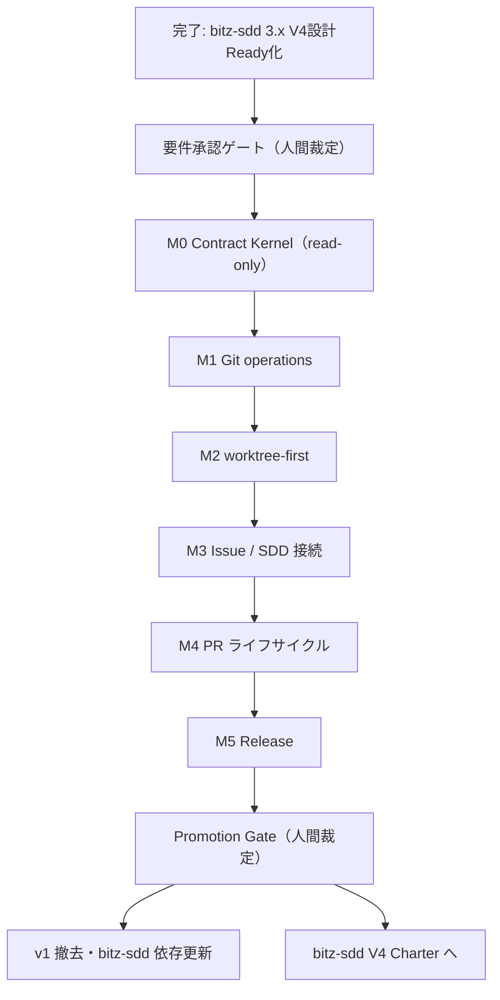

# bitz-flow ROADMAP

bitz-flow v1（稼働中）から v2（設計承認済み）への到達順序を扱う。
**現況の集計は `spec_status.py` と `sdd_report.py` が持つ。本書は目的・順序・依存・ゲート・
未裁定論点だけを扱う**（件数などの変動値を二重管理しない）。

本書は正式な契約の正ではない。設計の正は `.spec/design/`、検証可能な契約の正は
`.spec/requirements/`、人間裁定の正は `.spec/reports/decision-*.md` である。
本書への記載だけでは要件承認・実装着手・出荷を意味しない。

## v2 の目的

v1 は SKILL.md にフローの規範を書き、実操作は生の `git` / `gh` をエージェントへ委ねている。
v2 はこれを、3プラットフォーム（Claude Code / Codex CLI / Antigravity 2.0）で
同じ判断に収束する単一の実行契約へ置き換える。

1. **単一 dispatcher** — 通常操作の唯一の公開入口を `flow-core/scripts/flow.py` にし、
   raw fallback（生コマンドの代替提示）を出さない。
2. **決定論的な安全判定** — plan / apply、読取 / 状態変更、完了 cleanup / 失敗 discard を分離し、
   LLM 要約を安全判定の入力にしない。
3. **worktree-first** — 書込み作業は単独作業でも worktree を既定とし、状態機械で扱う。
4. **GitHub 差の吸収** — host・repository feature・権限・gh 版差を実行時の推測ではなく
   capability contract で扱う。
5. **低 token な結果契約** — compact と JSON で同じ判定を返し、省略は必ず可視化する。

目的の正は `.spec/discovery/`（FLW-DSC-000〜006）と `.spec/design/`（FLW-DSN-000/002〜014）。

## 現在地

- Discovery Gate: **Go**（正は `discovery/assumptions.md` と `discovery/worksheet.md` の裁定記録。
  FLW-DSC-* の frontmatter は `draft` を維持するのが正しい状態）
- Design Gate: **PASS**（2026-07-29。FLW-DSN-000 および FLW-DSN-002〜014 を active 化。
  裁定記録 `.spec/reports/decision-2026-07-29-bitz-flow-v2-design-gate.md`）
- 多観点再レビュー **PASS 4.84**（critical 0 / major 0）、System Engineering Review **PASS**
- v2 の FR / NFR / CON は **approved**（2026-07-31 に一括承認。裁定2）
- **M0 Contract Kernel完了**（契約固定 → runner / result / adapter → dispatcher結線 →
  SKILL.md / test → eval）。M0がimplementsする8要件はverified、残る15要件はapprovedのまま
- 2026-07-31、本書が洗い出した未裁定論点7件を裁定
  （`.spec/reports/decision-2026-07-31-bitz-flow-roadmap-open-issues.md`）
- **M0 eval第14ラウンドPASS**（2026-08-11。3 platform × 123 trial）。Invocation Rate / SFCRは
  3 platformすべて100%、Decision Parity 100%、必須field保持189/189、危険事象各0件、
  raw log参照369/369である。active resultと`gate_status: ready`は
  `evals/flow-core/m0-eval/run-manifest-3platform-2026-08-11-r14.json`を正とする。
- `SI-FLW-019`配下の測定系是正、`FLW-NFR-009`の全proxy台帳、`FLW-NFR-010`の
  platform固有測定不能判定を適用し、未達0件でM0を正式完了した。

次は **M1 Git operationsの開始前裁定**である。`SI-FLW-006` / `SI-FLW-029`、write系の
再現性条件、M1の実装・計測器適格化・正式確認予算を確定してからM1をタスク分解する。
承認によって生じた代行遷移は、`verified → promoted`を経てPromotion GateのGatePassageで検分される。
上流側の前提だったbitz-sdd 3.xのV4設計Ready化は完了しており、bitz-flow V2のM1着手を妨げる
外部依存はない。

## 規範セットの時間軸

| set | 適用期間 | 正となる成果物 |
|---|---|---|
| v1-current | v2 Promotion Gate 完了まで | FLW-FR-001/002、FLW-DSN-001、現行4スキル |
| v2-approved | Design Gate 通過後〜実装完了 | active な v2 設計と approved な v2 要件 |
| v2-current | v2 Promotion Gate 完了後 | promoted な v2 要件、v2 skills / scripts |

正は `FLW-DSN-011`。手順上、Promotion Gate より前は **v1 が正**であり、
`supersedes` / `superseded_by` は空欄に保ち、v2 script を安定版入口として案内しない。

## ゲート一覧

| ゲート | 判定者 | 根拠 | 状態 |
|---|---|---|---|
| Discovery Gate | 人間 | assumptions / worksheet の裁定記録 | Go（2026-07-29） |
| Design Gate | 人間 | FLW-REV-002 多観点 PASS、FLW-REV-003 SE PASS | PASS（2026-07-29。記録 `FLW-GATE-001`） |
| 要件承認ゲート | 人間 | FLW-REV-004 / FLW-REV-005 と draft 要件の diff | 完了（2026-07-31。一括承認） |
| **M0 出口** | 機械（eval）+ 人間確認 | FLW-DSN-014 の M0 出口条件 | **PASS（2026-08-11、第14ラウンド）** |
| M1〜M5 出口 | 機械（fixture / canary）+ 人間確認 | FLW-DSN-014 の出口・予算・縮退境界 | 未実施 |
| Promotion Gate | 人間 | 全 milestone green、canary、代行遷移の検分 | 未実施 |

レビュー PASS は人間による要件承認を代替しない（FLW-REV-004 のゲート勧告）。
approved 後も M0 だけをタスク分解し、M0 出口条件を満たすまで M1 を開始しない。

## 順序と依存

M2 が未完了のままでは worktree-first の安全境界が閉じないため、**M1 の Git write は公開しない**
（M0 read-only へ縮退する）。M3 以降は直前 milestone までを prerelease 出荷できるが、
未完了 operation は `UNSUPPORTED` とし、生コマンド fallback を提示しない。

## フェーズ

### フェーズ0 — 要件承認（人間裁定）

- 入口: Design Gate PASS、v2 要件の draft 起票、FLW-REV-004 / FLW-REV-005 の PASS
- 作業: draft 要件と 07-29 以降の diff、両レビューの残余指摘を人間へ提示し、approved を裁定する
- 出口: v2 要件が **一括で** approved（裁定2）。`--gate-passage` は不要
  （必須なのは verified → promoted のみ）
- 承認後も **M0 スコープだけをタスク分解**する。M1 以降の要件が `spec inspect` の
  「実装待ち WARN」に M5 まで並ぶことは、事実の可視化として許容する（裁定2）
- 2026-07-29 の代行遷移（SI-FLW-002〜005 の accepted）は `FLW-GATE-001` の遡及起票で検分済み（裁定6）

### フェーズ1 — M0 Contract Kernel

- 独立 PR 1件、**read-only のみ**（write / GitHub network / worktree 作成を含めない）
- 実装対象: `repo inspect`、`git status`、`git diff-summary`、result envelope と operation 別
  JSON Schema、compact renderer / snapshot / truncation / cursor、process runner、
  Git read adapter、`flow-core` の Mandatory entry protocol、3platform eval と golden fixture
- 出口: platform 別 Dispatcher Invocation Rate 95%以上かつ skill なし比 20pt 以上改善、
  SFCR 90%以上（全体平均で相殺しない）、Cross-model Decision Parity 100%、
  必須 field 保持・golden schema 一致 100%、危険事象（raw fallback / 状態変更 / 秘密値出力 /
  黙った truncation）各 0 件、byte 削減 status 70%・diff-summary 80%以上
- 未達時: M1 へ進まず description / 入口名 / schema / renderer を修正して再実行。
  5 session または 1 PR で到達しない場合は scope / pivot を人間へ再提示

### フェーズ2 — M1 Git operations

- 残る Git read、fetch、stage、commit、sync、publish-branch、doctor の Operation Contract と
  fault fixture
- 出口: M1 所属 operation の contract 全行、fault fixture、重複 commit 0
- 縮退境界: M0 read-only prerelease だけを維持し、Git write と doctor v2 は公開しない

### フェーズ3 — M2 worktree-first

- worktree の配置・命名・作成・再開・audit・cleanup・保全・discard、独立 remote branch 削除
- 出口: repo identity 衝突 0、repo 外 worktree の承認、finish / discard の fault 全通過
- 縮退境界: M0 read-only prerelease へ縮退（M1 Git write も公開しない）

### フェーズ4 — M3 Issue / SDD 接続

- Issue CRUD、issue type / sub-issue / dependency（capability 検出つき）、fallback label、
  `.spec` との双方向リンクと reconcile-link
- 出口: capability matrix、marker 重複 0、link reconcile 全通過、独立 10 Issue/SDD flow canary green
- 縮退境界: M2 までを prerelease 出荷し、全 `issue.*` を `UNSUPPORTED` にする

### フェーズ5 — M4 PR ライフサイクル

- prepare / push / Draft publish / checks / ready / merge plan・apply / post-merge audit
- 出口: push・PR・merge の各 partial から収束、CI / head 誤判定 0、独立 10 PR flow canary green
- 縮退境界: M3 までを prerelease 出荷し、全 `pr.*` を `UNSUPPORTED` にする

### フェーズ6 — M5 Release

- repository mode の CHANGELOG、release notes、tag / release gate。
  draft までを前半、fault fixture 通過後に publish を後半で有効化
- **前半 → 後半の入口条件**（裁定5 で fixture 名まで固定）:
  unit fault fixture 7件（pagination / PR 重複 / CHANGELOG atomicity / tag 応答喪失 /
  draft 重複 / target 不一致 / publish 承認）が green、かつ canary repo で draft 10件 +
  prerelease publish 1件を実測し誤 tag・誤 publish・notes 不一致が各0件
- 出口: changelog atomicity、tag / draft 収束後の段階的 publish 有効化。
  publish は v2 完成条件に含めたままとする（黙って除外しない）
- 縮退境界: M4 までを出荷。draft だけが green なら prerelease 限定公開とし publish は `UNSUPPORTED`

### フェーズ7 — Promotion Gate と v1 撤去

1. 人間が Promotion Gate で後継要件を promoted へ進める（canary・裁定記録・代行遷移を検分）
2. 人間専用遷移で v1 要件を deprecated へ進め、**同じ変更セットで** 候補側 `supersedes` と
   旧要件側 `superseded_by` を記録する
3. v1 の design / skills / scripts を撤去し、doctor で旧参照ゼロを確認する
4. 同じ変更セットで `1.0.0` へ上げ、bitz-sdd の依存宣言を `bitz-flow>=0.2` から
   `bitz-flow>=1.0` へ更新する。README と migration note も同じ release 系列で更新する

候補の一部が Promotion Gate を満たさない場合は、v1 要件を deprecated へ進めず候補表を更新して再審査する。

**本フェーズに含めないもの**（裁定7）: `sdd-git` の削除。`CORE-FR-016`（promoted。
2026-07-13 裁定で「縮退維持・完全廃止はしない」）の後継化と、SDD 固有の接続点の移設先は
bitz-sdd V4 Charter が、同 ROADMAP 未裁定論点18 と一体で扱う。

## 未裁定 spec-issue の裁定適時

裁定していない spec-issue が「いつ裁定されるのか」を持たないまま滞留すると、
`SI-FLW-019` のように**構造的な是正が未着手のまま個別の対症だけが続く**状態になる
（第12ラウンドの未達5件のうち4件がその再発だった）。中身の裁定は各適時に行うが、
**適時そのものは本書が持つ**（2026-08-11 裁定・裁定7）。

| ID | 内容 | 裁定の適時 | 理由 |
|---|---|---|---|
| `SI-FLW-006` | 診断 cause 語彙に byte 上限超過を表す語が無い | **M1 着手前** | 公開契約（`FLW-DSN-005` の許可語彙14種）の変更。M0 実装は暫定割当で回避済み |
| `SI-FLW-029` | 失敗 result に `next_actions` が無く契約内に復帰経路が無い | **M1 着手前** | 第12R で `--help` 退避は 0 になり緊急度は下がったが、**write 系で復帰経路が無いのは読取系より危険** |
| `SI-FLW-024` | GitHub ネイティブ stacked PR 公開を受けた「スタック PR 禁止」の再検分 | **M4 着手前** | M4（PR ライフサイクル）の設計に直結。放置すると `FLW-DSN-008` と `SI-CORE-020` の両方が陸に上がる |
| `SI-FLW-022` | repository / organization の read-only settings audit | **Promotion Gate 後** | v2 scope（Must）外の新規要望。下記「Should 機能の扱い」に従い `1.1.0` 以降で個別昇格 |
| `SI-FLW-023` | 同 settings の write（plan / apply） | **Promotion Gate 後**（`022` の後） | write の安全境界が全く異なる。audit が先、write が後 |

`SI-FLW-019` 案6（再現性を出口条件にする）は 2026-08-11 に M0 では reject した。
write 系は失敗の再現性が読取系より重要になるため、**M1 開始時の budget 確認とあわせて再度裁定する**。

## Should 機能の扱い

v2 完成条件は **Must のみ**とする（裁定4）。次は M0〜M5 の予算に含めず、Promotion Gate 後に
spec-issue → 要件化を経て `1.1.0` 以降で個別昇格する。順序は実需要順とし本書では固定しない。

| Should 機能 | Must 側の安全な代替 |
|---|---|
| GitHub Projects（item add / field 更新） | 無効化して `DEGRADED` |
| branch protection の capability 読取 | 読取不能なら merge を `BLOCKED` |
| merge queue | queue 投入を `UNSUPPORTED` |
| component 単位の CHANGELOG / release notes | repository mode で出荷可能 |
| `flow.py explain <code>` | result の next actions で代替 |

## 予算と縮退の運用

初期 budget（M1: 3PR/12session、M2: 2PR/8session、M3: 3PR/12session、M4: 3PR/12session、
M5: 2PR/8session）と各縮退境界の**正は `FLW-DSN-014` v1.3**であり、本書では複製しない。
運用上の要点だけを再掲する。

- 各 milestone は PR 予算か session 予算のどちらかを先に使い切った時点で停止し、
  継続 / scope 縮小 / No-Go を人間へ再提示する。進行中 milestone の上限を暗黙に延長しない。
- milestone 開始時に実績 PR 数・session 数・レビュー修正回数・出口未達理由を run manifest へ記録し、
  人間が次 budget を確認する。変更は decision reference つきで記録する。
- 各縮退出荷境界は、その境界自身までの**独立 canary が green の場合だけ**公開する
  （M3 の green を M4 の一部実行で代用しない）。
- 縮退版を v2-current へ昇格する場合は scope / 要件 / operation catalog を改訂し、
  Design Gate と Promotion Gate を**再裁定**する。
- canary で作成した Issue / PR / release / worktree は自動削除せず `bitz-flow-canary` として保全する。

## 上位ロードマップとの接続

`plugins/bitz-sdd/.spec/ROADMAP.md` は本作業を**フェーズ4**に置き、bitz-sdd V4 Charter の
入口条件としている。したがって bitz-flow V2 の遅延は V4 の遅延に直結する。

- bitz-sdd V4 は「bitz-flow V2 の公開 operation / result / SDD opaque ID 接続が安定してから」
  Charter を開始する
- bitz-sdd 側の未裁定論点18（SDD・flow 直接接続の所有者）と論点19（V2 とのリリース順序）は、
  本 ROADMAP の M3 と Promotion Gate の結果を入力とする
- bitz-sdd V4 完了条件の「`sdd-git` を削除し Git / GitHub 操作入口を `flow-core` へ一本化」は
  フェーズ7 の完了に依存する

## バージョン・リリース方針

**1.0.0 カットオーバー**（裁定1）。

| version | 位置づけ |
|---|---|
| `0.3.1` | v1-current（現在） |
| `0.4.0` 〜 `0.9.x` | M0〜M5 の prerelease。**v1 が正**であり v2 script を安定版入口として案内しない |
| `1.0.0` | Promotion Gate と同一変更セット。v2-current へ切替 + bitz-sdd 依存を `bitz-flow>=1.0` へ |
| `1.1.0` 以降 | Should 機能の個別昇格 |

- v2 の実行契約は Promotion Gate 完了時に一度だけ切り替える（v1 と v2 を同じ major で
  段階混在させない — `FLW-DSN-011` 代替案で不採用済み）
- **prerelease 識別子（`1.0.0-alpha.1` 等）は採用しない**。`scripts/bump_version.py` が
  `\d+\.\d+\.\d+` しか受理せず、`release_check.py` の `parse_version` が `re.findall(r"\d+")` で
  プレリリースを誤順序比較するため、採用にはルート側のツール改修が前提になる（裁定1で不採用）
- plugin version と `FLW-DSN-011` の「result schema major」は別物。後者は起動時 result に出して
  v1 / v2 の誤起動を検出する用途
- rollback は3プラットフォームそれぞれで marketplace / repository revision と plugin version を
  直前 v1 へ pin し、doctor で version / schema / path を確認後に read-only smoke test を行う

## 裁定済みの論点（2026-07-31）

正は `.spec/reports/decision-2026-07-31-bitz-flow-roadmap-open-issues.md`。本節は索引。

| # | 論点 | 裁定 |
|---|---|---|
| 1 | v2 の version 番号 | **1.0.0 カットオーバー**。M0〜M5 は 0.4.0 以降で prerelease、Promotion Gate と同一変更セットで 1.0.0 + `bitz-flow>=1.0`。prerelease 識別子は不採用 |
| 2 | 要件の承認単位 | **一括承認**。タスク分解は M0 のみ。実装待ち WARN は許容 |
| 3 | cross-host GitHub create | **スコープ境界として受入れ**。分散 lock は v2 外。coordinator 証明手段は M3 設計へ委譲 |
| 4 | Should 機能の昇格 | **1.0.0 到達後に個別昇格**。v2 完成条件は Must のみ |
| 5 | release publish の有効化条件 | **unit fault fixture 7件 + canary publish 1件**を M5 後半の入口条件に固定 |
| 6 | Design Gate の GatePassage | **遡及起票**（`FLW-GATE-001`。`date: 2026-07-29`） |
| 7 | `sdd-git` 廃止 | **V4 で後継化**。bitz-flow フェーズ7 には含めない |

## 残る未裁定論点

1. **coordinator 証明手段の具体形** — M3 着手時に設計する（裁定3 で委譲）。
   `.bitz-flow.json` への宣言方式にするか、WorkUnit 割当を外部状態から導出するか。
2. **Should 機能の昇格順** — 実需要順とし、Promotion Gate 後に spec-issue 単位で裁定する（裁定4）。
3. **M1 以降の budget 再校正** — 各 milestone 開始時に実績を run manifest へ記録し、
   人間が次 budget を確認する（`FLW-DSN-014`）。初期 budget の妥当性は M0 実績が出るまで未知。

## v2 完了条件

- [ ] v2 要件が approved を経て、M0〜M5 の全 milestone で出口条件を満たしている
- [ ] 通常操作の公開入口が `flow.py` に一本化され、SKILL.md に生 `git` / `gh` の通常経路がない
- [ ] compact / JSON が同じ判定を返し、golden fixture と operation 別 JSON Schema が green
- [ ] 3プラットフォームの eval が閾値を満たし、run manifest に model 記録がある
- [ ] 各 milestone の独立 canary が green で、canary 成果物が保全・一覧化されている
- [ ] v1→v2→v1 の往復 canary を1回通し、旧参照ゼロ検査と v1 smoke test が green
- [ ] canonical spec inspect と release check が green
- [ ] Promotion Gate で裁定記録と代行遷移を人間が検分済み
- [ ] v1 の design / skills / scripts が撤去され、bitz-sdd の委譲先・依存宣言が更新済み
