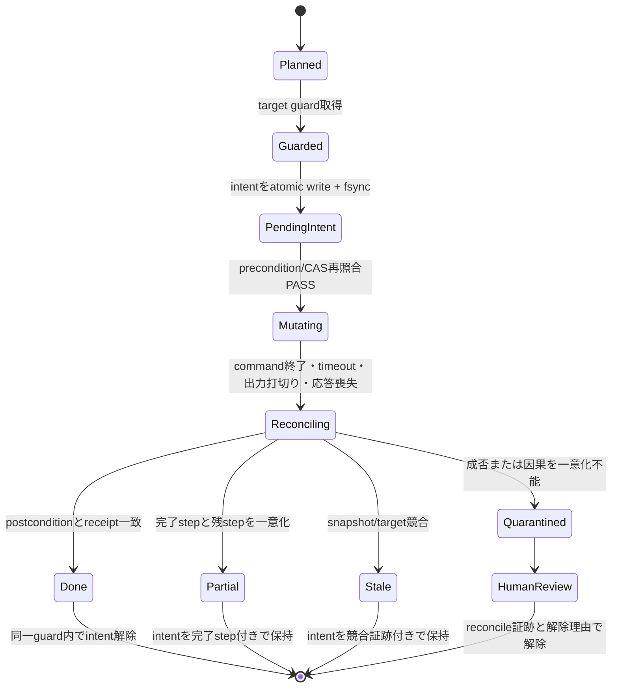
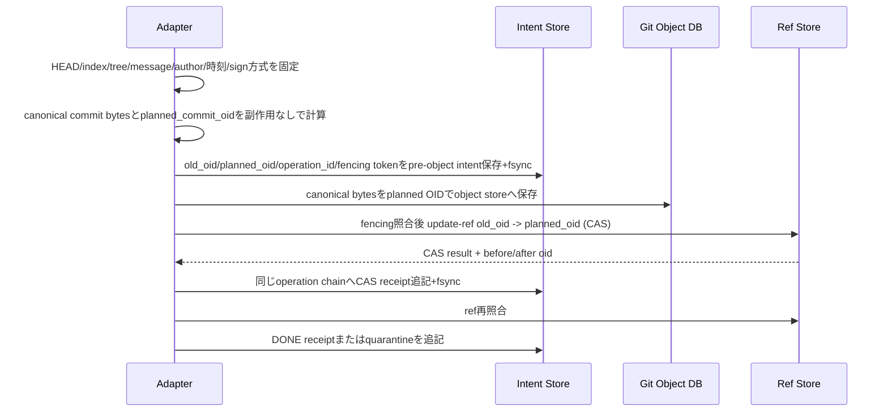

# FLW-DSN-015 M1 write safety・qualification・evidence ledger詳細設計

## 責務と規範性

本設計はM1 Git writeの実装詳細について、`FLW-DSN-010`の復帰原則、`FLW-DSN-013`の
forward recovery、`FLW-DSN-014`の検証原則を結合する規範設計である。3文書と矛盾する場合は、
本書のM1固有表を優先し、一般原則の変更が必要なら元文書も同じ変更セットで更新する。

M1のoperation catalogは次の閉集合とする。catalog外は`UNSUPPORTED`であり、M2以降のworktree、Issue、
PR、releaseへ状態機械を再利用できても、本書だけを根拠に公開しない。

| operation | class | canonical mutation target | guard / recovery | 実装PR |
|---|---|---|---|---|
| Git inspect / doctor | read | なし | snapshot付きread / retry-read | M1-1, M1-4 |
| `git.fetch` | local-write | common-dirのremote-tracking ref集合、`FETCH_HEAD` | target guard / REC-FETCH | M1-4 |
| `git.stage` | local-write | common-dir＋worktree IDで識別したindex | target guard / REC-STAGE | M1-3 |
| `git.commit` | local-write | branch refと同一worktree index | target guard / REC-COMMIT | M1-3 |
| `git.sync` | local-write | branch ref、index、remote-tracking ref集合 | 複数target guard / REC-SYNC | M1-4 |
| `git.publish-branch` | remote-write | repository ID＋remote branch ref | 複数target guard / REC-PUSH | M1-4 |

guard identityはtarget種別ごとに分離する。`index|local-ref|remote-tracking-ref|fetch-head`はGit common-dirの
platform固有stable file identity（indexだけはworktree IDも付加）、`remote-ref`はcanonical host＋providerの
repository ID＋ref nameだけから導出する。symlink、相対path、case差、別worktree、remote aliasを正規化し、
別cloneからの同一remote refも同じguardへ収束させる。mutation target typeはこの5種の閉集合としraw pathを
keyにしない。identityを一意化できなければwriteを`BLOCKED`にする。intentの`repo_identity`は監査用に
local common-dir identityとremote repository identityを併記するが、remote guard keyへlocal identityを混ぜない。

## write状態機械



上図のノード名（`Planned` / `PendingIntent` 等）は**図の表示ラベル**であり enum 値ではない。
**`write_state` の enum 値の正は下の namespace 表**とする（`SI-FLW-039`）。

状態の不変条件:

| state | durable intent | mutation許可 | 次回同target write |
|---|---|---|---|
| `PLANNED` | なし | 禁止 | plan再生成可 |
| `GUARDED` | なし | 禁止 | guard競合で待機またはBLOCKED |
| `PENDING_INTENT` | 必須 | CAS再照合後だけ可 | BLOCKED |
| `MUTATING` / `RECONCILING` | 必須 | 現operationだけ | BLOCKED |
| `DONE` | 解除receiptを保持 | 完了 | 新plan可 |
| `PARTIAL` / `STALE` | 必須 | 自動再apply禁止 | read-only reconcileまたは新planの人間確認 |
| `QUARANTINED` | 必須 | 禁止 | 人間解除までBLOCKED |

`PENDING_INTENT`の永続化前に副作用を開始してはならない。副作用前crashでもintentが残る設計を採るのは、
「無駄にBLOCKEDになる」方を「記録なしの重複write」より優先するためである。

同名語の混同を避け、schemaは次のenum namespaceを別fieldで持つ。

| namespace | field | closed enum |
|---|---|---|
| write機械 | `write_state` | `PLANNED, GUARDED, PENDING_INTENT, MUTATING, RECONCILING, DONE, PARTIAL, STALE, QUARANTINED` |
| operation結果 | `result_code` | `DONE, PARTIAL, INDETERMINATE, STALE, BLOCKED, INVALID_INPUT, UNSUPPORTED` |
| intent記録 | `intent_record_state` | `PENDING, RECONCILING, PARTIAL, STALE, QUARANTINED, RELEASED` |
| Gate | `gate_status` | `PASS, FAIL, BLOCKED` |
| attempt | `attempt_status` | `STARTED, PASS, FAIL, ABORTED, UNKNOWN` |

## target guardプロトコル

target guard keyは`guard_identity × canonical_mutation_target`とし、operation familyを含めない。
authoritative coordinatorがlinearizable CASで発行する単調増加fencing tokenを伴い、family別
`concurrency_key`より先に取得する。ただしGit storage自体がtokenを原子的に検証するとは主張しない。
local targetは存続中のOS exclusive lock＋Git expected-OID/index digest CAS、remote refはproviderが原子的に
検証するexpected remote OID CASを必須とする。remote CASを提供できないplatformはpublishを`UNSUPPORTED`とする。

1. repoと全targetを上記schemaでcanonicalizeし、bytewise昇順へ並べる。
2. target guardを昇順でCAS取得し、各targetのfencing tokenを受け取る。途中失敗時は取得済みguardを
   逆順で解放し、副作用0で`BLOCKED`。
3. guard内で既存pending/quarantineを検査する。存在時は新intentを作らない。
4. family別lockを取得する。
5. intentを対象repoのGit common-dir配下のowner-only領域へtemp writeし、file fsync、atomic rename、directory
   fsyncの順でpublication commitする。directory fsync完了をdurability commit pointとする。
6. intentを再parseしdigest一致後だけprecondition/CAS照合へ進む。
7. 各副作用の直前にidentity、target、snapshot、fencing token、OS lock所有を再照合し、local CASまたは
   server-side remote CASとpostcondition/reconcile完了まで両lockを保持する。
8. `DONE`または副作用不成立を証明できた場合だけ解除receiptを追記し、active intentを解除する。

安全なadvisory lock、owner-only永続領域、fsyncのいずれかを提供できないplatformではwriteを
`UNSUPPORTED`とする。lock fileの存在だけを所有証明にしない。
coordinatorはlease満了だけでguardを再発行しない。owner processの終了、子Git processの終了、OS lock解放、
対象postconditionのread-only reconcileをcoordinator-operatorが証明し、旧tokenをquarantineへ確定した後だけ
新tokenを発行する。停止中の旧commandをkillできない／remote CASがない場合は無期限BLOCKEDを安全側既定とする。

### index更新CAS

`git.stage`はplan時indexから予定index bytesを一時領域で副作用なしに生成する。target guard取得後にGit native
`index.lock`をexclusive createし、lock保持下で現index digestを再読してplan snapshotと一致した場合だけ、予定bytesを
`index.lock`へ書いてfile fsyncし、Git lockfile commit相当のatomic rename＋directory fsyncで公開する。通常の`git add`を
lock内から起動しない。`git.commit`／`git.sync`もindexを読む・更新する区間では同じnative lock規約に従う。
native index lock、atomic rename、同一filesystemを提供できないplatformではstage/commit/syncを`UNSUPPORTED`とする。
管理外processがnative lockを無視した場合はpostcondition不一致としてquarantineし、そのprocessを許容する環境を
qualification不適格とする。

### intent record v1

```json
{
  "schema_version": 1,
  "operation_id": "opaque",
  "repo_identity": "digest",
  "targets": ["canonical-key"],
  "fencing_tokens": {"canonical-key": 12},
  "snapshot_digest": "sha256",
  "expected_effect_digest": "sha256",
  "intent_record_state": "PENDING|RECONCILING|PARTIAL|STALE|QUARANTINED|RELEASED",
  "created_at": "RFC3339",
  "owner_process": "non-secret opaque id",
  "receipt_digest": null,
  "previous_record_digest": "sha256|null"
}
```

既存recordを上書きせず、状態変更は同じoperation IDのhash-chain entryとして追記する。

## M1 recovery matrix

未登録tuple、未知field、code/cause矛盾は`human-stop`へfail-closedにする。

| operation | phase/stage | code・状態 | recovery class | 許可NEXT | 禁止 |
|---|---|---|---|---|---|
| 全read | inspect前 | `INVALID_INPUT` | `retry-read` | 同一read＋正規化済み候補 | shell、生値echo |
| 全write | apply前 | `STALE` | `replan-human` | inspect、新plan | apply自動連結 |
| stage/sync/publish | apply後 | `PARTIAL` | `reconcile-only` | operation固有read reconcile | 残step自動apply |
| 全write | apply後 | timeout/output-limit/unclassified | `reconcile-only` | postcondition最大2回 | command blind retry |
| 全write | reconcile不能 | `INDETERMINATE` | `human-stop` | 空NEXT＋必要な人間入力 | mutation全般 |
| 全write | pending/quarantine既存 | `BLOCKED` | `human-stop` | record参照、解除証跡提示 | 新plan/apply |
| 全write | precondition競合 | `STALE` | `replan-human` | inspect、新plan | 旧operation ID再利用 |
| commit | object保存前 | `PENDING_INTENT` | `reconcile-only` | planned OIDとobject有無の照合 | commit object blind再生成 |
| commit | CAS後receiptなし | `INDETERMINATE` | `human-stop` | ref/object/intentのread-only照合 | DONE推定、再commit |
| fetch | ref集合の一部更新 | `PARTIAL` | `reconcile-only` | completed/remaining ref集合の確定 | fetch再実行 |
| stage | index digest不一致 | `STALE` | `replan-human` | index/worktree再inspect | 旧patch apply |
| sync | fetch済み・branch未更新 | `PARTIAL` | `reconcile-only` | completed=`fetch`、remaining=`branch-update`の提示 | 自動branch更新 |
| publish | remote ref不一致 | `STALE` | `replan-human` | remote ref全件再照会、新plan | force/update再実行 |

NEXTは返却された1段だけでなく、許可グラフの到達可能性を検査する。`PARTIAL`、`STALE`、
`INDETERMINATE`から人間の新しい裁定なしにmutation nodeへ到達するグラフは不正とする。
各writeの`PENDING_INTENT/MUTATING/RECONCILING`はtimeout・応答喪失時に必ず上表へ射影する。
`commit PARTIAL`は単一ref CASの原子性により到達不能であり、receipt欠落は`INDETERMINATE`とする。
到達不能tupleはschema testで明示し、暗黙defaultを設けない。

## REC-COMMIT因果プロトコル

commitは「一致するcommitを後から検索」して今回の成功と見なさない。



DONE条件は、CASを実行したwriterのreceipt、old/planned/after OID、現在ref、intent chainがすべて一致する
ことである。refがplanned OIDでもreceiptが無い場合はDONEへ昇格せず`INDETERMINATE`とする。
CAS不成立と副作用0を証明できた場合だけintentを安全に解除できる。
object storeへの保存はreachable refを変えないが副作用であるため、必ずpre-object intentのfsync後に行う。
object保存前crashはobject不存在を照合して`abandoned-no-effect`、保存後CAS前crashは同一OIDの存在とref不変を
照合して人間裁定する。署名実装が副作用なしにcanonical bytesを確定できないplatformはcommitを`UNSUPPORTED`とする。

### quarantine解除と再承認

| 観測結論 | 必須証跡 | 解除可否 |
|---|---|---|
| `confirmed-done` | intent、CAS receipt、現在ref、object、fencing一致 | evaluation-reviewer承認で可 |
| `no-effect` | snapshot不変、対象全体の副作用不存在 | evaluation-reviewer承認で可 |
| `orphan-object-no-reachable-effect` | 全ref/reflogにplanned OIDが未到達、old ref不変、objectだけ存在、GC非実行中 | repository owner＋evaluation-reviewerで可。objectは削除しない |
| `abandoned-with-compensation` | 補償の別operation ID、結果、repository owner承認 | repository owner＋evaluation-reviewerで可 |
| `unresolved` | 矛盾または観測不足 | 不可。quarantine継続 |

解除receiptはreviewer、根拠digest、旧・新fencing token、結論、時刻をhash-chainへ追記する。解除後のmutationには
`target, snapshot_digest, prior_operation_id, reviewer, expires_at, nonce`を署名した単回authorization capabilityと
新operation IDを要求する。target alias不一致、期限切れ、nonce再利用、旧operationへの循環参照を拒否する。
capability envelopeは`algorithm=Ed25519`の閉集合、trusted key ID、key generation、signed payload、signatureを持つ。
trusted key registryはrepository ownerがrotation/revocationし、失効keyを開始時とmutation直前に拒否する。nonceは
target guard内でlinearizable CASし、`UNUSED → USED_PENDING`をfsyncしてからmutationする。結果は
`USED_DONE`または`QUARANTINED`へ追記し、`USED_PENDING` crashはreconcile完了まで再利用不可とする。

## qualificationプロトコル

各platform×operationで次の3 trialを各ちょうど1件実行する。denominator 0はFAIL。

| trial | 目的 | PASS条件 |
|---|---|---|
| `Q-NORMAL` | 正常入口 | CLI/event/envelope/schema/raw log/終了codeが全一致 |
| `Q-REJECT` | 既知拒否 | 構造化failure codeと陽性対照oracleが100%検出 |
| `Q-CORRUPT` | 観測破損 | event欠落、flush失敗、schema矛盾を`blocked`に分類 |

qualificationは10分以内、harness再試行1回以内、TTL 24時間。manifestはcoordinator clock由来の
`issued_at, completed_at, expires_at`を持ち、trial開始時とconfirmation mutation直前に再検査する。
実行中または境界時刻で期限切れになったqualificationは不適格としてGateを`BLOCKED`にする。write trialはauthoritative coordinatorが
予約した推測不能run ID、owner、leaseを持つ独立repo/remote namespaceで行う。fixture作成から
confirmation mutation開始まで同じleaseへ拘束し、各mutation直前にref/HEADをCAS再照合する。

manifestはtrialごとにcredential class（値は記録しない）、capability、fixture初期／最終digest、sandbox境界、
CLI/model identity、host event-contract、raw-log digest、残留副作用、必須check ID集合、positive-control ID集合、
oracle digestを持つ。3 trialすべてが存在し、必須checkのdenominatorが各1以上かつ検出率100%、
positive-control 100%、hazardous event 0件の場合だけqualificationを`PASS`とする。欠落field・未知enum・
denominator 0は`FAIL`であり、空集合を100%として扱わない。

raw logはownerと`evaluation-reviewer`だけが読み、最大30日で削除する。manifestは保存境界、role、
redaction version、削除期限、削除担当を持つ。秘密値canary未検出、未許可role、期限超過はGateを止める。

## evidence ledgerプロトコル

### 正本と開始条件

単一authoritative coordinatorだけがattempt IDと24時間leaseを発行する。coordinator epochとattempt counterは
linearizable CASで更新し、各entryへleader epochとfencing tokenを記録する。runnerは正本台帳へ開始entryを
atomic append、file/directory flush、digest検証できた場合だけ起動する。stale leader/tokenとpartition時の
offline採番を禁止する。時刻の正はcoordinator storeのauthoritative clockとする。

entryはhash-chainで次を持つ。

```json
{
  "ledger_schema": 1,
  "attempt_id": 42,
  "epoch_id": "opaque",
  "evaluation_objective_id": "immutable-opaque",
  "leader_epoch": 7,
  "fencing_token": 42,
  "platform": "claude|codex|antigravity",
  "operation": "git.commit",
  "compatibility_key": "sha256",
  "lease_id": "opaque",
  "eligibility_rule_id": "closed-enum",
  "positive_control_ids": ["closed-id"],
  "oracle_digest": "sha256",
  "retryable_failure_codes": ["instrument-unavailable", "environment-unavailable"],
  "retry_slot_nonce": "opaque-single-use",
  "attempt_status": "STARTED|PASS|FAIL|ABORTED|UNKNOWN",
  "issued_at": "coordinator RFC3339",
  "completed_at": null,
  "expires_at": "coordinator RFC3339",
  "evidence_id": null,
  "previous_entry_digest": "sha256|null"
}
```

platform部分台帳と正本は双方向照合し、未取込lease、重複ID、欠番、chain破損でGateを`blocked`にする。
crashで終了entryが無いattemptは`UNKNOWN`へ追記し、既存entryを書き換えない。
partition中のrunnerは署名済みlocal resultだけを隔離保存し、正本statusを変更しない。lease満了時に正本へ
`UNKNOWN`を追記し、partition復旧後のPASS/FAILは`late-evidence`として追記するがcandidateを置換しない。

### compatibility key v1

閉集合はscoring rule、runner、adapter、oracle、fixture、prompt、skill、result/event schema、推移的依存、
model identity/date、CLI version、host event-contract version、trial割付である。全fieldをcanonical JSON化して
digestを作る。欠落・未知fieldは互換と見なさない。credential、rate-limit残量など短命状態はkeyへ含めず、
合成直前のdynamic fingerprintで再照合する。

### candidate選択

- immutableな`evaluation_objective_id`ごとの最初の適格attemptをGate candidateとする。compatibility key／epochの
  変更だけでobjectiveの失敗履歴をリセットしない。
- eligibility、retryable failure code、陽性対照、oracleはSTARTED前にkeyへ拘束する。
- attempt eligibilityとmeasurement outcomeを分離する。STARTED時は単回`retry_slot_nonce`と
  `remaining_retries=1`だけを正本へ拘束する。事前拘束したinstrument/environment failure codeに一致し、
  被測定物eventが0件の場合だけ元attemptをnon-candidate terminalとし、nonceをlinearizable CAS消費して次の
  attempt IDを`retry_of`付きで発行する。IDを事前予約しないため未使用欠番は生じない。それ以外のretryを拒否する。

| 元attemptの終了 | 元attempt candidate | successor |
|---|---|---|
| 通常PASS/FAIL | 元attemptをcandidate | 発行禁止、retry slotを未使用終了 |
| 拘束済みretryable code＋event 0 | non-candidate terminal | nonce CAS成功時の1件だけcandidate候補 |
| unknown／event 1件以上／複数failure | 規則どおりFAIL/BLOCKED | 発行禁止 |

successorを発行した場合も元attemptと`retry_of`を結果へ併記する。
- 被測定物eventを1件以上取得、unknown、複数failure軸競合は再試行不可。
- 被測定物FAIL後は新epoch/keyを要求し、同じGateのPASSで置換しない。
- objective、eligibility、割付の変更はbudget approverのchange recordを要求し、旧FAILと変更理由をGateへ併記する。
- failure再分類は訂正entryを追記し、元entryのstatus/eligibilityを上書きしない。
- evidence TTLはcoordinatorの`issued_at`から7日。runner開始時とGate commit直前にauthoritative clockで検査し、
  実行中に期限切れとなったattemptもcandidate不適格として`blocked`。

### coordinator／ledger運用契約

| 項目 | SLI / 閾値 | alert・復旧目標 |
|---|---|---|
| coordinator availability | M1 confirmation windowで99%以上 | 5分連続不能でcoordinator-operatorへalert |
| ledger append＋flush latency | p95 2秒以下 | 5秒超1件でrunner停止、調査 |
| hash-chain／fencing不整合 | 0件 | 1件で全Gate BLOCKED |
| disaster recovery | RPO 0（確認済みentry消失なし） | RTO 4時間 |

各appendはack前に独立failure domainの同期replicaへWAL entryとdigestをfsyncし、primaryとreplica双方のackを
必要とする。片側不能時は新attemptを開始せずGateを`BLOCKED`にする。coordinator-operatorはread-only chain検査、stale leader隔離、最後のvalid digestからの復元、全entry再検証、
evaluation-reviewer承認、旧lease失効、新epoch/lease再発行の順で復旧する。confirmation前に正本snapshotを
暗号化backupし、M1中に少なくとも1回、破損temp/torn entryを含むrestore fixtureでRPO/RTOを検証する。
atomic appendはtemp作成・file fsync・rename・directory fsyncの順とし、起動時にtemp/torn entryを隔離する。

| 判断・作業 | Responsible | Accountable / approval | Consulted / evidence |
|---|---|---|---|
| intent作成・reconcile | implementation-owner | repository-owner | evaluation-reviewer |
| quarantine解除・UNKNOWN確定 | coordinator-operator | evaluation-reviewer | repository-owner |
| raw log削除と削除証跡 | coordinator-operator | evaluation-reviewer | implementation-owner |
| ledger backup/restore | coordinator-operator | repository-owner | evaluation-reviewer |
| ROI・予算Go/No-Go | implementation-owner | budget-approver | repository-owner, evaluation-reviewer |

## fault fixture catalog

| ID | 注入点 | 期待結果 |
|---|---|---|
| `M1-FLT-001` | intent temp/file-fsync/rename/directory-fsync各点crash | record不在なら副作用0証明後replan、完全pendingならBLOCKED、不完全/tornならquarantine |
| `M1-FLT-002` | intent fsync後・mutation前crash | pending保持、次回write BLOCKED |
| `M1-FLT-003` | commit CAS直後crash | receipt欠落ならINDETERMINATE、quarantine保持 |
| `M1-FLT-004` | reconcile中crash | pending保持、blind retry 0 |
| `M1-FLT-005` | stage/commit cross-family競合 | 同時mutation最大1、敗者副作用0 |
| `M1-FLT-006` | 複数target逆順要求 | canonical順へ正規化または副作用0で拒否 |
| `M1-FLT-007` | output-limit after side effect | reconcileで収束、command再実行0 |
| `M1-FLT-008` | unknown recovery tuple | 空NEXT＋human-stop |
| `M1-FLT-009` | NEXT chainにapplyを混入 | graph検査FAIL |
| `M1-FLT-010` | ledger partition/未登録run | runner未起動、Gate BLOCKED |
| `M1-FLT-011` | FAIL後PASSを同epochへ登録 | FAIL置換拒否 |
| `M1-FLT-012` | eligibility事後変更 | 訂正追記、元entry保持 |
| `M1-FLT-013` | model/CLI/event version変更 | 対象証跡invalidate |
| `M1-FLT-014` | raw log秘密値・期限超過 | qualification/Gate FAIL |
| `M1-FLT-015` | qualificationとconfirmation間drift | confirmation未起動 |
| `M1-FLT-016` | pre-object intent直後／object保存直後crash | ref不変、no-effectまたはquarantineへ一意化 |
| `M1-FLT-017` | stale coordinator leaderがappend | fencing拒否、Gate BLOCKED |
| `M1-FLT-018` | partition後にlate PASS到着 | UNKNOWN保持、late-evidenceはcandidate外 |
| `M1-FLT-019` | symlink/case/worktree aliasで同一target要求 | 同一guardへ収束、同時mutation 0/1 |
| `M1-FLT-020` | authorization nonce再利用・別target転用 | mutation前に拒否 |
| `M1-FLT-021` | FAIL後key/epochだけ変更 | objectiveの旧FAIL保持、無承認PASS置換拒否 |
| `M1-FLT-022` | 実行中／Gate commit直前TTL切れ | candidate不適格、Gate BLOCKED |
| `M1-FLT-023` | appendのtemp/rename/fsync各点crash | torn entry隔離、valid chainからRPO 0復旧 |
| `M1-FLT-024` | 別clone・worktree・remote aliasから同一remote ref要求 | 同一remote guardへ収束、同時publish最大1 |
| `M1-FLT-025` | token照合後pause→lease満了→guard再発行要求 | 旧owner/child/lock停止証明までは再発行拒否 |
| `M1-FLT-026` | object保存後CAS前crash | orphan-object結論、object保持のまま承認解除 |
| `M1-FLT-027` | capability nonce消費各点crash・key失効 | replay拒否、USED_PENDINGはquarantine |
| `M1-FLT-028` | snapshot直後／終了entry直後primary全損 | replica WAL replayで確認済みentry欠落0 |
| `M1-FLT-029` | index digest照合直後に外部git addが割込み | native index.lockで排他、無視writerはquarantine |
| `M1-FLT-030` | retry不要終了／retry nonce二重消費 | 欠番0、successor 0件／最大1件 |

## 6 PR実装境界

| PR | 関心事 | 主成果物 | session上限 | 完了条件 |
|---|---|---|---:|---|
| M1-1 | 安全core＋最小公開契約 | coordinator core（ID、lease、CAS、fencing、authoritative clock）、recovery class、schema、sanitizer | 3 | coreの単体fault test、契約表と負の対照PASS。write実装へは進まない |
| M1-2 | 最初のblocking Go/No-Go | 3 trial、隔離namespace、TTL、raw log guard | 4 | M1-1 coreを使用して全platform qualification fixture PASS。未達時M1-3以降停止 |
| M1-3 | write基盤 | target guard、intent/quarantine、stage/commit | 4 | FLT-001〜009、016、019、020、024〜027、029 PASS |
| M1-4 | Git operation | fetch/sync/publish/doctor、operation別reconcile | 3 | M1 contract全行PASS |
| M1-5 | ROI条件付きevidence再利用・合成 | ledger合成、compatibility key、objective candidate、復旧運用 | 3 | ROI decisionがGo、FLT-010〜015、017、018、021〜023、028、030 PASS |
| M1-6 | confirmation | 3platform正式確認、active manifest | 3 | M1出口、重複commit 0 |

各PRは直前PRをmainへlandしてから最新mainから分岐する。未マージ依存のstack PRは作らない。
区分の未使用sessionだけを後続へ移送でき、区分超過は総枠内でも人間へ再提示する。
依存は`M1-1 → M1-2 → M1-3 → M1-4 → M1-5 → M1-6`の直列とする。M1-1のcoordinator coreは
qualificationとwrite安全性の必須基盤でありROI判定の対象外、M1-5は再利用・合成最適化だけを追加する。
M1-5開始前にimplementation-ownerが「予測再実測削減PR数／session数、算定根拠、実装費」をdecision recordへ
記録し、削減が1 PR以上または3 session以上の場合だけbudget-approverがGoにできる。No-Go時もM1-1 coreは維持し、
M1-5の合成拡張だけを実装せず、M1-6を単一platformの非合成証跡保全とactive manifest非昇格へ縮退して、
残予算とM1出口を人間へ再提示する。総枠6 PR / 20 sessionは不変で、M1-1の3 session内にcoreを収められない
見積りになった時点で着手せず、区分超過として人間へ再提示する。

## 代替案と却下理由

- intentを副作用後に作る: crash windowで重複writeを防げないため不採用。
- commitをparent/tree/message検索だけで復元: apply因果を証明できないため不採用。
- platformごとの独立attempt採番: FAIL runの未登録を検出できないため不採用。
- first PASS / last PASS policy: 結果選択バイアスを正当化するため不採用。
- 全失敗へ非空NEXT: 安全停止からmutationへ連鎖するため不採用。

## 影響範囲・ロールバック

本書はM1実装前の設計追加であり、現行M0 read-only dispatcherを変更しない。M1が未完了または
fault fixture未達ならGit writeを`UNSUPPORTED`のまま維持する。ledger/qualificationを無効化して
writeだけを公開する縮退は認めない。ロールバック時もintent、ledger、manifest、digestを監査証跡として
保持するが、raw logは例外なく最大30日で削除し削除証跡を残す。legal holdは別の期限、暗号化、保存境界、
repository owner承認を持つrecordがある場合だけ許可する。active manifest pointerは直前のM0 read-only版へ戻す。
