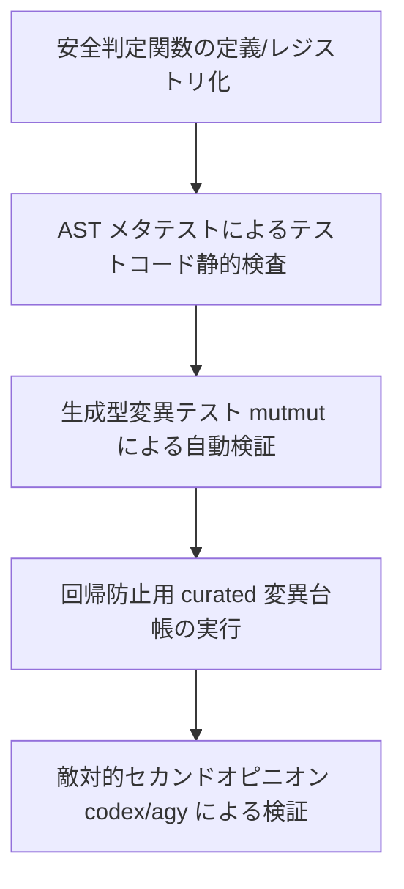

# antigravity（Gemini）による起票計画レビュー — 2026-08-25

ご提示いただいた起票計画（レビュー対象）について、[FLW-REV-030.md](file:///tmp/tmp.iy48j5Lyq6/BitzSkills/plugins/bitz-flow/.spec/reviews/FLW-REV-030.md)、[FLW-CON-008.md](file:///tmp/tmp.iy48j5Lyq6/BitzSkills/plugins/bitz-flow/.spec/requirements/FLW-CON-008.md)、[test_flow_design_completion_contract.py](file:///tmp/tmp.iy48j5Lyq6/BitzSkills/tests/test_flow_design_completion_contract.py)、[test_flow_m2_judgement_quality.py](file:///tmp/tmp.iy48j5Lyq6/BitzSkills/tests/test_flow_m2_judgement_quality.py) を精査・検証し、レビューを実施しました。

---

## 総合判定

**却下 (REJECT)**

### 判定の理由
本計画の中心となる前提「変異の義務が証拠能力の規約を機械的に包含する」は**論理的に成立しません**。そのため、この計画をそのまま実行しても **3 回連続で起きている失敗（確認方法の自己無効化・偽陽性テスト）を止めることはできません**。

---

## 疑ってほしい 7 点への詳細分析

### 1. 「変異の義務が証拠能力の規約を包含する」という主張の妥当性
* **結論**: **妥当ではない（包含しない）**。
* **理由**: 
  - テストが `assert OP._AUDIT_ACTIONS[...] == ...` のように内部定数を直接アサートしている場合、変異台帳に「内部定数の値を変更する変異」を登録すれば、このテストは**見事に失敗（変異を検出）**します。
  - テストがソースコードの文字列照合を行っている場合、変異台帳に「ソースコード文字列を変更する変異」を登録すれば、このテストは**見事に失敗（変異を検出）**します。
  - つまり、「変異を検出できるテストが存在する」ことは、「そのテストが公開 API / CLI 経路の振る舞いを検証している」ことの証明には一切なりません。内部定数照合やソース照合テストであっても変異を検出できてしまうため、変異の義務だけでは「非公開定数照合・テスト側再実装の排除」という証拠能力の規約を包含できません。

### 2. 変異台帳の記述主体と盲点の共有・順序再現
* **結論**: **同一次元（実装者＝テスト作成者＝変異台帳作成者）での運用では、盲点は解消されず順序も再現できない**。
* **理由**: 
  - [FLW-REV-030](file:///tmp/tmp.iy48j5Lyq6/BitzSkills/plugins/bitz-flow/.spec/reviews/FLW-REV-030.md) の P0（`verify_receipt` を壊してもパスする件や `UNSUPPORTED` の丸め込み件）は、開発者自身が「振る舞いを検査している」と信じ込んでいたために生じた盲点でした。
  - 実装者が変異台帳を書く場合、自分が理解している（＝自分のテストが落とせる）変異しか台帳に登録しません。外部レビュアー（Codex / Antigravity）が指摘したような「システム全体レベルでの未結合・意図しない丸め込み」という変異を発想・登録することは不可能です。結果として「自作テストを落とせる自作変異」を登録してセルフパスする構造が再現されます。

### 3. 「安全判定」の機械的定義と適用境界
* **結論**: **機械的定義が欠如しており、適用境界が不透明**。
* **理由**: 
  - [FLW-CON-008](file:///tmp/tmp.iy48j5Lyq6/BitzSkills/plugins/bitz-flow/.spec/requirements/FLW-CON-008.md) は `implements: [FLW-CON-008]` を宣言した設計文書という明確な収集規則を持ち、[test_flow_design_completion_contract.py](file:///tmp/tmp.iy48j5Lyq6/BitzSkills/tests/test_flow_design_completion_contract.py) で対象0件時に FAIL させる仕掛けまで備えています。
  - 一方、本要件の「安全判定を導入・変更するとき」という条件は定性的・主観的であり、どの関数・モジュールが対象かを AST やレジストリで自動判別できません。「これは安全判定ではない」という口実で変異台帳の登録を回避できる抜け道が残ります。

### 4. 検出テスト範囲の自己申告設計
* **結論**: **極めて危険であり、確実に儀式化・形骸化する**。
* **理由**: 
  - 変異 X に対して「テスト Y で検出する」とピンポイントで自己申告指定できる設計にすると、内部状態を直接アサートするだけの単位テスト Y を指定することで、簡単に runner をパスさせられます。
  - 変異テストの本質は「コードの変異に対して、既存のテストスイート全体のいずれかがそれを検知できるか」にあります。1対1のペアを自作自演で指定させる仕組みは、テストの偽陽性を隠蔽するインセンティブを与えます。

### 5. curated 変異台帳 vs 生成型変異テスト（mutmut / cosmic-ray 等）
* **結論**: **盲点検出能力において、手動 curated 台帳は生成型変異テストに圧倒的に劣る**。
* **理由**: 
  - [test_flow_m2_judgement_quality.py](file:///tmp/tmp.iy48j5Lyq6/BitzSkills/tests/test_flow_m2_judgement_quality.py) の問題（ロジックの `valid = True` 改変や条件分岐の丸め込みをテストが検出しない）は、対象モジュール（`flowlib`）に mutmut 等の生成型変異テストを当てていれば、手動で変異を書かなくても **Surviving Mutant（生存変異）** として一発で自動検出されていたはずです。
  - 手動 curated 台帳は「開発者が思いつく変異」しかテストできないため、未知の盲点を炙り出す目的には不向きです（過去のバグに対する回帰テスト目的としてのみ有用）。

### 6. 計画に欠けているステップ
1. **テストコードに対する静的解析（AST 検査）メタテストの導入**: 公開 API 未通過・内部定数直接参照・判定ロジック再実装をテストコードから検知するステップ。
2. **安全判定対象の明示的レジストリ化**: システム内のどの関数が対象かを全数定義するステップ。
3. **敵対的セカンドオピニオン（異種 AI / レビュアー）による変異攻撃ステップ**: 開発者が変異・テストを書いた後に、外部レビュアーが変異攻撃を行って確証するプロセスの組み込み。

### 7. 見積りの妥当性
* **結論**: **著しく過小評価（不適切）**。
* **理由**: 
  - 本質的な修正（AST によるテスト品質の機械検証、公開 API 経由への既存テスト全体の修正、変異テストの自動化）を行わずに「手動変異 runner と 2 変異の登録」だけで済ませる前提の見積もり（3〜3.5 session）です。これでは根本解決にならないため、見積もり自体が目的に見合っていません。

---

## Findings

### Finding 1 [P0 - CRITICAL]: 「変異の義務が証拠能力の規約を包含する」という核心前提の論理的破綻
* **問題**: 提案者は変異テストのパスを要求すれば、ソース照合や内部定数照合などの不適切なテストが自動排除できると仮定している。
* **なぜそう言えるか**: 内部定数照合テストであっても、その内部定数の値を変異させればテストは失敗する。したがって、変異検出条件を満たしても「公開 API / CLI 経路を正しく呼んでいるか」の保証にはならない。変異義務と証拠能力規約（公開 API 呼び出しの強制・内部状態照合の禁止）は独立して両方を機械強制する必要がある。

### Finding 2 [P0 - CRITICAL]: 同一開発者による変異台帳作成に伴う「盲点共有」と「セルフパスの構造化」
* **問題**: 実装者・テスト作成者・変異台帳作成者が同一であるため、開発者自身の認知の盲点をカバーできない。
* **なぜそう言えるか**: 開発者は自分が書いたテスト（内部定数アサート等）を落とせる変異だけを台帳に登録し、「変異テストが落ちたから PASS」と自己追認する。FLW-REV-030 で問題となったような外部レビュアーが指摘するレベルの判定抜け・丸め込みは台帳から抜け落ちる。

### Finding 3 [P1 - HIGH]: 変異検出テスト範囲の自己申告による検証の形骸化
* **問題**: 変異ごとに実行するテストファイルを自己申告させる設計が、不適切なテストとの1対1結合を許容する。
* **なぜそう言えるか**: 判定ロジックの変異がシステム全体（公開 CLI や他の統合テスト）にどう影響するかを検証せず、開発者が用意したピンポイントの単位テストのみを回して PASS 判定するため、偽陽性テストの隠蔽手段として悪用される。

### Finding 4 [P1 - HIGH]: 「安全判定」の機械的収集・検証規則の欠如
* **問題**: 要件 FLW-CON-009 の対象範囲である「安全判定」が定性的であり、コードベースから自動収集・検査できない。
* **なぜそう言えるか**: FLW-CON-008 のように `implements` タグ等で対象を動的収集し、0件の場合に FAIL させるような強固な機械検証を構築できないため、要件適用が形骸化する。

---

## 計画への具体的な修正案（Re-Design）

3 回連続の FAIL を確実に止めるため、以下の設計改訂を提案します。

### 1. 「証拠能力の規約」を AST メタテストで独立して機械強制する
「変異の義務」に依存せず、**テストコード自体の品質を静的解析（AST）で強制するメタテスト**（例: `tests/test_test_evidence_quality.py`）を新設する。
* **アサート条件**:
  - テスト内でモジュールのプライベート定数・内部変数（`_` で始まる識別子、例: `OP._AUDIT_ACTIONS`）を直接参照・比較していないこと。
  - テスト内で判定ロジックの再実装・ヘルパー複製を行っていないこと。
  - テストが必ず公開ファサードまたは CLI 経路（例: `cli.main`）の呼び出しを含んでいること。

### 2. 「安全判定」をレジストリ化（アノテーション化）する
* 対象を定性的な言葉で曖昧にせず、レジストリファイル（`safety_judgements.json`）またはコード上のデコレータ（`@safety_judgement`）で全数明示する。
* 検査スクリプトは、レジストリに登録されたすべての安全判定関数に対して、テストの存在と変異検証状況を調べる。

### 3. curated 台帳だけに頼らず生成型変異テスト（mutmut）を安全判定モジュールに当てる
* 手動の curated 変異台帳は「過去に発生した具体的な P0 バグ（`valid = True` 固定、`UNSUPPORTED` の `BLOCKED` 丸め込み等）」の**回帰防止用（Regression Mutants）** として保持する。
* 未知の盲点検知には、安全判定モジュール（`worktree_operability.py` 等）に絞って **mutmut（または差分 AST 変異スクリプト）** を実行し、Surviving Mutant（生き残った変異）が 0 件であることを CI / release_check で求める。

### 4. 自己申告テスト範囲を廃止し、モジュール単位テストスイートを実行する
* 「変異 A はテスト Y で検出する」という自己申告を廃止する。
* 変異を適用した際は、対象モジュールのテストスイート全体（例: `pytest tests/test_flow_m2_*.py`）を実行し、少なくとも 1 件以上のテストが FAIL することを確認する。

### 5. 敵対的セカンドオピニオン（Codex / AGY）の事前検証プロセス化
* 開発者がテストと変異を書いた後、**Design / Promotion Gate 提出前に、別種 AI エージェント（Codex / Antigravity）による敵対的変異攻撃（Adversarial Mutation Attack）を必須ステップとして実行**し、自己レビューの盲点をセカンドオピニオン段階で潰すフローを組み込む。
