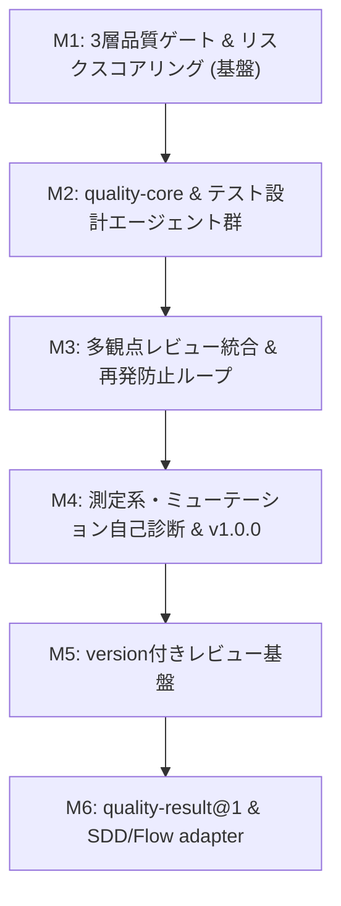

# bitz-quality ロードマップ

## 1. ビジョンと目的
「最速で最高の品質を自律的・再現性高く届ける品質管理＆多層ゲートエンジン」

1. **QAプロセスの自律オーケストレーション**: 専門エージェント分業によるテスト設計自動化。
2. **リスク駆動の品質関与**: 5軸スコアリングによる関与レベル（A/B/C）判定。
3. **3層品質判定**: 静的 × LLM × Hooks 向け判定材料による多層品質防御と再発防止ループ。
4. **測定系・検証履歴モデル**: 測定定義（分母・proxy・乖離条件）と時系列品質追跡。

`bitz-quality` は品質を評価する **QA provider** を責務とする。Git / PR を停止する強制は
`bitz-flow`、要件status・GatePassage・ReviewFinding・検証証跡のSSOTは `bitz-sdd` が所有し、
本プラグインはそれらを直接更新・代替しない。

## 2. マイルストーン計画

- **M1**: `quality-init`, `quality-doctor`, `quality-score`, `quality-gate`（静的S01〜S10・Hooks）
- **M2**: `quality-core`（セッション管理）、`quality-design`（影響・観点・ケース・データ）
- **M3**: `quality-review`（プロファイル別査読・`cause`/`general_rule` 再発防止蓄積）
- **M4**: `quality-measurand`（測定系モデル化、ミューテーションテスト、v1.0.0リリース。完了）
- **M5**: 論理Reviewer、platform adapter、review profile、個別結果・synthesis schema、validator
- **M6**: `quality-result@1`、`bitz-sdd` V4 adapter、`bitz-flow` V2 adapter

## 3. 次期統合マイルストーン（Design Gate通過・契約補強中）

1. **レビュー基盤契約** — `QLT-FR-017〜026`をapproved化。Discovery GateとDesign Gateは
   2026-08-14にGo（`QLT-GATE-001`）。`QLT-REV-003`はPASS。追加契約は`SI-QLT-002`と
   `QLT-FR-027〜030`で補強中、`QLT-REV-004`はPASS。補足Gate後に実装タスクへ進む。
2. **`quality-result@1`** — `target_sha`、判定、finding、measurand、規則・tool version、
   evidence digestを持つ閉集合JSON schemaを設計し、未知field・欠落・古いSHAを安全側に扱う。
3. **SDD adapter** — EARS要件ID・テストID・測定結果をV4の公開portへ渡す。
   検証判定は`sdd-test`、証跡は`.spec/verification/`、status遷移は`sdd-core`を正とする。
4. **Flow adapter** — `quality-result@1`をV2 dispatcherのPR/check operationへ入力する。
   qualityは`evaluate`、flowは`enforce`を所有し、生のGit/PR操作へfallbackしない。
5. **移行** — 現行の独自trace/reportは互換readerとして残し、二重書込みを行わない。
   3プラグインのcontract testとgreen/red/stale/unknownのcanary後に既定経路を切り替える。

順序は **bitz-flow V2 Promotion Gate → bitz-sdd V4公開port確定 → adapter実装** とする。
それまではV2/V4互換を表明せず、`planned / contract pending`として扱う。
