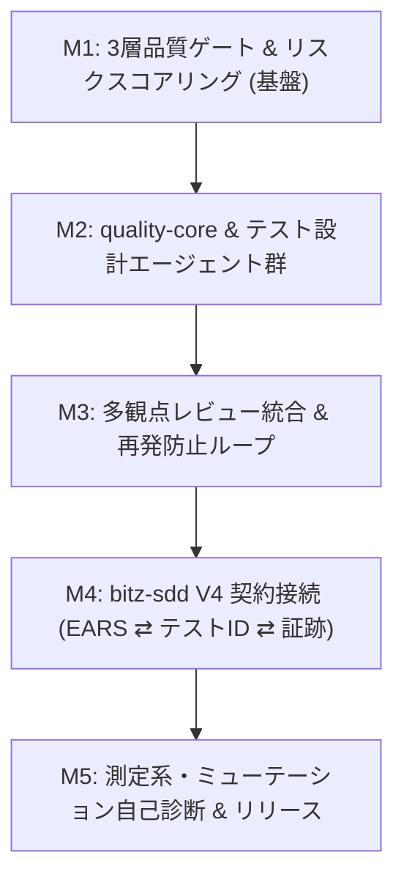

# bitz-quality ロードマップ

## 1. ビジョンと目的
「最速で最高の品質を自律的・再現性高く届ける品質管理＆多層ゲートエンジン」

1. **QAプロセスの自律オーケストレーション**: 専門エージェント分業によるテスト設計自動化。
2. **リスク駆動の品質関与**: 5軸スコアリングによる関与レベル（A/B/C）判定。
3. **3層品質ゲート**: 静的 × LLM × Hooks による多層品質防御と再発防止ループ。
4. **測定系・検証履歴モデル**: 測定定義（分母・proxy・乖離条件）と時系列品質追跡。

## 2. マイルストーン計画

- **M1**: `quality-init`, `quality-doctor`, `quality-score`, `quality-gate`（静的S01〜S10・Hooks）
- **M2**: `quality-core`（セッション管理）、`quality-design`（影響・観点・ケース・データ）
- **M3**: `quality-review`（プロファイル別査読・`cause`/`general_rule` 再発防止蓄積）
- **M4**: `bitz-sdd` V4 連携（3層トレーサビリティ、Design Gate 接続、PR受入判定）
- **M5**: `quality-measurand`（測定系モデル化、ミューテーションテスト、正式リリース）
