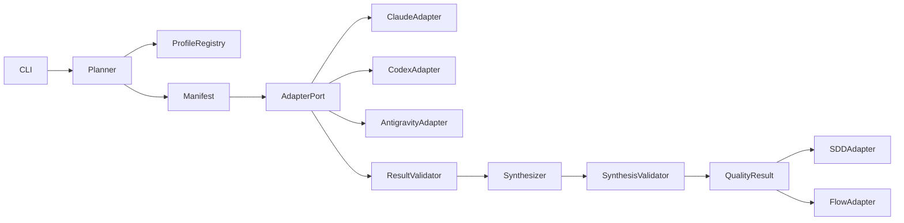

# アーキテクチャ

## Component view

coreはfilesystem/process/platformを直接知らずport越しに扱う。adapterのraw outputは監査領域へ隔離し、
会話・compact結果・canonical synthesisへ無検査で流さない。

## Execution view

1. Plannerがtarget/profileを凍結しmanifestを作る。
2. Adapterがreviewerを実行し、attemptごとのindividual resultを保存する。
3. Validatorがschema・target・参照を検査する。
4. Synthesizerがvalid resultだけを入力に重複排除・優先度・Gate規則を適用する。
5. Synthesis validatorが不変条件を検査し`quality-result@1`を発行する。
6. consumer adapterはread-only結果を各所有領域へ写像する。

## Deployment view

- 共通core/schema/profileは`skills/quality-review/`内で自己完結させる。
- Claude/Codex/Antigravityの物理agent定義はplatform別配布境界に置き、共通schemaを参照する。
- project overrideの正は`.spec/quality/review/`とし、base profileとのdigest・owner・versionをmanifestへ記録する。
- writeはrun世代ごとのimmutable directoryへ行い、全schema検証後にgeneration manifestをfsyncする。
  単一の`current` pointerだけを同一filesystem上でatomic replaceして公開線形化点とし、consumerは
  pointer経由だけを読む。pointer破損・欠落時はlast-known-goodを選び、孤立世代はquarantineする。

## 技術適合性

| 技術 | 判断 | 根拠 |
|---|---|---|
| Python 3.10+標準ライブラリ | Adopt | 既存quality/SDD資産と可搬性 |
| JSON Schema相当の手書きvalidator | Conditional | 外部依存なし。ただしschema定義との二重化をcontract testで防ぐ |
| platform固有agent frontmatter | Adapter only | 共通論理契約には採用しない |
| LLMによる最終Gate判定 | Reject | 機械不変条件と人間裁定を迂回するため |

## Security / operations

- prompt injectionをfinding/evidenceデータとして隔離し、命令として再実行しない。
- repository外write、secret読取、任意shellはadapter capabilityで既定拒否する。
- adapterはreviewer別作業領域とquotaを持ち、timeout時はprocess groupへgraceful cancel後、固定期限で
  強制終了する。任意ReviewerのattemptはBLOCKEDとして隔離し、run verdictはprofile decision tableへ委ねる。
- raw logはdefault-denyとし、明示opt-in主体、streaming redaction、最小権限、容量上限、TTL、削除監査を
  必須とする。redaction失敗時は保存せず、canonical成果物にはdigestと監査時刻だけを残す。
- 入力はschema versionで固定したcanonical bytesとpath/symlink規則でdigest化したsnapshotを渡し、
  adapter終了後にも再照合する。不一致は`STALE`として公開しない。adapterのread rootはsnapshotだけに閉じる。
