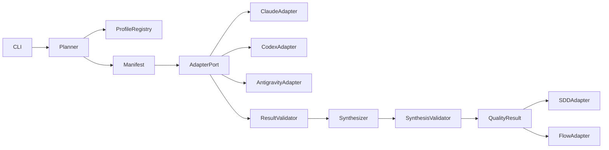

# アーキテクチャ

## Component view

coreはfilesystem/process/platformを直接知らずport越しに扱う。adapterのraw outputは監査領域へ隔離し、
会話・compact結果・canonical synthesisへ無検査で流さない。

## Execution view

1. Plannerがtarget/profileを凍結しmanifestを作る。
2. Adapterがreviewerを実行し、attemptごとのindividual resultを保存する。
3. Validatorがschema・target・参照を検査する。
4. Synthesizerがvalid resultだけを入力に重複排除・優先度・Gate規則を適用する。
5. Synthesis validatorが不変条件を検査し`quality-result@1`を発行する。
6. consumer adapterはread-only結果を各所有領域へ写像する。

## Deployment view

- 共通core/schema/profileは`skills/quality-review/`内で自己完結させる。
- Claude/Codex/Antigravityの物理agent定義はplatform別配布境界に置き、共通schemaを参照する。
- project overrideは`.spec/quality/review/`候補だが、物理配置はDesign Gateで確定する。
- writeはrun世代ごとのimmutable directoryへ行い、全schema検証後にcommit manifest/current pointerを
  一時ファイル→file/parent directory flush→atomic replaceする。workspace lock参加を必須とし、
  commit markerのない孤立世代はquarantineしてconsumerへ提示しない。

## 技術適合性

| 技術 | 判断 | 根拠 |
|---|---|---|
| Python 3.10+標準ライブラリ | Adopt | 既存quality/SDD資産と可搬性 |
| JSON Schema相当の手書きvalidator | Conditional | 外部依存なし。ただしschema定義との二重化をcontract testで防ぐ |
| platform固有agent frontmatter | Adapter only | 共通論理契約には採用しない |
| LLMによる最終Gate判定 | Reject | 機械不変条件と人間裁定を迂回するため |

## Security / operations

- prompt injectionをfinding/evidenceデータとして隔離し、命令として再実行しない。
- repository外write、secret読取、任意shellはadapter capabilityで既定拒否する。
- adapterはreviewer別作業領域とquotaを持ち、timeout時はprocess groupへgraceful cancel後、固定期限で
  強制終了する。時間・token・出力・ディスク・同時実行上限の超過は`BLOCKED`とする。
- raw logは既定非保存とし、必要時のみsecret redaction後に最小権限のquarantine領域へ期限付き保存する。
  canonical成果物にはraw log本文を含めずdigestと監査時刻だけを残す。
- 入力はschema versionで固定したcanonical bytesとpath/symlink規則でdigest化したsnapshotを渡し、
  adapter終了後にも再照合する。不一致は`STALE`として公開しない。
