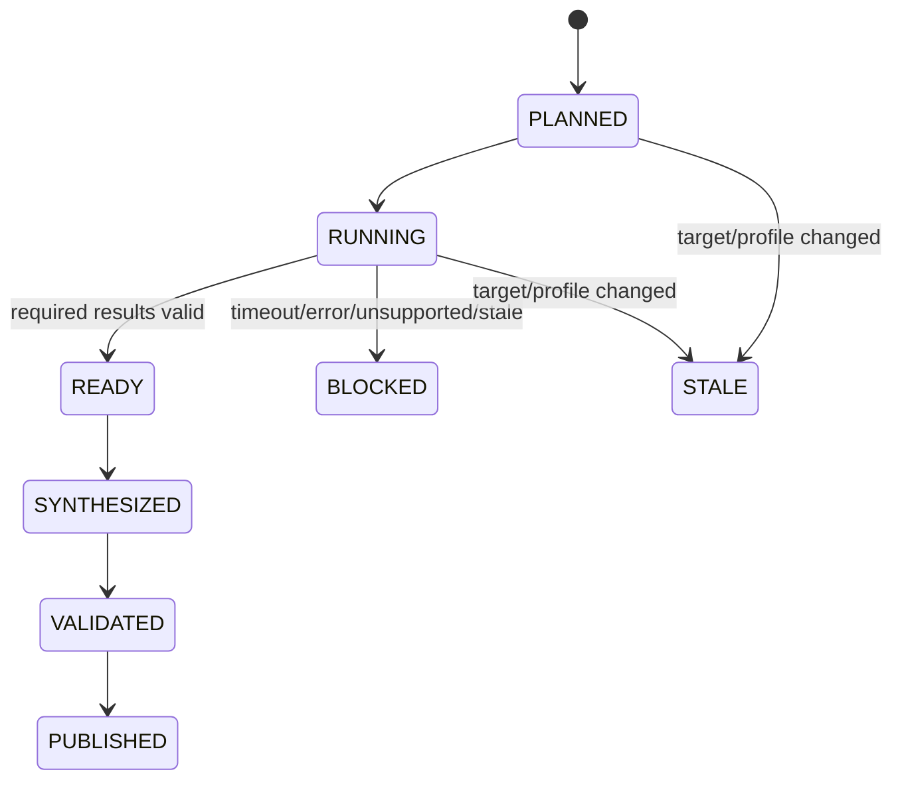

# ドメインモデル

## Bounded Context

| Context | 所有するもの | 所有しないもの |
|---|---|---|
| Review Definition | LogicalReviewer、Perspective、ReviewProfile | platform固有プロセス |
| Review Execution | InvocationManifest、IndividualResult、RunState | SDD status、PR副作用 |
| Review Synthesis | Finding、GatePrecondition、Synthesis | 人間のGate裁定 |
| Platform Adaptation | AdapterCapability、QualificationEvidence | 論理観点の意味 |
| Compatibility | LegacyMapping、ParityResult、MigrationStage | legacy成果物の破壊的変換 |

## Aggregateと不変条件

### ReviewRun

Aggregate rootは`ReviewRun(review_id)`。`InvocationManifest`でtarget/profileを凍結し、
必須`LogicalReviewer`ごとに高々1つのactive `IndividualResult`を持つ。

- target/profile digestが異なるresultを同じrunへ混在させない。
- 必須resultが成功集合に揃うまでPASS synthesisを作らない。
- retryはattemptを増やし、既存evidenceを上書きしない。
- attemptは単調増加する世代であり、単一writer lockまたはcompare-and-swapでactive遷移を直列化する。
- 取消済み・終了済みattemptの遅延結果はimmutable evidenceとして隔離し、active集合へ戻さない。

### ReviewSynthesis

- 入力result IDとdigestを完全列挙する。
- finding IDは`<REV-ID>:SYN-NNN`で一意。
- 未追跡P0/P1、assumed blocking GP、未応答blocking GPを含むPASSを禁止する。
- verdictは`PASS | CONDITIONAL_PASS | FAIL | BLOCKED`。`UNKNOWN`は実行結果codeでありGate通過判定ではない。

## 状態機械

`PUBLISHED`はquality成果物の公開であり、SDDのapproved/verifiedやFlowのmerge許可を意味しない。

## Published Language

| 用語 | 意味 |
|---|---|
| LogicalReviewer | platform非依存の役割・観点・入力・出力契約 |
| Adapter | LogicalReviewerをplatform固有実行へ写像する境界 |
| ReviewProfile | 必須/任意観点、条件、重み、Gate規則のversion付き集合 |
| IndividualReviewResult | 1 reviewer×1 attemptの検証可能な結果 |
| ReviewSynthesis | 重複排除・追跡・Gate規則適用後の統合結果 |
| Quality Result | consumerへ渡すread-only判定材料。外部statusを変更しない |
