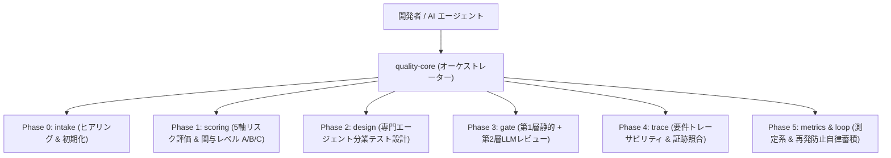

# bitz-quality プラグイン (v1.0.0)

実践的な多層QAプラクティス（専門サブエージェント分業・プール制QA・3層品質ゲート・再発防止自律蓄積ループ）と、BitzSDD 仕様駆動開発（EARSトレーサビリティ・測定系モデル）を統合した、AIエージェント向け包括的品質管理プラグインです。

---

## 1. 含まれるスキル一覧

| スキル名 | コマンド / スクリプト | 主な役割 |
|---|---|---|
| **[`quality-core`](file:///home/hide/BitzLabs/BitzSkills/plugins/bitz-quality/skills/quality-core/SKILL.md)** | `quality_session.py`<br>`quality_status.py` | QAプロセスの自律オーケストレーション、セッション管理、およびエージェント向け状態照会 |
| **[`quality-init`](file:///home/hide/BitzLabs/BitzSkills/plugins/bitz-quality/skills/quality-init/SKILL.md)** | `quality_init.py` | `.spec/quality/` ワークスペースおよび再発防止台帳の初期化 |
| **[`quality-doctor`](file:///home/hide/BitzLabs/BitzSkills/plugins/bitz-quality/skills/quality-doctor/SKILL.md)** | `quality_doctor.py` | 品質環境・ルール台帳・セッション健全性の読み取り専用診断 |
| **[`quality-score`](file:///home/hide/BitzLabs/BitzSkills/plugins/bitz-quality/skills/quality-score/SKILL.md)** | `quality_score.py` | 5軸リスクスコアリング（規模・セキュリティ・影響・難易度・習熟度）と関与レベル（A/B/C）判定 |
| **[`quality-gate`](file:///home/hide/BitzLabs/BitzSkills/plugins/bitz-quality/skills/quality-gate/SKILL.md)** | `quality_gate.py` | 第1層 静的チェック（S01〜S10: デバッグ文・シークレット検知・`--staged`） |
| **[`quality-design`](file:///home/hide/BitzLabs/BitzSkills/plugins/bitz-quality/skills/quality-design/SKILL.md)** | `quality_impact_analysis.py`<br>`quality_bug_analysis.py`<br>`quality_viewpoints.py`<br>`quality_cases.py` | 5つの専門サブエージェント（影響分析・不具合傾向・テスト観点一覧・具象ケース・境界値テストデータ生成） |
| **[`quality-review`](file:///home/hide/BitzLabs/BitzSkills/plugins/bitz-quality/skills/quality-review/SKILL.md)** | `quality_llm_review.py`<br>`quality_rule_extractor.py` | 第2層 LLM多観点レビュー（L01〜L11）と再発防止ルール（cause/general_rule）自律蓄積ループ |
| **[`quality-trace`](file:///home/hide/BitzLabs/BitzSkills/plugins/bitz-quality/skills/quality-trace/SKILL.md)** | `quality_trace.py` | EARS 要件 ⇄ 自動テスト ⇄ 証跡の双方向トレーサビリティ照合 |
| **[`quality-measurand`](file:///home/hide/BitzLabs/BitzSkills/plugins/bitz-quality/skills/quality-measurand/SKILL.md)** | `quality_measurand.py` | 統合品質メトリクス測定 & ミューテーション自己診断（人工欠陥注入テスト） |
| **[`quality-report`](file:///home/hide/BitzLabs/BitzSkills/plugins/bitz-quality/skills/quality-report/SKILL.md)** | `quality_report.py` | 人間向け総合品質報告書（ダッシュボード・多層ゲート・トレーサビリティ・再発防止統合）の自動生成 |

---

## 2. アーキテクチャ



---

## 3. クイックスタート

### 1. ワークスペース初期化
```bash
python3 plugins/bitz-quality/skills/quality-init/scripts/quality_init.py .
```

### 2. 環境健全性診断
```bash
python3 plugins/bitz-quality/skills/quality-doctor/scripts/quality_doctor.py .
```

### 3. リスクスコアリング
```bash
python3 plugins/bitz-quality/skills/quality-score/scripts/quality_score.py FEAT-001 --scale 2 --security 1 --blast-radius 2 --save
```

### 4. 影響分析 & テスト観点設計
```bash
python3 plugins/bitz-quality/skills/quality-design/scripts/quality_impact_analysis.py FEAT-001 . --save
python3 plugins/bitz-quality/skills/quality-design/scripts/quality_viewpoints.py FEAT-001 . --title "認証機能" --save
```

### 5. 静的ゲート & LLMレビュー
```bash
python3 plugins/bitz-quality/skills/quality-gate/scripts/quality_gate.py . --staged
python3 plugins/bitz-quality/skills/quality-review/scripts/quality_llm_review.py FEAT-001 . --save --auto-ledger
```

### 6. トレーサビリティ検証 & メトリクス集計
```bash
python3 plugins/bitz-quality/skills/quality-trace/scripts/quality_trace.py verify . --save
python3 plugins/bitz-quality/skills/quality-measurand/scripts/quality_measurand.py metrics . --save
```
