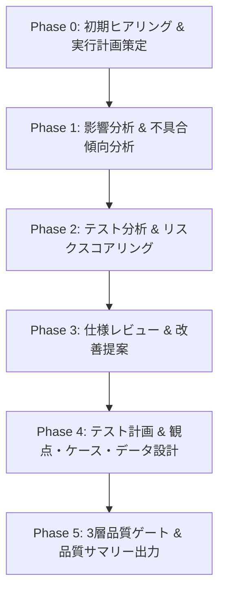

# quality-core

BitzQuality のメインスキルであり、QAプロセスの自律オーケストレーターです。
アルダグラム流の専門エージェント分業モデルに基づき、テスト分析からケース・データ設計までの各工程を統括します。

## 1. 責務と特徴

1. **プロセスの自律オーケストレーション**: ユーザーとの対話窓口となり、工程（Phase 0〜5）に応じた専門エージェントを裏で順次起動する。
2. **状態・成果物の永続化**: `.spec/quality/sessions/qa-session.json` に進捗、入力資料、生成成果物を記録し、中断・再開を可能にする。
3. **人間承認ゲート**: 各 Phase の境界で人間の確認・承認を挟み、AI による勝手な先走りを防ぐ。
4. **コンテキストの段階的蓄積**: 前段の成果物（影響分析・不具合分析等）を後段の設計エージェントへ正確に受け渡す。

## 2. 作業フロー（Phase構成）

| Phase | プロセス | AI（専門エージェント）の役割 | 人間の役割 | 主なアウトプット |
|---|---|---|---|---|
| **0** | **初期ヒアリング** | インプット資料の収集・ユースケース特定・実行計画策定 | 資料指定・計画承認 | `.spec/quality/sessions/qa-session.json` |
| **1** | **影響・不具合分析** | コード差分の影響範囲整理・過去の類似バグ傾向抽出 | 分析結果の確認 | `.spec/quality/analyses/impact-analysis.md` |
| **2** | **テスト分析 & スコア** | テストタイプ・スコープ選定・5軸リスク判定 | レベル（A/B/C）判定承認 | `.spec/quality/scorings/risk-score.md` |
| **3** | **仕様レビュー** | 仕様の曖昧箇所検出・境界値・異常系レビュー | 指摘への対応方針判断 | `.spec/reviews/spec-review.md` |
| **4** | **テスト設計** | テスト観点・テストケース・テストデータの自動設計 | テスト設計の承認 | `.spec/quality/viewpoints/`, `tests/` |
| **5** | **品質ゲート & 報告** | 3層ゲート（静的+LLM）検証・品質サマリー生成 | 最終受入・リリース判定 | `.spec/quality/reports/quality-summary.md` |

## 3. スキル連携・ルーティング

- **初期化**: 環境未整備時は `quality-init` を案内する。
- **環境診断**: トラブル発生時や前提確認は `quality-doctor` に委譲する。
- **リスク評価**: 施策単体のリスク判定は `quality-score` を実行する。
- **3層ゲート**: コミット/PR時の品質判定は `quality-gate` を呼び出す。
- **多観点レビュー**: 設計・コード・テストの査読は `quality-review` に委譲する。
- **仕様連携**: EARS 要件の検証合格（verified 昇格）は `sdd-test` / `sdd-core` に引き継ぐ。

## 4. 規律と禁止事項

- **直接ファイル破壊の禁止**: 既存のテストコードや仕様書を人間の承認なしに上書き・削除しない。
- **セッション情報の整合性**: 成果物を生成した際は必ず `qa-session.json` のステータスを更新する。
- **ゲートの自己承認禁止**: 各 Phase の承認は必ず人間が行い、エージェントが自ら承認を下さない。
