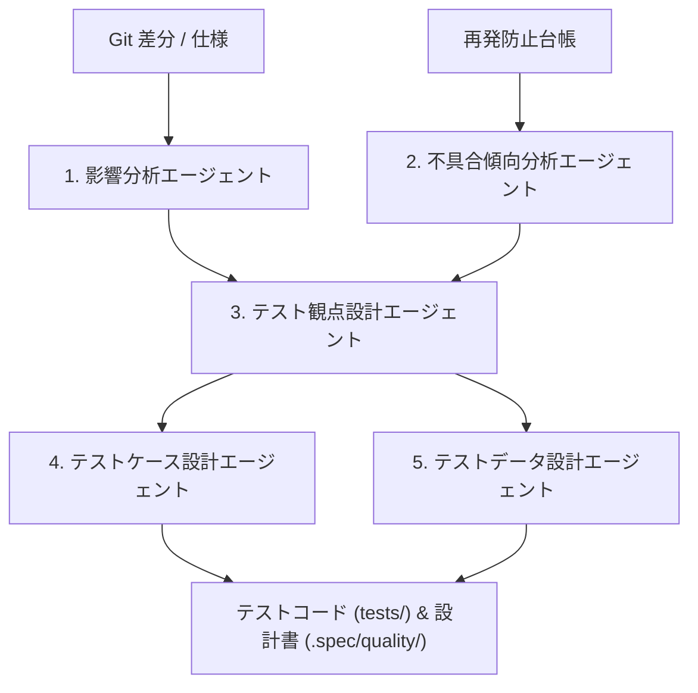

# quality-design

`quality-design` は、アルダグラム流の**5つの専門サブエージェント分業モデル**に基づき、テスト分析からケース・データ設計までのテスト設計工程を自動化するスキルです。

## 1. 専門サブエージェントの分業構成



| # | エージェント | 主な役割 | 生成物 |
|---|---|---|---|
| **1** | **影響分析エージェント** | Git差分から直接波及・間接波及・DB影響を抽出 | `.spec/quality/analyses/impact-<id>.md` |
| **2** | **不具合傾向分析エージェント** | 再発防止台帳から過去のバグ傾向と再発防止ルールを抽出 | `.spec/quality/analyses/bug-trend-<id>.md` |
| **3** | **テスト観点設計エージェント** | 機能・非機能・異常系・境界値・セキュリティ観点を網羅設計 | `.spec/quality/viewpoints/viewpoints-<id>.md` |
| **4** | **テストケース設計エージェント** | 各観点に対する具体的なテスト手順・期待結果を設計 | `tests/test_<feature>.py` スキャフォールド |
| **5** | **テストデータ設計エージェント** | 境界値・異常値・NULL値・長文・特殊文字データを生成 | テストフィクスチャ / モックデータ |

## 2. 実行手順

### 手順 1: 影響分析の実行
```bash
python3 <このスキル>/scripts/quality_impact_analysis.py FEAT-001 . --save
```

### 手順 2: 不具合傾向分析の実行
```bash
python3 <このスキル>/scripts/quality_bug_analysis.py FEAT-001 . --keywords "auth" "migration" --save
```

### 手順 3: テスト観点およびケースの生成
観点設計スクリプト（`quality_viewpoints.py`）を実行して観点一覧を出力し、テストコードを作成します。

## 3. 規律

- **コンテキストの引き継ぎ**: 影響分析と不具合分析の結果を必ずテスト観点設計へインプットすること。
- **再発防止ルールの網羅**: `rules-ledger.md` に記載された `cause` を再現する異常系ケースを必ずテストに含めること。
