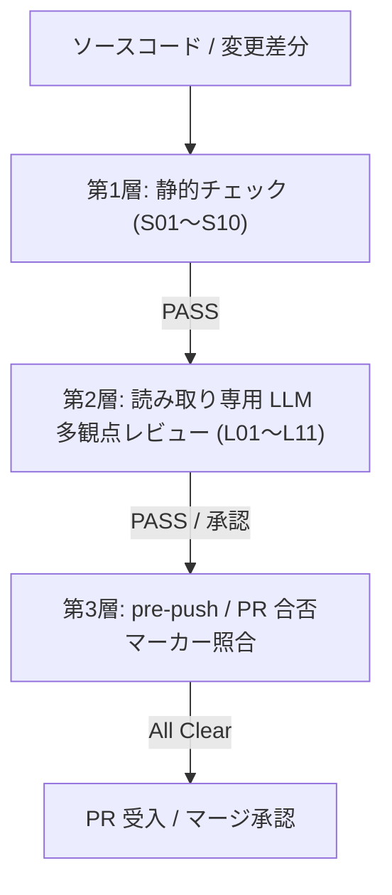

# quality-gate

`quality-gate` は、アルダグラム流の**3層品質ゲート**を強制し、コードおよび仕様の欠陥をコミット・PR・リリース前に確実にブロックするスキルです。

## 1. 3層ゲートの構造



## 2. チェック項目一覧

### 第1層: 静的チェック（S01〜S10）
- **S01**: 変更ファイル・差分の存在確認
- **S02**: 禁止デバッグ文（`console.log`, `debugger`, `pdb`）の残存チェック
- **S03**: APIキー・トークン・秘密鍵等のシークレット混入チェック
- **S04**: 型チェック・Lint・フォーマッタの実行と全件パス
- **S05**: プラグインマニフェスト・バージョン整合性チェック
- **S06**: frontmatter 必須フィールドの充足確認
- **S07**: コミットメッセージの Conventional Commits 準拠確認
- **S08**: 自動テストスイートの全件パス（回帰なし）
- **S09**: 再発防止ルール台帳（`rules-ledger.md`）の禁止規則との照合
- **S10**: 破壊的コマンド・不要ファイル混入の防止

### 第2層: 読み取り専用 LLM レビュー（L01〜L11）
- **L01**: 仕様合致性（EARS 要件・受入基準との一致）
- **L02**: 境界値・オフバイワン（0, 負数, 最大値, 空配列）
- **L03**: 異常系・エラーハンドリング（例外スロー, ロールバック）
- **L04**: セキュリティ・認可漏れ（SQLi, XSS, 権限バイパス）
- **L05**: パフォーマンス・N+1 クエリ問題
- **L06**: 冪等性・リトライ安全性
- **L07**: DBマイグレーション後方互換性（ダウンタイムなし・カラム削除手順）
- **L08**: 命名規則・コード可読性
- **L09**: テストケースの網羅性・検証充足度
- **L10**: 指摘事項に対する `cause`（原因）と `general_rule`（再発防止策）の明記
- **L11**: スコープ逸脱（YAGNI 違反・関係ないリファクタの混入）

## 3. 再発防止ルール自律蓄積ループ

LLM レビューで重大な指摘（Critical / High）が発生した場合、レビュアーは以下のフォーマットで指摘を出力します。

```markdown
### [指摘 L04] 認可チェックの欠落
- **発生要因 (cause)**: 管理者権限チェックをコントローラー層のみで行い、サービス層で未検証だった。
- **再発防止ルール (general_rule)**: 権限判定は必ずドメイン・サービス層で二重検証する。
```

抽出された `general_rule` は、`.spec/quality/rules/rules-ledger.md` へ追記され、次回以降のゲート検証に自動反映されます。

## 4. 実行手順

同梱スクリプト `<このスキル>/scripts/quality_gate.py` を実行して静的ゲートを検証します。

```bash
# 全ファイルの静的チェック
python3 <このスキル>/scripts/quality_gate.py .

# ステージングされた変更のみを対象とする場合
python3 <このスキル>/scripts/quality_gate.py --staged .
```
