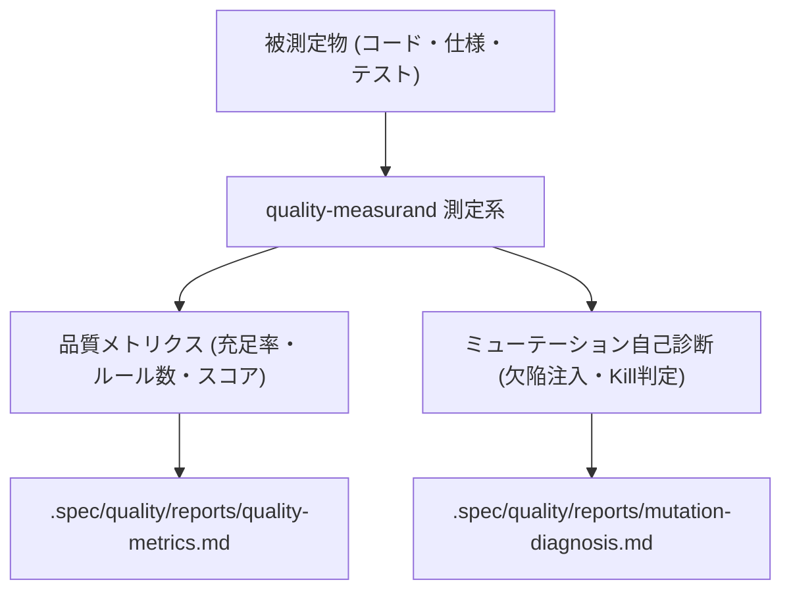

# quality-measurand

`quality-measurand` は、ソフトウェアの**品質測定系モデル**に基づき、客観的な品質メトリクス集計とテストスイート自身の検出力（ミューテーション自己診断）を測定するスキルです。

## 1. 測定系モデルの構成



## 2. 実行手順

### 手順 1: 品質メトリクスの測定・集計
```bash
python3 <このスキル>/scripts/quality_measurand.py metrics . --save
```

### 手順 2: ミューテーション自己診断の実行
```bash
python3 <このスキル>/scripts/quality_measurand.py mutate . --save
```

## 3. 規律

- **測定系の独立性**: 被測定対象の変更を伴わずに測定を実行し、客観的な数値（スコア・充足率）として記録すること。
- **テストの自己検証**: 静的ゲートおよびレビュー機能が欠陥を100%撃墜（Kill）できることを定期的に診断すること。
