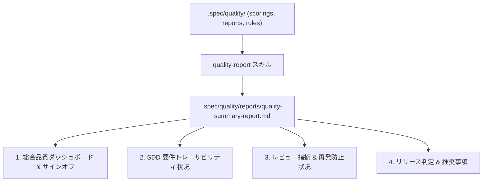

# quality-report

`quality-report` は、開発者・レビュアー・QAリードが PR レビューやリリース判断時に一目で品質状態を確認できる**総合品質報告書（Markdown）**を自動生成するスキルです。

## 1. 報告書の構成



## 2. 実行手順

### 手順 1: 総合品質報告書の生成・保存
```bash
python3 <このスキル>/scripts/quality_report.py . --save
```

## 3. 規律

- **完全性の担保**: 各品質モジュール（スコアリング・ゲート・レビュー・トレーサビリティ・ルール台帳）の最新結果を統合して出力すること。
- **サインオフ基準の明示**: 総合判定（PASS / CONDITIONAL / FAIL）とリリース可否の推奨判断を先頭に明記すること。
