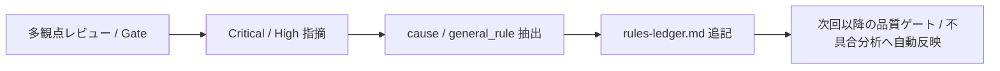

# quality-review

`quality-review` は、**再発防止自律蓄積ループ**を担うスキルです。
レビュー指摘や不具合から発生要因（`cause`）と再発防止ルール（`general_rule`）を抽出し、台帳へ永続化します。

## 1. 再発防止ループの構成



## 2. 実行手順

```bash
python3 <このスキル>/scripts/quality_rule_extractor.py R-102 . \
  --type "API" \
  --scope "endpoints/user" \
  --rule "レスポンスに機密情報（パスワードハッシュ等）を含めない" \
  --cause "シリアライザのフィールド除外設定漏れ"
```

## 3. 規律

- **cause と general_rule のペア必須**: 指摘に対する「なぜ起きたか」と「どう防ぐか」が明記されていないルールは登録しない。
- **次回ゲートへの自動フィードバック**: 登録されたルールは `quality-design`（不具合傾向分析）および `quality-gate`（静的チェック）のインプットとして直ちに機能する。
