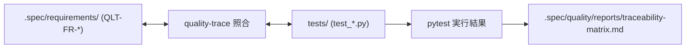

# quality-trace

`quality-trace` は、**要件定義（EARS）⇄ 自動テストコード ⇄ 検証証跡（Evidence）** の双方向トレーサビリティを自動照合・可視化するスキルです。

## 1. トレーサビリティ連携モデル



## 2. 実行手順

### 手順 1: トレーサビリティ照合の実行
```bash
python3 <このスキル>/scripts/quality_trace.py verify . --save
```

## 3. 規律

- **未カバー要件のゼロ化**: approved 状態の要件は必ず対応するユニットテストまたは結合テストで参照され、100% カバレッジを維持すること。
- **証跡の自動蓄積**: テスト実行結果はマトリクスレポートとして `.spec/quality/reports/` に永続化すること。
