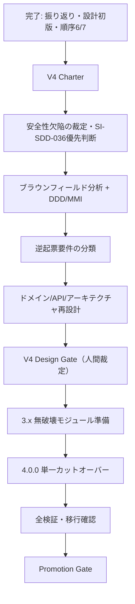

# bitz-sdd ROADMAP

sdd-core が定義する `.spec/` 構成のうち欠落していた成果物。SDD-REV-006 の GP-003 により新設。
**現況の集計は `spec_status.py` と `sdd_report.py` が持つ。本書は目的・順序・依存・ゲートだけを扱う**
（件数などの変動値を二重管理しない）。

> **本書の V4 部分は provisional（仮）である。**
> 2026-07-30 の対話で示された方向性を、追加検討の受け皿として先に構造化した。
> V4 のスコープ、設計、要件、実装順序、4.0.0 のリリースはいずれも未裁定であり、
> 本書への記載だけでは Design Gate 通過・要件承認・実装着手を意味しない。

## V4 の目的（仮）

V4 を単なる証跡 schema の破壊的変更ではなく、次の目的を一体で扱う
**ドメイン境界に沿ったモジュール再設計リリース**として検討する。

1. **きちんとした設計** — 既存3.xの実装を現状分析し、ドメインモデル・公開API・
   アーキテクチャを揃えてから変更する。
2. **責任範囲の明確化** — 仕様ライフサイクル、検証、上流と設計、実装オーケストレーション、
   ナラティブ同期、可視化、開発フローとの接続を境界づけ、所有する不変条件と公開言語を定める。
3. **スクリプトの整理・機能分割** — CLI、アプリケーション処理、ドメインポリシー、
   ファイル/Git等のアダプタを分離し、巨大CLIを薄い入口へ縮退できるかを設計・評価する。
4. **公開契約と内部実装の分離** — CLI引数、終了コード、JSON、frontmatter、
   verification evidence等の公開契約を明示し、内部リファクタリングで不用意に壊さない。
5. **一度の明確なV4カットオーバー** — V4に含める破壊的変更をDesign Gateで確定し、
   3.xで無破壊な準備を済ませた後、4.0.0でまとめて切り替える。

DDD は境界・語彙・不変条件・依存方向を明確にするために用いる。
EntityやRepository等のパターンを形式的に増やすことや、本格DDD手法を
bitz-sdd本体へ取り込むこと自体は目的にしない。

## V4で追加検討する設計テーマ（仮）

### 1. bitz-sdd / bitz-ddd共通のユビキタス言語

- 両プラグインで共有する概念は、**正式英語名・略称・正式日本語名**を一組で定義する。
- Markdownの説明本文は日本語を基本とし、英語名や略称だけで意味を推測させない。
- 用語ごとに日本語の定義、利用文脈、類似語との違い、許容表記・非推奨表記、
  使用例、所有ドメイン、status/versionを記録できる形を検討する。
- 専門用語には、初見の利用者向けの説明項目を設ける。
- 用語の正をどこに置き、bitz-sddとbitz-dddがどのPublished Languageで共有するかを
  V4ターゲット設計で確定する。

`WORK` は bitz-flow のWorkUnitやGit worktreeと混同する可能性がある。
Root Workspace / Component Workspace等を含め、正式名称と略称は用語設計で裁定し、
本書では確定前の呼称を公開契約として扱わない。

### 2. モノレポWorkspaceの責任分解

暫定的に、ルート側をRoot Workspace、担当機能側をComponent Workspaceと呼ぶ。

- **Root Workspace** — 全Workspaceのビジョン、共通用語、共通制約、Workspace台帳、
  依存関係、横断状態、レビューとPromotionを統合する。Component Workspace間の要望や
  変更を必ず仲介し、名前空間衝突・循環依存・共通契約からの逸脱を検出する。
- **Component Workspace** — 担当機能の管理者として、ローカルな要件・設計・タスク・
  テストと公開契約を所有する。共通契約の変更が必要な場合はRoot Workspaceへ提案し、
  他Component Workspaceと直接、正の契約を上書きしない。
- Root Workspaceは全ローカル仕様を直接所有せず、共通契約と調整規約によって統制する。
- Single WorkspaceからComponent Workspaceへ分割する条件として、責任境界、
  独立した変更・検証ライフサイクル、所有者と名前空間、公開契約、
  変更の局所性、非循環な依存を評価する。
- 下位Component Workspaceを許容するかは未裁定とする。V4の第一候補は
  Root → Componentの1階層だけを正式サポートし、将来拡張可能なデータモデルを検討する。
- モノレポからSingle Workspaceへ戻す変換はV4の対象外とし、必要性が生じた時点で別途検討する。

既存のSub → Rootエスカレーション、Root → Sub委託、Sub間の直接調整禁止という
star topologyとの互換性を確認し、責任分解をWorkspace Manifest、公開契約、
変更調整プロトコルとして機械検証できるかを評価する。

### 3. レビュー品質目標の引き上げ

- V4設計の品質目標は、`sdd-review`の総合スコア**4.5以上**とする案を評価する。
- 総合点だけで弱点を相殺しないため、各観点4.0以上、critical / major指摘0件、
  未追跡のP0/P1指摘0件をV4固有Gateの第一候補とする。
- `sdd-review`の多観点レビューに加えて、エージェントがシステムエンジニアとして
  全体整合、運用可能性、移行可能性、責任境界、過剰設計を判断する
  **System Engineering Review**を別プロファイルとして実施する。
- 現行`sdd-review`の全プロジェクト共通PASS基準を直ちに変更せず、
  まずV4固有のquality profileとして運用し、実測後に共通機能へ昇格するか裁定する。
- review profile、最低点、指摘の重要度、Gate判定、`ReviewFinding`への追跡を
  `sdd-review`へ追加すべきか検討する。

## 現在地

SDD-REV-006（2026-07-29、判定 **CONDITIONAL_PASS**）を起点とした設計後付けのうち、
順序6（GatePassage / ReviewFinding）と順序7（スクリプト呼び出し規約）は完了した。
現在は、従来の順序8へ直行せず、**V4の目的とターゲット設計を確定する前段階**にいる。

| GP | 条件 | 状態 |
|---|---|---|
| GP-001 | レビュー指摘の spec-issue 化を機械的に追跡する仕組み | satisfied（ReviewFinding を実装） |
| GP-002 | SDD-REV-004 の未消化指摘を spec-issue 化する | satisfied（SI-SDD-032） |
| GP-003 | Design 層の後付け | partial（domain-model / ROADMAP は存在。逆起票分類・V4設計は未完了） |
| GP-004 | Discovery を実体へ追随させる | satisfied |
| GP-005 | SDD ツール呼び出し規約の統一方針 | satisfied（CORE-CON-012 / 013） |

既存の `domain-model.md` は7つの境界づけられたコンテキストを提示しているが、
V4のモジュール配置、依存方向、公開CLI契約までは定義していない。
また、sdd-git はすでに bitz-flow への薄い委譲ポインタとなり、bitz-sdd は
`bitz-flow>=0.2` への依存を宣言済みであるため、「移管未確定」とする設計記述を
現在の実体へ追随させる必要がある。

## 完了済みの経緯

### フェーズ1 — 振り返りと上流の追随

1. **SDD-REV-006** — 多観点レビューで現状を成果物化。判定 CONDITIONAL_PASS
2. **Discovery 1.1** — 6成果物を実体へ追随（GP-004）
3. **ドメインストーリー**（SDD-DSN-006〜008）
4. **ドメインモデル初版**（SDD-DSN-009）— 7コンテキスト、集約、不変条件を導出
5. **Design Gate** — 2026-07-29 に6件を対話裁定

| # | 裁定点 | 裁定 | 追跡 |
|---|---|---|---|
| 1 | 検証判定の帰属 | **sdd-test へ移設** | SI-SDD-030 |
| 2 | `GatePassage` の導入 | **導入する** | SI-SDD-028（実装済み） |
| 3 | `ReviewFinding` の独立 | **独立させ `tracked_by` 必須** | SI-SDD-031（実装済み） |
| 4 | 集約分割 | **種別ごとに分割（段階的）** | V4ターゲット設計で具体化 |
| 5 | `manual-check` の扱い | **実施記録を証跡へ格上げ** | SI-SDD-029 |
| 6 | sdd-usecase の配置 | **「上流と設計」へ** | SI-SDD-013 |

### フェーズ2 — 独立した加法的改善

6. **GatePassage / ReviewFinding** — PR #138 / #140 で実装
7. **スクリプト呼び出し規約** — CORE-CON-012 / 013 と機械検査を導入

順序7で見送った `scripts/spec` の `REL` 一般化は、V4ターゲット設計において
新しい公開ツールが必要だと実証された場合だけ再検討する。`basis: assumed` のまま
先行実装しない。

## V4着手前の前提条件（仮）

### P0 — V4 Charter とスコープ裁定

- 本書の「V4の目的」を確認し、V4で解決する問題と解決しない問題を人間が裁定する。
- V4を「内部構造の再設計」と「破壊的な公開契約変更」のどこまで含めるかを定める。
- sdd-usecase（SI-SDD-013）のような新機能は、構造改善との混在を避けるため
  V4対象外とする案を第一候補とするが、未裁定として残す。
- V4の成功条件とNo-Go条件を、実装前に測定可能な形で定める。
- ユビキタス言語、Workspace責任分解、レビュー品質目標をV4の必須スコープ、
  準備項目、V4後の改善候補のいずれに置くか裁定する。

### P1 — 安全に設計を続けるための欠陥裁定

次のopen spec-issueを人間がaccept/rejectし、V4設計との順序を確定する。

| issue | 論点 | 暫定位置づけ |
|---|---|---|
| SI-SDD-032 | sdd_syncのmtime精度・mutation lock不参加 | データ損失防止。V4前または無破壊準備候補 |
| SI-SDD-033 | 共有作業ツリーの汚染経路 | 文書規律と機械強制を分離して裁定 |
| SI-SDD-034 | 完了済み系列とdraft系列併存時のフェーズ誤判定 | V4計画・状態表示の信頼性に関わる |
| SI-SDD-036 | design/stories走査漏れとfrontmatter非依存採番 | 設計成果物のID一意性に関わるため最優先候補 |

特にSI-SDD-036は、以後の設計成果物を安全に採番・検査する前提として、
V4の本格設計より先に解消する案を第一候補とする。

### P2 — 現行設計と実体の同期

- `domain-model.md` の bitz-flow / sdd-git 境界を現在の実体へ追随させる。
- 既存Design Gateの裁定と `domain-model.md` のstatusの関係を整理する。
- 本ROADMAP、Discovery、ドメインモデル間の保留事項・完了事項を一致させる。
- 現行3.xの公開契約と、内部実装上の偶発的な依存を区別する。

### P3 — ブラウンフィールド現状分析

`ddd-evaluate` の手法を用い、少なくとも次を `.spec/design/analysis/` と
`.spec/design/evaluation/` に成果物化する。

- スキル／スクリプト／Pythonモジュール一覧
- 関数・責務と7コンテキストの対応表
- import依存グラフ、fan-in / fan-out、循環の有無
- CLI、JSON、frontmatter、ファイルschema、終了コードの公開契約一覧
- DDD成熟度12基準の評価
- モジュール別MMI（凝集度・結合度・独立性・再利用性）
- quick winと構造改善の分類、および改善優先度

現時点で確認されている分割候補には、複数責務を持つ `spec_inspect.py`、
CLIから共有ライブラリとして参照されるfrontmatter・gate関連処理、
巨大なレポート生成処理、複製された表示語彙がある。
正式な分割案は上記評価を経てから確定する。

### P4 — 逆起票要件の分類

SDD-REV-006で特定した逆起票要件を、V4ターゲット設計の前に次へ分類する。

1. 維持すべき公開契約
2. 内部実装詳細を要件化したもの
3. 後継V4要件へ置き換えるもの
4. deprecated候補

従来の順序11から前倒しする。現行実装の偶発的構造をV4の要件として固定しないためである。

### P5 — V4ターゲット設計

少なくとも次の設計成果物を揃える。

- 更新版 `domain-model.md` — コンテキスト、所有する不変条件、Published Language
- 共通用語集 — 正式英語名、略称、正式日本語名、日本語定義、専門用語の説明
- Workspace責任モデル — Root / Componentの権限、委託、エスカレーション、分割条件
- Workspace Manifest / 依存契約 — 所有者、名前空間、公開契約、依存方向、検証範囲
- `architecture.md` — モジュール配置、レイヤ、依存方向、実行・配布ビュー
- `api-design.md` — CLI、終了コード、JSON、schema version、互換性
- V4 review quality profile — 4.5目標、観点別下限、指摘上限、SE Review、Gate接続
- モジュール分割表 — 現行関数から新しい所有モジュールへの対応
- 移行計画 — 3.xから4.0.0、固定版ドッグフーディング、bitz-ddd依存への波及
- rollback / downgrade条件 — lock・transaction・schemaを含む安全な戻し方

設計では、少なくとも次の層を分離できるか評価する。

1. **Domain policy** — artifact種別、ライフサイクル、Gate、検証判定等の不変条件
2. **Application use case** — inspect / status / scaffold / update / verify / sync / report
3. **Ports / adapters** — filesystem、Git、clock、process、atomic write
4. **CLI adapter** — argparse、標準出力、終了コード

### P6 — V4 Design Gate

- `sdd-review` による多観点レビューを実施する。
- V4固有quality profileとして、総合4.5以上、各観点4.0以上、
  critical / major指摘0件、未追跡P0/P1指摘0件を満たすか確認する。
- System Engineering Reviewを実施し、V4設計が全体として実装・運用・移行可能かを判定する。
- DDD/MMI評価の改善対象がターゲット設計へ反映されていることを確認する。
- 公開契約、移行、rollback、スキル自己完結性の未解決P0/P1を残さない。
- 人間がV4スコープと設計を裁定した後にのみ、V4要件をdraft起票・approveする。

## 仮の順序と依存

### フェーズ3 — V4準備（provisional）

8. **V4 Charter** — 目的、スコープ、非目標、成功条件を裁定
9. **安全性基盤** — open issueを裁定し、SI-SDD-036等の先行修正を判断
10. **ブラウンフィールド分析** — モジュール構造、DDD成熟度、MMI、公開契約を測定
11. **逆起票要件の分類** — 契約と実装詳細を分離
12. **V4ターゲット設計** — domain / API / architecture / migration / rollback
13. **V4 Design Gate** — 多観点レビューと人間裁定

### フェーズ4 — 3.xでの無破壊準備（provisional）

14. **characterization / golden testの固定** — 現行CLI、JSON、終了コード、生成ファイルを保護
15. **内部モジュール抽出** — 公開挙動を変えず、parser、query、policy、adapter等を分離
16. **薄いCLIへの段階的縮退** — 各PRを単独revert可能にし、mainを常に利用可能に保つ
17. **4.0.0 cutover readiness review** — 未完了transaction、互換表、移行手順、依存先を確認

### フェーズ5 — V4カットオーバー（provisional）

18. **証跡schemaと検証責務** — SI-SDD-029 / 030の裁定内容を実装
19. **artifact種別ごとのポリシー分割** — 従来の裁定4をターゲット設計どおり実装
20. **必要なCLI / JSON契約の切替** — V4対象として承認された破壊的変更を同時に反映
21. **4.0.0へ一括bump** — 3マニフェスト、marketplace、移行文書、依存検査を同一変更系列で更新

### フェーズ6 — 検収（provisional）

22. **全検証・移行確認** — characterization、V4要件、canonical inspect、
    release check、依存プラグイン、旧workspace fixtureを検証
23. **Promotion Gate** — GatePassageを作成し、未検分の代行遷移と裁定記録を人間が確認

## 今後の進め方と成果物への昇格

検討中は本ROADMAPを受け皿として継続できる。ただし、本書だけを正式な設計・契約の正にはしない。
候補、裁定、設計、検証可能な契約を次の順で分離する。

1. **ROADMAPへ仮登録** — 新しい案を目的、依存、未裁定論点として追記する。
   詳細定義や実装契約は持たせず、検討の入口と順序を保つ。
2. **V4 Charterを作成** — アイデア出しが一段落したら、目的、問題、設計原則、
   対象・対象外、成功条件、No-Go条件、未決事項をdraft成果物へ移す。
3. **設計基盤を安全化** — SI-SDD-036を先行裁定し、DSN IDの採番と再帰走査を
   信頼できる状態にしてから正式な設計成果物を増やす。
4. **テーマ別設計へ分離** — 共通用語集、Workspace責任モデル、公開契約、
   architecture / API、review quality profileをそれぞれの正へ記述する。
5. **重要判断を意思決定記録へ残す** — Workspaceの最大階層、用語集の所有者、
   4.5品質Gate、共有コードの配置、互換性等について、採用案、代替案、
   判断理由、影響範囲を1関心事単位で記録する。
6. **要望と要件へ変換** — 設計で判明した追加・変更はspec-issueへ起票し、
   人間裁定後に検証可能なEARS要件をdraft作成する。ROADMAPの記述を直接、
   approved要件として扱わない。
7. **Design Gate後に実装計画へ進む** — 多観点レビューとSystem Engineering Review、
   人間裁定を通過してからタスク分解、3.x無破壊準備、4.0.0切替へ進む。

成果物の責任分担は次を暫定原則とする。

| 成果物 | 責任 |
|---|---|
| `ROADMAP.md` | 目的、順序、依存、ゲート、未裁定論点 |
| V4 Charter | 問題、スコープ、非目標、設計原則、成功・No-Go条件 |
| 共通用語集 / ドメイン・Workspace設計 | 正式な語彙、責任境界、不変条件、Published Language |
| architecture / API / migration | 構造、依存方向、公開契約、移行・rollback |
| review quality profile | 採点基準、最低品質、SE Review、Gate条件 |
| 意思決定記録 | 裁定、代替案、理由、影響 |
| spec-issue / requirements | 変更提案と、人間が承認する検証可能な契約 |

`STATE.md`はブランチローカルの短命な作業メモに限り、V4の長期的な判断根拠を置かない。

## 従来順序との対応

| 従来順序 | 扱い |
|---|---|
| 6 GatePassage / ReviewFinding | 完了 |
| 7 呼び出し規約 | 完了 |
| 8 証跡schema・判定移設 | V4ターゲット設計と単一カットオーバーへ分割して統合 |
| 9 集約分割 | 4.0.0後の追加破壊を避けるため、V4ターゲット設計と単一カットオーバーへ統合 |
| 10 mtime・mutation lock | open issue裁定後、安全性基盤または3.x無破壊準備へ配置 |
| 11 逆起票要件分類 | V4設計の入力とするため前倒し |
| 12 Promotion Gate | V4検収の最終段へ維持 |

## 未裁定の設計論点

以下は本ROADMAP更新では決めない。現状分析と選択肢比較を添えてDesign Gateで裁定する。

1. **配布単位** — スキル単体の自己完結性を維持しながら、共有Pythonコードをどこに置くか。
2. **検証境界** — semanticな判定をsdd-testへ移した後、sdd-coreのcanonical inspectと
   どの公開契約で接続するか。
3. **共有語彙の正** — frontmatter parser、status、domain、schema等をどこが所有するか。
4. **CLI公開範囲** — `scripts/spec` が公開するツール集合と、直接実行ツールの境界。
5. **互換性** — 旧CLI、旧JSON、旧証跡schemaをどこまで読み取り互換として残すか。
6. **sdd-usecase** — V4へ含めるか、V4後の独立featureとするか。
7. **SI-SDD-032 / 034 / 036の順序** — V4前修正、3.x準備、V4同梱のどれに置くか。
8. **モジュール分割粒度** — コンテキスト、スキル、Python packageの境界を一致させるか。
9. **V4の出荷単位** — 4.0.0切替を1PRにまとめるか、非公開の統合手段を設けるか。
10. **用語集の所有権** — bitz-sdd / bitz-dddのどちらが正を持ち、どう同期・検証するか。
11. **Workspaceの正式名称と略称** — WORKとの呼称衝突を避け、英語・略称・日本語をどう定めるか。
12. **Workspaceの最大階層** — V4はRoot → Componentの1階層に限定するか。
13. **Workspace分割判定** — どの条件を必須とし、誰が分割・統合を裁定するか。
14. **Workspace間変更プロトコル** — Published Language変更、依存更新、横断issueをどう交通整理するか。
15. **レビュー4.5の適用範囲** — V4固有Gate、bitz-sdd全体、全プラグイン共通のどこまで適用するか。
16. **System Engineering Reviewの実装形態** — review profile、独立成果物、共通観点追加のどれにするか。

## バージョン・リリース方針（仮）

- **V4 Design Gateを通るまで4.0.0へbumpしない。**
- 3.xでは公開契約を壊さない準備、テスト固定、内部抽出だけを行う。
- V4に含める破壊的変更は4.0.0の単一カットオーバーまでに揃える。
- 4.0.0公開後に別の破壊的変更を順次加えない。必要ならV4スコープへ戻すか、将来majorへ送る。
- marketplaceは `"source": "./plugins/bitz-sdd"` でmainへのマージが即配布になるため、
  各準備PRは単独で利用可能・検証可能・revert可能な状態を保つ。
- 4.0.0切替PRは、3マニフェスト、依存制約、移行文書、検証結果を一体で扱う。

## 保全する資産と制約

- **verified / promoted済み要件を作り直さない。** V4設計との照合・分類・後継化で扱う。
- Discovery成果物は破棄せず、実体とのドリフトだけを改訂する。
- `.spec` SSOT、権限分離、検証中心、履歴保持の原則を維持する。
- stdlib中心、オフライン動作、スキル単体コピー時の自己完結性を設計制約として評価する。
- bitz-flowはGit/GitHub運用の正、bitz-dddは本格DDD手法の正、bitz-envは環境展開の正とする。
- 新しい機能追加と構造再設計を無条件に同じV4スコープへ混ぜない。

## V4実装着手のReady条件（仮）

- [ ] V4 Charterが人間裁定済み
- [ ] open spec-issueの採否と順序が裁定済み
- [ ] SI-SDD-036により設計成果物の走査・採番を信頼できる、または同等の先行対策がある
- [ ] ブラウンフィールド分析とDDD/MMI評価が完了
- [ ] 逆起票要件の分類が完了
- [ ] domain-model / api-design / architecture / migration / rollbackが揃っている
- [ ] 共通用語集とWorkspace責任モデルが揃い、bitz-sdd / bitz-ddd間のPublished Languageが明確
- [ ] Workspace階層、分割条件、委託・エスカレーション、変更調整手順が裁定済み
- [ ] 公開契約の互換表とcharacterization test計画がある
- [ ] V4 review quality profileが裁定済み
- [ ] sdd-reviewがV4品質目標を満たし、System Engineering ReviewがPASS
- [ ] 人間がV4 Design Gateを通過させている

## V4完了条件（仮）

- [ ] V4で承認した破壊的変更が4.0.0に集約されている
- [ ] CLIが薄いadapterとなり、ドメインポリシーが独立してテスト可能
- [ ] コンテキスト間の依存方向とPublished Languageが設計・コード・テストで一致
- [ ] Root / Component Workspaceの責任と変更調整が機械検証またはテストで確認できる
- [ ] bitz-sdd / bitz-dddの正式英語名・略称・正式日本語名と日本語説明が一致
- [ ] 旧3.x workspaceの移行fixtureがgreen
- [ ] bitz-ddd / bitz-flowとの依存・接続検査がgreen
- [ ] canonical spec inspectとrelease checkがgreen
- [ ] rollback / downgrade条件が実測済み
- [ ] Promotion Gateで裁定記録と代行遷移を人間が検分済み
