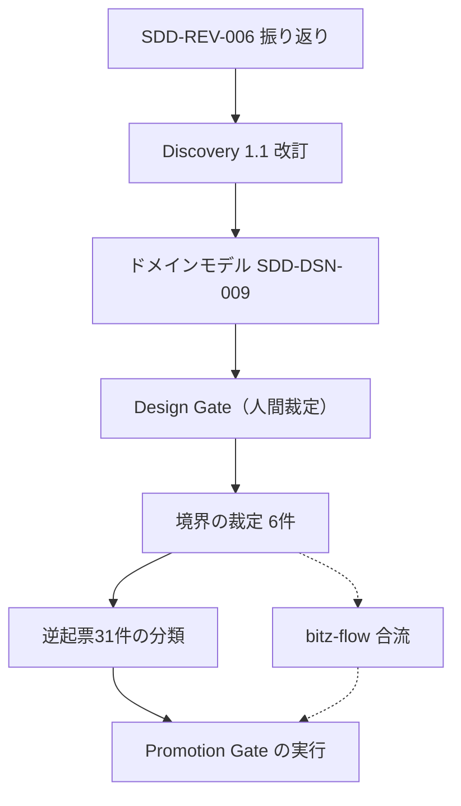

# bitz-sdd ROADMAP

sdd-core が定義する `.spec/` 構成のうち欠落していた成果物。SDD-REV-006 の GP-003 により新設。
**現況の集計は `spec_status.py` と `sdd_report.py` が持つ。本書は順序と依存だけを扱う**
（数値を二重管理しない）。

## 現在地

SDD-REV-006（2026-07-29、判定 **CONDITIONAL_PASS**）の Gate 前提条件を消化中。
消化するまで Design Gate を通さない。

| GP | 条件 | 状態 |
|---|---|---|
| GP-001 | レビュー指摘の spec-issue 化を機械的に追跡する仕組み | **Gate で裁定済**（裁定3）→ 実装は順序7 |
| GP-002 | SDD-REV-004 の未消化指摘を spec-issue 化する | satisfied |
| GP-003 | Design 層の後付け（domain-model / ROADMAP / 逆起票31件の分類） | partial（分類は順序11） |
| GP-004 | Discovery を実体へ追随させる | satisfied |
| GP-005 | SDD ツール呼び出し規約の統一方針 | **Gate の帰結として前提条件化**（裁定1）→ 順序6 |

> **前提条件の定義に誤りがあった**: SDD-REV-006 は「GP-001〜005 の消化前に Design Gate を
> 通さない」と書いたが、GP-001 と GP-005 は **Gate の前に済ませるものではなく Gate で
> 決めること**だった（裁定3 が GP-001 の答え、裁定1 が GP-005 を前提条件へ引き上げた）。
> 「Gate 通過前に消化する条件」と「Gate で決める論点」を区別していなかった。
> この区別は裁定3（ReviewFinding の設計）で扱う。

## 順序と依存

### フェーズ1 — 振り返りと上流の追随（完了）

1. **SDD-REV-006** — 多観点レビューで現状を成果物化。判定 CONDITIONAL_PASS
2. **Discovery 1.1** — 6成果物を実体へ追随（GP-004）

### フェーズ2 — 設計層の確立（進行中）

3. **ドメインストーリー**（SDD-DSN-006〜008）— P1 × J1 / P1 × J2 / P3 × J1・J4
4. **ドメインモデル**（SDD-DSN-009）— 7つの境界づけられたコンテキスト、集約と不変条件
5. **Design Gate** — 2026-07-29 に**対話裁定で6件すべて裁定済み**。
   裁定記録は `.spec/reports/decision-2026-07-29-design-gate.md`

| # | 裁定点 | 裁定 | 追跡 |
|---|---|---|---|
| 1 | 検証判定の帰属 | **sdd-test へ移設** | SI-SDD-030 |
| 2 | `GatePassage` の導入 | **導入する** | SI-SDD-028 |
| 3 | `ReviewFinding` の独立 | **独立させ `tracked_by` 必須** | SI-SDD-031 |
| 4 | 集約分割 | **種別ごとに分割（段階的）** | — |
| 5 | `manual-check` の扱い | **実施記録を証跡へ格上げ** | SI-SDD-029 |
| 6 | sdd-usecase の配置 | **「上流と設計」へ** | SI-SDD-013 |

### フェーズ3 — 裁定の実装（依存順）

裁定1が SI-CORE-038 を実装前提へ引き上げたため、呼び出し規約の統一が先行する。

| 順 | 内容 | 性質 |
|---|---|---|
| 6 | **SI-CORE-038** ラッパーの任意ツール対応 | 加法的。裁定1の前提 |
| 7 | **裁定2 GatePassage** / **裁定3 ReviewFinding**（並行可） | 加法的 |
| 8 | **裁定1 + 裁定5** 証跡 schema 拡張と判定移設 | 破壊的（証跡 schema） |
| 9 | **裁定4** 集約分割 | 破壊的（CLI 契約） |
| 10 | **SI-SDD-032** mtime 精度・mutation lock 不参加 | 独立して実施可 |
| 11 | **逆起票31件の分類**（GP-003 の後半） | 境界確定後に照合 |

### フェーズ4 — 検収

12. **Promotion Gate の実行** — 63件の verified を promoted へ。
    代行遷移の裁定記録を人間が辿る。これが「設計に落ちた」ことの唯一の機械的な検収。
    **裁定2 の `GatePassage` が前提**

### 保留（bitz-flow の設計完了後に合わせる）

- **sdd-git の bitz-flow への移管**と、bitz-sdd ↔ bitz-flow の依存境界の粒度
  （discovery/scope.md の Open Question / SI-CORE-010）
- 並行開発規律の機械強制（SI-SDD-033 の提案4）— 移管後に強制層の所有者が変わるため、
  いま bitz-sdd 側へ実装すると二重管理になる

## 方針

- **63件の verified を書き直さない** — 機械検証とトレースが付いた資産であり、
  作り直せばトレーサビリティがゼロに戻る。設計の後付けは置き換えではなく**照合**として行う
- **破壊的変更は許容**（人間裁定 2026-07-29）。ただし公開契約を壊す場合は、
  bitz-ddd の `bitz-sdd>=2.0` 依存と、本リポジトリが bitz-sdd を固定版で消費している事実への
  波及を移行計画として明示する
- **本格 DDD 手法は bitz-ddd の責務**（discovery/scope.md の Won't）。
  bitz-sdd 自身の設計方針は軽量デフォルトのまま変えない。bitz-ddd はモデリングの道具として使う
