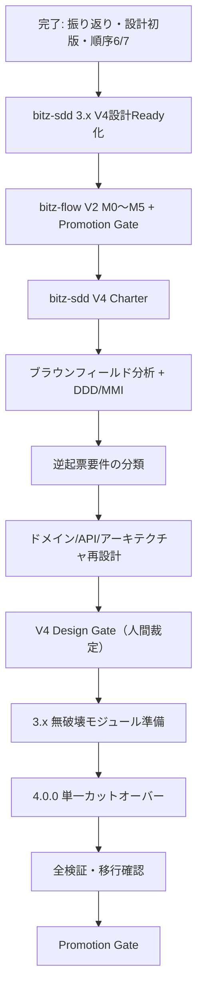

# bitz-sdd ROADMAP

sdd-core が定義する `.spec/` 構成のうち欠落していた成果物。SDD-REV-006 の GP-003 により新設。
**現況の集計は `spec_status.py` と `sdd_report.py` が持つ。本書は目的・順序・依存・ゲートだけを扱う**
（件数などの変動値を二重管理しない）。

> **本書の V4 部分は provisional（仮）である。**
> 2026-07-30 の対話で示された方向性を、追加検討の受け皿として先に構造化した。
> V4 のスコープ、設計、要件、実装順序、4.0.0 のリリースはいずれも未裁定であり、
> 本書への記載だけでは Design Gate 通過・要件承認・実装着手を意味しない。

## V4 の目的（仮）

V4 を単なる証跡 schema の破壊的変更ではなく、次の目的を一体で扱う
**ドメイン境界に沿ったモジュール再設計リリース**として検討する。

1. **きちんとした設計** — 既存3.xの実装を現状分析し、ドメインモデル・公開API・
   アーキテクチャを揃えてから変更する。
2. **責任範囲の明確化** — 仕様ライフサイクル、検証、上流と設計、実装オーケストレーション、
   ナラティブ同期、可視化、開発フローとの接続を境界づけ、所有する不変条件と公開言語を定める。
3. **スクリプトの整理・機能分割** — CLI、アプリケーション処理、ドメインポリシー、
   ファイル/Git等のアダプタを分離し、巨大CLIを薄い入口へ縮退できるかを設計・評価する。
4. **公開契約と内部実装の分離** — CLI引数、終了コード、JSON、frontmatter、
   verification evidence等の公開契約を明示し、内部リファクタリングで不用意に壊さない。
5. **一度の明確なV4カットオーバー** — V4に含める破壊的変更をDesign Gateで確定し、
   3.xで無破壊な準備を済ませた後、4.0.0でまとめて切り替える。

DDD は境界・語彙・不変条件・依存方向を明確にするために用いる。
EntityやRepository等のパターンを形式的に増やすことや、本格DDD手法を
bitz-sdd本体へ取り込むこと自体は目的にしない。

## V4で追加検討する設計テーマ（仮）

### 1. bitz-sdd / bitz-ddd共通のユビキタス言語

- 両プラグインで共有する概念は、**正式英語名・略称・正式日本語名**を一組で定義する。
- Markdownの説明本文は日本語を基本とし、英語名や略称だけで意味を推測させない。
- 用語ごとに日本語の定義、利用文脈、類似語との違い、許容表記・非推奨表記、
  使用例、所有ドメイン、status/versionを記録できる形を検討する。
- 専門用語には、初見の利用者向けの説明項目を設ける。
- 用語の正をどこに置き、bitz-sddとbitz-dddがどのPublished Languageで共有するかを
  V4ターゲット設計で確定する。

`WORK` は bitz-flow のWorkUnitやGit worktreeと混同する可能性がある。
Root Workspace / Component Workspace等を含め、正式名称と略称は用語設計で裁定し、
本書では確定前の呼称を公開契約として扱わない。

### 2. モノレポWorkspaceの責任分解

暫定的に、ルート側をRoot Workspace、担当機能側をComponent Workspaceと呼ぶ。

- **Root Workspace** — 全Workspaceのビジョン、共通用語、共通制約、Workspace台帳、
  依存関係、横断状態、レビューとPromotionを統合する。Component Workspace間の要望や
  変更を必ず仲介し、名前空間衝突・循環依存・共通契約からの逸脱を検出する。
- **Component Workspace** — 担当機能の管理者として、ローカルな要件・設計・タスク・
  テストと公開契約を所有する。共通契約の変更が必要な場合はRoot Workspaceへ提案し、
  他Component Workspaceと直接、正の契約を上書きしない。
- Root Workspaceは全ローカル仕様を直接所有せず、共通契約と調整規約によって統制する。
- Single WorkspaceからComponent Workspaceへ分割する条件として、責任境界、
  独立した変更・検証ライフサイクル、所有者と名前空間、公開契約、
  変更の局所性、非循環な依存を評価する。
- 下位Component Workspaceを許容するかは未裁定とする。V4の第一候補は
  Root → Componentの1階層だけを正式サポートし、将来拡張可能なデータモデルを検討する。
- モノレポからSingle Workspaceへ戻す変換はV4の対象外とし、必要性が生じた時点で別途検討する。

既存のSub → Rootエスカレーション、Root → Sub委託、Sub間の直接調整禁止という
star topologyとの互換性を確認し、責任分解をWorkspace Manifest、公開契約、
変更調整プロトコルとして機械検証できるかを評価する。

### 3. レビュー品質目標の引き上げ

- V4設計の品質目標は、`sdd-review`の総合スコア**4.5以上**とする案を評価する。
- 総合点だけで弱点を相殺しないため、各観点4.0以上、critical / major指摘0件、
  未追跡のP0/P1指摘0件をV4固有Gateの第一候補とする。
- `sdd-review`の多観点レビューに加えて、エージェントがシステムエンジニアとして
  全体整合、運用可能性、移行可能性、責任境界、過剰設計を判断する
  **System Engineering Review**を別プロファイルとして実施する。
- 現行`sdd-review`の全プロジェクト共通PASS基準を直ちに変更せず、
  まずV4固有のquality profileとして運用し、実測後に共通機能へ昇格するか裁定する。
- **水準の引き上げと観点の追加を別の判断として扱う（2026-08-07 追加。テーマ13）。**
  bitz-flow の `FLW-REV-002` は総合 **4.74**（判定PASS）で `FLW-DSN-014` を通したが、
  その設計には初回ラウンドから達成不能な出口条件と未定義のmeasurandが含まれていた。
  **4.74は本テーマが案とする4.5を超えており、閾値の引き上げでは本件を捕捉できない。**
  テーマ13のCが提案する`measurability`観点の追加を、水準引き上げと並行して評価する。
- review profile、最低点、指摘の重要度、Gate判定、`ReviewFinding`への追跡を
  `sdd-review`へ追加すべきか検討する。

### 4. `sdd-git`の廃止とbitz-flow V2への直接接続

V4では、Git / GitHub実行の正をbitz-flow V2の`flow-core`へ完全に一本化し、
実行機能を持たない委譲ポインタ`sdd-git`を廃止する案を第一候補とする。
名前だけを変えた後継ポインタスキルは作らない。

| 責任 | V4の所有候補 |
|---|---|
| Git、worktree、branch、commit、Issue、PR、release、cleanup / discard | bitz-flow `flow-core` |
| `.spec`のSSOT、権限、status、Gate、target SHAと採番の整合 | `sdd-core` |
| `implements` / `depends_on` / `boundary`、並列投入、コミットtraceの意味 | `sdd-implement` |
| spec-issueとGitHub Issueを接続する判断、SDD側URL記録 | `sdd-issue` |
| taskとIssue / PRを接続する判断、SDD側URL記録 | `sdd-implement` |
| GitHub側のmarker、URL、Issue / PR操作、リンク照合 | bitz-flow `flow-core` |
| 失敗原因を仕様へ戻す判断 | `sdd-core`のfailure protocol |
| 失敗worktreeの保全と、明示判断後のdiscard | bitz-flow `flow-core` |

`sdd-core`へ残すのはGit操作手順ではなく、次のSDD統合契約に限定する。

- Git / GitHub操作はbitz-flow `flow-core`へ直接委譲する。
- bitz-flowは`.spec`の本文・status・人間裁定を変更しない。
- SDD側が渡すspec-issue / requirement / task ID、URL、期待状態の意味を定める。
- 並列時の`spec_inspect --check-only`、target SHA鮮度、採番・status変更の直列化を定める。
- bitz-flowの結果をどのSDD成果物へ記録し、どの失敗をspec-issueへ戻すかを定める。

完全廃止は、従来の「縮退維持・完全廃止しない」という`CORE-FR-016`の人間裁定を変更する
破壊的変更である。V4の後継要件と意思決定記録を作り、3.xではdeprecated入口として残した後、
4.0.0で削除する段階移行を候補とする。

既存の逆起票要件はV4設計で次のように分類する。

- `SDD-FR-080` — worktree隔離の実行責任はbitz-flowへ移し、SDD側には並列投入条件だけを残す。
- `SDD-FR-081` — `Implements:`の意味規約は`sdd-implement`、書式検査とcommit操作はbitz-flowへ分ける。
- `SDD-FR-082` — 「失敗時に直ちにworktreeを破棄」を見直し、bitz-flow V2に合わせて
  失敗状態を既定で保全し、明示判断後にdiscardする契約へ後継化する。

`sdd-core/references/parallel-git.md`はGit手順、SDD並列規律、権限マトリクスが混在している。
V4ではSDD固有部分を`concurrent-execution`等の責任に沿った文書へ再編し、
Git操作手順をbitz-flowへ移す。デフォルトブランチへの直接コミットを許す古い記述は、
現行ガードレールに合わせて廃止する。

### 5. V3 workspaceからV4への移行・再構築

V4本体を旧`.spec`形式の実行時互換で複雑化しない。V4 runtimeはV4形式だけを読み書きし、
V3形式の解釈は移行専用境界へ隔離する案を第一候補とする。

- 読み取り専用の`sdd-doctor`を、環境診断に加えてworkspace形式・移行可否・欠損・
  旧参照を診断できるよう拡張する。
- 既存の`spec update`はartifactのstatus遷移を意味するため、workspace形式の移行は
  `sdd-migrate`（仮称）として分離し、用語の衝突を避ける。
- 診断結果は`COMPATIBLE` / `MIGRATABLE` / `REBUILD_RECOMMENDED` /
  `BLOCKED` / `UNSUPPORTED`の候補語彙で、人間向け日本語説明と機械可読JSONを返す。
- `sdd-migrate`は`plan`を既定とし、人間確認後の`apply`、適用後の`verify`を分離する。
- 機械的に意味を保持できる場合だけ`convert`し、それ以外はV4 workspaceを新しく構築する
  `rebuild`を正式な移行戦略として提供する。
- 旧`.spec`は自動削除せず、source hash、旧ID→新ID、保全・変換・後継化・除外・再生成の
  対応表と、変換できなかった項目を必ず残す。
- rebuildしたartifactを自動的にapproved / verified / promotedへ昇格しない。
  裁定と証跡を検分できないstatusはdraftまたは未検証として人間Gateへ戻す。
- inspection report、status report、索引、docs等の派生成果物は変換せず、
  V4の正から再生成する。
- V4で自動変換を保証する対象は原則として最新V3→V4に限定し、
  それ以前は段階移行またはrebuildを案内する。

workspace自身が形式を自己記述できるよう、プラグインsemverとは独立した
`workspace_schema`、workspace種別、所有者、依存、capability等を持つ
Workspace ManifestをV4設計対象とする。

### テーマ6〜12について（2026-07-30 追加）

以下のテーマ6〜12は、テーマ1〜5（構造再設計）と性質が異なり、**新しい成果物・工程・
公開先を増やす機能追加**を含む。「保全する資産と制約」の
「新しい機能追加と構造再設計を無条件に同じV4スコープへ混ぜない」に従い、
各テーマをV4必須スコープ・準備項目・V4後の改善候補のいずれに置くかはP0 Charterで裁定する。
本節への記載はスコープ入りを意味しない。

### 6. テストのトレーサビリティ再設計（EARS ⇄ テスト仕様書 ⇄ テストモジュール）

三者のリンクが切れにくい構造をV4で確立する。

現状の課題は次の3点である。

- 検証の正は要件IDと`.spec/verification/`の証跡だが、**テスト側に安定した独立IDが無い**。
- テスト仕様書は`.spec/specs/<feature>/test-spec.md`のfeature単位1枚であり、
  要件が増えるほど肥大化して人間のレビューが成立しなくなる。
- テストコードとの結び付きは「テストケース名・タグに要件IDを含める」という命名規約
  （例`test_FR012_...`）だけで、機械検証は幽霊参照検出にとどまる。
  テスト仕様書の記述とテストモジュールの対応は追跡されない。

V4で検討する方向性は次のとおり。

- 3層のリンクを固定する — **EARS要件ID（SPECの正・処理優先）→ テストID → テストモジュール**。
- テストIDを採番する（`XX-TST-NNN`候補）。管理単位は、タスクが実装都合で分割・消滅する
  短命な単位でdone後に意味を失うのに対し要件はverifiedを持つ永続単位であることから、
  **タスクID単位にせず、テストIDを要件IDに従属させて1要件 → 1..N テストIDとする案を
  第一候補とする**（裁定は論点23）。
- テスト仕様書は人間がテストの妥当性をレビューするためのMarkdownとして維持し、
  書式（対象要件・EARS節種別・導出パターン・verification_method・期待結果・レビュー観点）
  を契約化する。feature単位1枚から、テストID単位または要件ID単位への分割を評価する。
- テストモジュールは**1テストID = 1モジュール**を原則とし、肥大化を防ぐ。
  配置はComponent Workspace単位でフォルダ分けする（テーマ2の責任分解と接続）。
  複数テストIDを束ねる統括モジュール（テストフロー用など）は許容し、
  それ自身にテストIDを与えるか、束ねる対象を宣言させるかを裁定する。
- 要件→テストID、テストID→モジュール、モジュール→要件の参照切れを
  `spec_inspect.py`で検出する。

テストの範囲については、現行のverification_method統制語彙が
`pbt` / `example-test` / `unit-test` / `benchmark` / `sast` / `dep-audit` /
`load-test` / `manual-check`の8語であり、**結合テストとE2Eテストに対応する語が無い**。
どの層まで統制語彙として持つか、要件の性質から必須層を導けるか、
性能テストをNFRの数値閾値の有無で必須化するかを裁定する。

開発言語ごとのテスト手法の提案とテスト戦略の確定をどのフェーズのどの成果物で行うかも
未確定である。`docs/04_テスト仕様/テスト戦略.md`のテンプレートは既にあるが、
`.spec/`側に対応する正が無い。戦略確定をテスト実装着手の前提ゲートにするかを含めて設計する。

本テーマは、Design Gate 裁定1（検証判定の sdd-test 移設 = SI-SDD-030）・裁定5
（manual-check 実施記録の証跡格上げ = SI-SDD-029）およびフェーズ7 順序24
（証跡schemaと検証責務）と同じ検証境界を対象とする。**別々に設計せず、
順序24 の設計入力として統合する**。

### 7. `ROADMAP.md`の正式成果物化とdocs公開

現状、`.spec/ROADMAP.md`は`sdd-core`のディレクトリ構成に`PROJECT.md / ROADMAP.md`として
列挙されているが、**artifact種別ではない**。`spec_scaffold.py`の生成種別に無く、
frontmatter契約・ID採番・statusを持たず、`spec_inspect.py`の検査対象外で、
`sdd_sync.py`の`DEFAULT_MAPPING`にも含まれないためdocsへ同期されない。
上流探索（discovery）の成果物でもない（discoveryはvision / metrics / constraints /
scope / personas / positioningの6件）。一方でdocsテンプレート
`00_はじめに/ガバナンス.md`は「実行可能なロードマップ・マイルストーン・進捗は
.spec/（ROADMAP）」とドリフト境界を宣言済みであり、docs側に受け皿の宣言だけが存在する。

V4で検討する方向性は次のとおり。

- frontmatter（status / version / updated / owner）を持つ正式artifactとし、inspect対象にする。
- `sdd_sync.py`の`DEFAULT_MAPPING`へ`.spec/ROADMAP.md` →
  `docs/00_はじめに/ロードマップ.md`（仮）を追加する。同期は1:1対称の制約を満たす。
- 本書冒頭の「件数などの変動値を二重管理しない」方針をdocs公開後も維持する。
  進捗の正は`spec_status.py` / `sdd_report.py`のままとし、
  docs側へは目的・順序・依存・ゲートだけを写す。
- provisional（仮）と裁定済みの区別を機械可読にする。本書のように仮の節と
  裁定済みの節が混在する状態をそのままdocsへ公開すると、確定事項として誤読される。

### 8. ユースケース工程のV4取り込み（SI-SDD-013）

新規テーマではなく、**accepted のまま未着手**の`SI-SDD-013`をV4スコープへ引き上げるかの
裁定である（未裁定論点6と同一対象。P0 は「構造改善との混在を避けるため
V4対象外とする案」を第一候補としており、本テーマはその再裁定材料である）。同issueの提案5には
`docs/02_ユースケース/UCNNN_名称.md`への個別展開が既に含まれ、
docsテンプレートは索引1枚（`ユースケース一覧.md`、status: proposed、UC001はTODO）
の暫定状態にある。

「ユースケースIDごとにdocsが作成され、かつ内容が充実する」を達成するため、
充実度を人手の努力ではなく**機械検証可能な必須フィールドの充足**として定義する案を検討する。

- UCを空欄テンプレートの手書きに委ねない。入力を明示する — discoveryのペルソナ／JTBD／
  承認済みスコープを必須入力とし、bitz-ddd導入時は`ddd-story`のハッピーパスを任意入力とする。
  根拠となる入力が無いUCは起票させない。
- 1UC → N EARS要件の対応表を必須項目とし、要件側から元UCへ逆参照する。
  トレースが埋まらないUCはdraftのままGateを通さない。
- テーマ6のテストID体系と接続し、UCの受入条件をテスト導出の入力にする
  （`SI-SDD-013`提案2の「受入条件／テスト入力」項目が該当）。

### 9. SDD開発ライフサイクル解説の所在

「どのようなライフサイクルで開発するのか、どのフェーズで何をして何ができるのか」を
利用者が読める形で提供する。現状、`sdd-core`のSKILL.mdに「フェーズ・ルーティング」表があるが
これはエージェント向けのルーティングであり、**フェーズごとの成果物一覧を持たない**。
READMEは導入手順・スキル一覧・帰属が中心で、docsテンプレートの`00_はじめに/`は
利用先プロジェクトのビジョン用であってSDD手法自体の解説ではない。

V4で検討する方向性は次のとおり。

- 対象読者で分ける — 利用者向け（導入した人が全体像を把握する）と、
  エージェント向け（実行時ルーティング）。後者は現行のフェーズ表を維持する。
- 両者を二重管理しない。フェーズ語彙は`spec_status.py`の`PHASE_CODES`（7語）が
  機械検証マーカー付きのSSOTであるため、解説文書も同じマーカー方式で照合する。
- 「フェーズ × やること × 成果物 × ゲート」の1表を正とし、他はそこへリンクする。

置き場所（プラグインREADME / `plugins/bitz-sdd/docs/` / `sdd-core`のreferences /
利用先プロジェクトのdocsへ配布）は未確定とする。

### 10. sandbox（仕様検討・検証用の実験領域）

リポジトリルートに`src` / `tests` / `docs`と並列で`sandbox/`を許容する。
仕様検討段階の確認用プログラム、ベンチマーク、CLIの挙動・出力の確認、
バージョンアップによる齟齬の確認などを置く。

sandboxは**成果物ではなく証拠の生成装置**であり、SSOTではない。
設計論点は次のとおり。

- **SPECとのリンク** — sandboxの実験が、どのspec-issue／要件／設計判断の根拠かを
  宣言する形（frontmatterか命名規約）を定める。逆にspec側からは
  「この判断はsandboxの実測に基づく」と参照できるようにし、
  順序7で規定した`basis: assumed`のまま先行実装しない原則と接続する。
- **走査対象** — 現行の幽霊参照判定の対象は`.spec/specs`・`.spec/tasks`・`tests`・
  `test`・`src`である。sandboxを対象に含めると実験コード中のID言及が
  正規の参照として数えられるため、**`scripts`と同じ扱い（対象外）が第一候補**。
- **ライフサイクル** — sandboxは短命である。裁定後の実験を削除するか保全するか、
  `.spec/verification/`の証跡へ昇格させる経路を持つかを定める。
- **テストとの区別** — sandboxはCIのgreen判定に含めない。

### 11. 帰属（Attribution）の追随

`plugins/bitz-sdd/README.md`の「帰属（Attribution）」節は、
`sdd-discovery` / `sdd-design` / `sdd-data` / `sdd-review` / `sdd-ops` /
`sdd-implement` / `sdd-test`の手法群と`sdd-core`の変更再伝播プロトコルが
nexus-architect（MIT License, Copyright (c) 2026 Wataru Fukatsu）からの翻案であることを
示し、MIT全文を掲載している。

MITは著作権表示とライセンス文の保持を条件とするため、**派生が残っている限り記載は
ライセンス上の義務であり、任意の判断ではない**。したがってV4の論点は「残すか」ではなく
**「どこまでが今も派生か」の再判定**である。

- V4でスキルを再設計・分割・改名するため、スキル名ベースの現行列挙は陳腐化する。
  手法（フェーズ構成・成果物種別・導出パターン）の粒度で残存範囲を棚卸しし、
  帰属記述を実体へ追随させる。
- 完全に書き換えた部分まで帰属し続けると、逆に由来を誤認させる。
  残存・改変・独自の3分類で整理する。
- 記述の置き場所（README / 各SKILL.md / LICENSE併記）を裁定する。

### 12. 要件IDの採番方式

現状は2方式が混在している。`SDD-FR-001`〜`111`は逆起票時の**スキル別ブロック割当**
（PROJECT.md記載。010=core / 020=discovery / 030=design / 040=data / 050=ops /
060=review / 070=implement / 080=git / 090=test / 100=docs / 110=report）であり、
FR / NFR / CONがブロックを共有するためFRだけを見ると歯抜けに見える
（例: FR-030 / 031 / 033の隙間である032は`SDD-CON-032`）。
`112`以降は`spec_scaffold.py`の`next_number()`が`max + 1`で払い出すため、
**112〜165まで欠番のない連番**である。

欠番による不整合は発生していない。V4で裁定するのは、Workspace分割後に
ブロック割当を復活させるか、連番のまま維持するかである。

### テーマ13について（2026-08-07 追加）

bitz-flow の M0 eval が10ラウンドを要した経緯を再解析し（`plugins/bitz-flow/.spec/reports/
analysis-2026-08-07-m0-measurement-system.md`、レビュー `FLW-REV-006`）、
**bitz-sdd 側の構造的な欠落**として抽出した。テーマ13は既存テーマの補足ではなく、
テーマ3・6と未裁定論点26に接続する新しい対象領域である。

### 13. 検証活動の成果物化

bitz-sddは**成果物とその関係**（要件・設計・タスク・spec-issue・ゲート）を機械検証するが、
**検証という活動そのもの**をモデル化していない。モデル化しているのは活動の「結果」だけである。

| モデル化済み | 未モデル化 |
|---|---|
| 要件（EARS・数値閾値・`verification_method`） | **測定の定義** — その閾値を何でどう測るか（measurand・proxy・分母・除外規則） |
| 設計・タスク・spec-issue・ゲート | **計測器** — 測る道具そのものの正しさ。`tests/`でも実装でもない第三のコード |
| 証跡（`verification-evidence@1`。コマンド単位のgreen/red） | **検証の履歴** — 条件別に何回測って何回落ちたか、どの規則バージョンで判定したか |
| フェーズ進行・ゲート | **予算消費** — timeboxが設計文書の散文にしか存在しない |

#### 根拠となった実測

bitz-flow M0 で起票された spec-issue 15件のうち **9件が測定系（harness・採点規則）の欠陥**であり、
被測定物の欠陥7件を上回った。うち2件は同一関数から再発した。加えて次の3点が観測された。

1. **高得点のレビューがこの設計を通している。** `FLW-REV-002`（2026-07-29、判定PASS、
   総合 **4.74**）が通した `FLW-DSN-014` に、初回ラウンドから達成不能なCross-model Decision Parity条件と、
   未定義のmeasurandが含まれていた。テーマ3が案とする品質目標 **4.5** を 4.74 は超えており、
   **閾値を上げても本件は通る**。不足していたのは水準ではなく観点（軸）である。
2. **検証実績がSDDの証跡モデルの外にある。** M0の10ラウンド・23 run manifest・1000超のtrialに対し、
   `plugins/bitz-flow/.spec/verification/` は **0件**である。`spec_verify.py` は失敗も記録できるが、
   表現できるのがコマンド単位のgreen/redであり、**8つの出口条件を持つメトリクス検証が乗らない**。
   結果としてharnessは独自の `run-manifest-*.json` を書き、誰も検証しないコードになった。
3. **時系列でしか見えない欠陥に構造的に盲目である。** Parity条件は10ラウンドすべてでFAIL行を
   出し続けながら、どのspec-issueにも起票されなかった。単発の判定では「未達の一つ」にしか見えず、
   「**一度もPASSしていない条件**」として認識するには履歴の集計が要る。

#### V4で検討する方向性

- **A. 検証ランの履歴を成果物化する。** `verification-evidence` を拡張し、
  条件別のpass/fail、計測器バージョン（採点コードのハッシュ等）、母数、試行回数を持たせる。
  そのうえで「一度もPASSしていない条件」「N回連続でFAILしている条件」を
  `spec_status` / `sdd-report` が提示する。**本件が第2ラウンドでParityを検出できた項目**である。
  現行の `<command-id>--<commit>.json` 形式との後方互換、および
  ワークスペースあたりの証跡ファイル数の増加をどう抑えるかを設計する。
- **B. 測定定義を成果物化する。** 数値閾値を持つ要件に対し、measurand・proxy・分母・
  除外規則とその歯止め・**proxyがmeasurandから乖離する条件**・必要な母数（検出力）を
  仕様側で定めることを要求する。EARSは「median 40%以上」を書けるが
  「分母は何か」を書く場所がなく、その空白を実装のヒューリスティック1行が埋めた。
  乖離条件を書けないproxyは採用しない、という不変条件を置けるかを評価する。
- **C. `measurability`（検証可能性）をレビュー観点へ追加する。** 次元候補は
  measurandの定義、検出力（母数と閾値の整合。「0件」条件が現実の母数で検証可能か）、
  計装の等価性（複数環境で測るとき同じものを測っているか）、
  計測器自身の健全性（自己診断・陽性対照）。
  `review-registry.json` は `data-integrity` に `conditions: "persistent-data"` という
  条件付き有効化の前例を持つため、`conditions: "has-metric-requirements"` で足せる。
  数値閾値を持たないプロジェクトでは発動しない。
- **D. stale検出を要件→設計の向きへ拡張する。** `spec_inspect` は
  「docs乖離（派生元docsが派生後に変更された要件 — stale候補）」を持つが**片方向**である。
  「要件が更新された。それを `implements` する設計文書の最終更新はそれより古い → stale候補」を
  出せれば、`FLW-NFR-008`（2026-08-05にstatus閾値を70%→40%へ再校正）に対し
  `FLW-DSN-014` 本文が70%のまま取り残された事象を機械検出できた。
  **既存機構の向きを増やす加算的修正であり、V4を待つ理由が薄い**。3.xで先行する案を評価する。
- **E. マイルストーン予算を成果物化する。** `FLW-DSN-014` は「M0は独立PR1件」
  「5回の作業sessionまたは1PRで出口に到達しない場合はscope/pivotを人間へ再提示する」と
  自ら安全弁を定めたが、実績は14 PR・10ラウンドで**一度も発動しなかった**。
  散文の予算は機械から見えない。予算と消費をworkspaceの成果物として持ち、
  超過時にゲート判定へ現れる形を検討する。テーマ2のWorkspace Manifestと所有者が重なるため、
  どちらが持つかを裁定する。

#### 既存テーマとの接続

- **テーマ3（レビュー品質目標）** — Cを追加対象として接続する。
  「4.74が4.5を超えている」という反証により、**閾値の引き上げだけでは本件を捕捉できない**ことが
  実測で示された。軸の追加と水準の引き上げを別の判断として扱う。
- **テーマ6（テストのトレーサビリティ再設計）** — EARS ⇄ テストID ⇄ テストモジュールの
  **リンク**を扱うが、メトリクスの**定義**は扱っていない。Bは隣接する別対象である。
  ただし順序24（証跡schemaと検証責務）とAは同じ証跡schemaを変更するため、**統合して設計する**。
- **未裁定論点26（テスト層の統制語彙）** — 「性能テストをNFRの数値閾値の有無で必須化するか」は
  Bの適用条件（数値閾値を持つ要件に測定定義を必須とするか）と同一の判定である。統合して裁定する。

#### 失わないもの

本件の再解析が成立したのはSDDの規律による。trial記録がコミットされていたこと、
裁定記録10件が判断の経緯を残していたこと、spec-issueの粒度が細かかったこと、
そして `spec_inspect` が**レビュー成果物自身の幽霊参照7件を検出した**こと。
V4の再設計でこれらを損なわないことを前提条件とする。

## 現在地

SDD-REV-006（2026-07-29、判定 **CONDITIONAL_PASS**）を起点とした設計後付けのうち、
順序6（GatePassage / ReviewFinding）と順序7（スクリプト呼び出し規約）は完了した。
現在は、従来の順序8へ直行せず、**V4の目的とターゲット設計を確定する前段階**にいる。

2026-07-30、フェーズ3 の順序8（設計基盤の欠陥裁定）を実施した。open spec-issue 4件
（`SI-SDD-032` / `033` / `034` / `036`）を**すべて accept** し、V4設計との順序を確定した
（P1 節と `.spec/reports/decision-2026-07-30-order8-design-foundation.md`）。
続けて順序9（設計toolchainの安全化）を同日に完了させ、4件の裁定を `SDD-FR-162`〜`SDD-FR-165`
として実装・検証した。続けて順序10（V4設計Ready canary）を同日に完了させ、
Root / Component Workspace fixture で設計成果物の作成・検査を実測した。
**R0 の残りは`sdd-doctor`によるV4設計Ready診断（条文は「検討する」）のみ**であり、
次はフェーズ4（bitz-flow V2 のM0〜M5とPromotion Gate）である。

| GP | 条件 | 状態 |
|---|---|---|
| GP-001 | レビュー指摘の spec-issue 化を機械的に追跡する仕組み | satisfied（ReviewFinding を実装） |
| GP-002 | SDD-REV-004 の未消化指摘を spec-issue 化する | satisfied（SI-SDD-032） |
| GP-003 | Design 層の後付け | partial（domain-model / ROADMAP は存在。逆起票分類・V4設計は未完了） |
| GP-004 | Discovery を実体へ追随させる | satisfied |
| GP-005 | SDD ツール呼び出し規約の統一方針 | satisfied（CORE-CON-012 / 013） |

既存の `domain-model.md` は7つの境界づけられたコンテキストを提示しているが、
V4のモジュール配置、依存方向、公開CLI契約までは定義していない。
また、sdd-git はすでに bitz-flow への薄い委譲ポインタとなり、bitz-sdd は
`bitz-flow>=0.2` への依存を宣言済みであるため、「移管未確定」とする設計記述を
現在の実体へ追随させる必要がある。

## 完了済みの経緯

### フェーズ1 — 振り返りと上流の追随

1. **SDD-REV-006** — 多観点レビューで現状を成果物化。判定 CONDITIONAL_PASS
2. **Discovery 1.1** — 6成果物を実体へ追随（GP-004）
3. **ドメインストーリー**（SDD-DSN-006〜008）
4. **ドメインモデル初版**（SDD-DSN-009）— 7コンテキスト、集約、不変条件を導出
5. **Design Gate** — 2026-07-29 に6件を対話裁定

| # | 裁定点 | 裁定 | 追跡 |
|---|---|---|---|
| 1 | 検証判定の帰属 | **sdd-test へ移設** | SI-SDD-030 |
| 2 | `GatePassage` の導入 | **導入する** | SI-SDD-028（実装済み） |
| 3 | `ReviewFinding` の独立 | **独立させ `tracked_by` 必須** | SI-SDD-031（実装済み） |
| 4 | 集約分割 | **種別ごとに分割（段階的）** | V4ターゲット設計で具体化 |
| 5 | `manual-check` の扱い | **実施記録を証跡へ格上げ** | SI-SDD-029 |
| 6 | sdd-usecase の配置 | **「上流と設計」へ** | SI-SDD-013 |

### フェーズ2 — 独立した加法的改善

6. **GatePassage / ReviewFinding** — PR #138 / #140 で実装
7. **スクリプト呼び出し規約** — CORE-CON-012 / 013 と機械検査を導入

順序7で見送った `scripts/spec` の `REL` 一般化は、V4ターゲット設計において
新しい公開ツールが必要だと実証された場合だけ再検討する。`basis: assumed` のまま
先行実装しない。

## V4着手前の前提条件（仮）

### R0 — bitz-sdd 3.xをV4設計Readyにする

V4の正式なCharter・設計成果物を増やす前に、現行bitz-sdd 3.xを
「V4を安全に設計できる道具」として整える。この段階ではV4の公開契約を実装しない。

- ✅ SI-SDD-036を裁定・解消し、`.spec/design/`配下の再帰走査、DSN ID一意性、
  frontmatter基準の採番を信頼できる状態にする（`SDD-FR-162`）。
- ✅ design scaffold → recursive inspect → status / review参照のcanaryを追加し、
  Root / Component Workspaceを含む複数workspaceで実測する
  （順序10。`tests/test_design_canary.py`。review参照の欠落は`SI-SDD-038`へ）。
- ✅ SI-SDD-032 / 034のうち、設計中のデータ損失またはフェーズ誤判定につながる部分を
  V4設計開始前に解消するか、人間が許容可能な制約として明記する
  （`SDD-FR-163` / `SDD-FR-164`。mutation lock不参加は`SDD-FR-164`に設計判断として明記）。
- ⬜ `sdd-doctor`がV4設計Ready条件を読み取り専用で診断できる形を検討する
  （条文は「検討する」。canaryが機械検査を担うため、診断の追加要否はV4 Charterで判断してよい）。
- ✅ 本ROADMAPとV4設計Ready条件を確定refへ保存し、V4設計中に基盤契約を同時変更しない（PR #150）。

R0を通過した後、bitz-flow V2をM0〜M5とPromotion Gateまで進める。
bitz-flow V2の公開operation / result / SDD opaque ID接続が安定してから、
bitz-sdd V4 Charterと正式設計を開始する。

### P0 — V4 Charter とスコープ裁定

- 本書の「V4の目的」を確認し、V4で解決する問題と解決しない問題を人間が裁定する。
- V4を「内部構造の再設計」と「破壊的な公開契約変更」のどこまで含めるかを定める。
- sdd-usecase（SI-SDD-013）のような新機能は、構造改善との混在を避けるため
  V4対象外とする案を第一候補とするが、未裁定として残す。
- V4の成功条件とNo-Go条件を、実装前に測定可能な形で定める。
- ユビキタス言語、Workspace責任分解、レビュー品質目標をV4の必須スコープ、
  準備項目、V4後の改善候補のいずれに置くか裁定する。
- テーマ6〜13（テストトレーサビリティ、`ROADMAP.md`成果物化、ユースケース工程、
  ライフサイクル解説、sandbox、帰属追随、採番方式、検証活動の成果物化）についても
  同じ3分類で裁定する。これらは機能追加を含むため、構造再設計と一括でスコープへ入れない。
  **テーマ13のDは既存機構の向きを増やす加算的修正であり、V4を待たず3.xで先行できる**
  （論点38）。テーマ単位で一括分類せず、A〜Eを個別に分類する。
- `sdd-git`の3.x deprecated化、4.0.0削除、bitz-flow V2との直接接続を
  V4の破壊的変更スコープへ含めるか裁定する。
- V4 runtimeはV4形式だけを扱い、V3互換を`sdd-doctor` / `sdd-migrate`へ隔離する方針と、
  convert / rebuildの選択条件を裁定する。

### P1 — 安全に設計を続けるための欠陥裁定 — **裁定済み（2026-07-30）**

4件すべてを **accept** した。裁定記録は
`.spec/reports/decision-2026-07-30-order8-design-foundation.md`（裁定H〜K）。

| issue | 論点 | 裁定 |
|---|---|---|
| SI-SDD-036 | design/stories走査漏れとfrontmatter非依存採番 | accept（提案1〜3）。**最優先で先にland**。提案4（ブランチ跨ぎ事前防止）は見送り |
| SI-SDD-032 | sdd_syncのmtime精度・mutation lock不参加 | accept。V4設計前に解消。`st_mtime_ns`統一＋lock参加。内容ハッシュ比較へは進まない |
| SI-SDD-034 | 完了済み系列とdraft系列併存時のフェーズ誤判定 | accept。V4設計前に加算的修正（`phase_code`の既存値は削除・改名しない） |
| SI-SDD-033 | 共有作業ツリーの汚染経路 | accept（提案1〜3の文書のみ）。提案4の機械強制はbitz-flow移管後 |

SI-SDD-036 は、以後の設計成果物を安全に採番・検査する前提として他3件より先に実装・land する。
SI-SDD-032 / 034 はいずれも**V4設計中にそのまま踏む**欠陥であるため、3.x無破壊準備フェーズ
（順序18〜）へ後回しにせず設計着手前に解消する。

### P2 — 現行設計と実体の同期

- `domain-model.md` の bitz-flow / sdd-git 境界を現在の実体へ追随させる。
- 既存Design Gateの裁定と `domain-model.md` のstatusの関係を整理する。
- 本ROADMAP、Discovery、ドメインモデル間の保留事項・完了事項を一致させる。
- 現行3.xの公開契約と、内部実装上の偶発的な依存を区別する。
- `sdd-git`、`parallel-git.md`、`sdd-implement`、README / docs / evalsに分散した
  SDD・Git接続規律を棚卸しし、bitz-flow V2の責務境界と照合する。
- `CORE-FR-016`と`SDD-FR-080〜082`を、維持、後継化、deprecatedのどれに置くか整理する。

### P3 — ブラウンフィールド現状分析

`ddd-evaluate` の手法を用い、少なくとも次を `.spec/design/analysis/` と
`.spec/design/evaluation/` に成果物化する。

- スキル／スクリプト／Pythonモジュール一覧
- 関数・責務と7コンテキストの対応表
- import依存グラフ、fan-in / fan-out、循環の有無
- CLI、JSON、frontmatter、ファイルschema、終了コードの公開契約一覧
- DDD成熟度12基準の評価
- モジュール別MMI（凝集度・結合度・独立性・再利用性）
- quick winと構造改善の分類、および改善優先度

現時点で確認されている分割候補には、複数責務を持つ `spec_inspect.py`、
CLIから共有ライブラリとして参照されるfrontmatter・gate関連処理、
巨大なレポート生成処理、複製された表示語彙がある。
正式な分割案は上記評価を経てから確定する。

### P4 — 逆起票要件の分類

SDD-REV-006で特定した逆起票要件を、V4ターゲット設計の前に次へ分類する。

1. 維持すべき公開契約
2. 内部実装詳細を要件化したもの
3. 後継V4要件へ置き換えるもの
4. deprecated候補

従来の順序11から前倒しする。現行実装の偶発的構造をV4の要件として固定しないためである。

### P5 — V4ターゲット設計

少なくとも次の設計成果物を揃える。

- 更新版 `domain-model.md` — コンテキスト、所有する不変条件、Published Language
- 共通用語集 — 正式英語名、略称、正式日本語名、日本語定義、専門用語の説明
- Workspace責任モデル — Root / Componentの権限、委託、エスカレーション、分割条件
- Workspace Manifest / 依存契約 — 所有者、名前空間、公開契約、依存方向、検証範囲
- workspace schema / Artifact Registry — workspace形式、artifact種別、必須field、
  status、配置、inspect / scaffold / docs同期の共通定義
- bitz-flow V2統合契約 — SDD側ID / URL / statusとflow-core operation / resultの対応
- `sdd-git`移行計画 — 3.x deprecated、直接接続canary、4.0.0削除、旧参照検出
- V3→V4移行・再構築設計 — doctor判定、convert / rebuild、対応表、status再裁定、旧資産保全
- `architecture.md` — モジュール配置、レイヤ、依存方向、実行・配布ビュー
- `api-design.md` — CLI、終了コード、JSON、schema version、互換性
- V4 review quality profile — 4.5目標、観点別下限、指摘上限、SE Review、Gate接続
- bitz-quality接続契約 — `quality-result@1`を入力するport、ReviewFindingへの変換、
  stale/unknown時の安全側判定。quality側へstatus・GatePassage・証跡SSOTを委譲しない
- モジュール分割表 — 現行関数から新しい所有モジュールへの対応
- 移行計画 — 3.xから4.0.0、固定版ドッグフーディング、bitz-ddd依存への波及
- rollback / downgrade条件 — lock・transaction・schemaを含む安全な戻し方

設計では、少なくとも次の層を分離できるか評価する。

1. **Domain policy** — artifact種別、ライフサイクル、Gate、検証判定等の不変条件
2. **Application use case** — inspect / status / scaffold / update / verify / sync / report
3. **Ports / adapters** — filesystem、Git、clock、process、atomic write
4. **CLI adapter** — argparse、標準出力、終了コード

### P6 — V4 Design Gate

- `sdd-review` による多観点レビューを実施する。
- V4固有quality profileとして、総合4.5以上、各観点4.0以上、
  critical / major指摘0件、未追跡P0/P1指摘0件を満たすか確認する。
- System Engineering Reviewを実施し、V4設計が全体として実装・運用・移行可能かを判定する。
- bitz-flow V2の単一dispatcherからSDD連携が成立し、`sdd-git`なしで
  Issue / task / commit / PRのtraceと失敗時復旧が閉じることを確認する。
- DDD/MMI評価の改善対象がターゲット設計へ反映されていることを確認する。
- 公開契約、移行、rollback、スキル自己完結性の未解決P0/P1を残さない。
- 人間がV4スコープと設計を裁定した後にのみ、V4要件をdraft起票・approveする。

## 仮の順序と依存

### フェーズ3 — bitz-sdd 3.x V4設計Ready化（provisional）

8. **設計基盤の欠陥裁定** — **完了（2026-07-30）**。SI-SDD-032 / 033 / 034 / 036 を accept し、
   4件とも V4設計前修正へ配置（裁定H〜K）
9. **設計toolchainの安全化** — **完了（2026-07-30）**。裁定H〜K を4本の PR で実装した。

   | 要件 | 内容 | 由来 |
   |---|---|---|
   | `SDD-FR-162` | 再帰inspect・重複ID時の両パス表示・frontmatter基準の採番 | SI-SDD-036（最優先） |
   | `SDD-FR-163` | フェーズ判定の `done` 抑止（`draft` 併存時） | SI-SDD-034 |
   | `SDD-FR-164` | sdd_sync の mtime を `st_mtime_ns` へ統一 | SI-SDD-032 |
   | `SDD-FR-165` | 共有作業ツリー規律・測定値の出典・権限マトリクス | SI-SDD-033 |

   **V4 へ送った残件**: `sdd_sync` / `migrate_docs` の mutation lock 参加（SI-SDD-032 提案2 と
   提案3 の並行実行テスト）— lock 機構が sdd-core にあり `CORE-CON-004` により sdd-docs から
   参照できないため、未裁定論点1（配布単位）の裁定後に後続要件として実装する。
   実装中に `SI-SDD-037`（`parallel-git.md` の既定ブランチ直接コミット記述と
   bitz-env ガードレールの矛盾）を起票した — V4 テーマ4 の再編と対象が重なるため、
   先行解消するかは裁定点。
10. **V4設計Ready canary** — **完了（2026-07-30）**。Root Workspace 1つ + Component Workspace 2つの
    fixtureで、design scaffold → recursive inspect → statusの連鎖を実測し、
    `tests/test_design_canary.py`（7ケース）として固定した。
    退行検出力は変異試験で確認済み（`RECURSIVE_ARTIFACT_DIRS`を空にすると3ケース、
    scaffoldの再帰採番を切ると1ケースが落ちる）。

    | 実測項目 | 結果 |
    |---|---|
    | Root / Componentのどこでもdesign scaffoldが採番生成できる | ✅ |
    | `design/`サブディレクトリの成果物が採番根拠に入る（`SDD-FR-162`） | ✅ |
    | サブディレクトリの成果物がレジストリへ登録される | ✅ |
    | 重複DSN IDが両方のパス付きでFAILする | ✅ |
    | 複数ワークスペース一括検査で各ワークスペースが独立にPASSする | ✅ |
    | 兄弟ワークスペースのDSN IDが幽霊参照にならない | ✅ |
    | `phase_code`がワークスペースごとに正しい（design / plan / map） | ✅ |
    | **設計・レビュー成果物の発信参照が幽霊参照検査に掛かる** | ❌ **`SI-SDD-038`を起票** |

    設計成果物とレビュー成果物は**参照元として走査されない**ため、存在しないIDを参照しても
    検出されない（対照群の`.spec/specs/`は検出する）。V4のP4（要件の後継化・ID再編）と
    P5（設計成果物の大量追加）が重なる工程で参照切れを見逃す経路であり、
    P4・P5より前の解消を推奨する。裁定は`SI-SDD-038`。

### フェーズ4 — bitz-flow V2（別workspaceで実施）

11. **bitz-flow V2 M0〜M5** — bitz-flow ROADMAPと承認済み設計に従って段階実装
    - 予算の正はbitz-flow `FLW-DSN-014`とし、M0〜M5の実装 **30 PR / 100 session** と
      M2 Design Gate前の設計再整備 **3 PR / 9 session**、合計 **33 PR / 109 session** を参照する。
      上流で再配賦した場合はbitz-flow側の値へ追随し、bitz-sddで独自に再定義しない。
12. **bitz-flow V2 Promotion Gate** — 単一dispatcher、SDD opaque ID、result契約を確定
    - `bitz-quality`連携はV2の公開result/check契約を消費するadapter候補として扱い、
      Promotion Gate前の内部APIへ結合しない。

### フェーズ5 — bitz-sdd V4準備（provisional）

13. **V4 Charter** — 目的、スコープ、非目標、成功条件、破壊的変更方針を裁定
14. **ブラウンフィールド分析** — モジュール構造、DDD成熟度、MMI、公開契約を測定
15. **逆起票要件の分類** — 契約と実装詳細を分離し、`SDD-FR-080〜082`の後継先を確定
16. **V4ターゲット設計** — domain / API / architecture / migration / rebuild / rollback
    - QA責務境界を設計する。`bitz-quality`は評価・測定・テスト設計、`bitz-flow`は
      Git/PRでの強制、`bitz-sdd`は要件status・GatePassage・ReviewFinding・
      `.spec/verification/`のSSOTを所有する。
    - `quality-result@1`受入portと、findingの重複排除・追跡・古いtarget SHA拒否を定義する。
17. **V4 Design Gate** — 多観点レビューと人間裁定

### フェーズ6 — 3.xでの無破壊準備（provisional）

18. **characterization / golden testの固定** — 現行CLI、JSON、終了コード、生成ファイルを保護
19. **内部モジュール抽出** — 公開挙動を変えず、parser、query、policy、adapter等を分離
20. **薄いCLIへの段階的縮退** — 各PRを単独revert可能にし、mainを常に利用可能に保つ
21. **doctor / migrate準備** — V3診断、移行plan、rebuild、対応表の独立境界を用意
22. **3.x deprecated入口と直接接続canary** — `sdd-git`の新規利用を止め、
    sdd-core / sdd-issue / sdd-implementからbitz-flow V2 `flow-core`へ直接接続
23. **4.0.0 cutover readiness review** — 未完了transaction、schema、移行・rebuild手順、依存先を確認

### フェーズ7 — V4カットオーバー（provisional）

24. **証跡schemaと検証責務** — SI-SDD-029 / 030の裁定内容を実装
    - `bitz-quality`の結果は検証入力であり、verified判定そのものではない。
      `sdd-test`が要件・test-spec・実出力を照合してcanonical evidenceへ昇格する。
25. **artifact種別ごとのポリシー分割** — 従来の裁定4をターゲット設計どおり実装
26. **`sdd-git`削除** — skill、ルーティング、旧参照を削除し、SDD固有契約を各所有先へ移す
27. **必要なCLI / JSON契約の切替** — V4対象として承認された破壊的変更を同時に反映
28. **4.0.0へ一括bump** — 3マニフェスト、marketplace、移行文書、依存検査を同一変更系列で更新

### フェーズ8 — 検収（provisional）

29. **全検証・移行・rebuild確認** — characterization、V4要件、canonical inspect、
    release check、依存プラグイン、旧workspace fixtureを検証
30. **Promotion Gate** — GatePassageを作成し、未検分の代行遷移と裁定記録を人間が確認

## 今後の進め方と成果物への昇格

検討中は本ROADMAPを受け皿として継続できる。ただし、本書だけを正式な設計・契約の正にはしない。
候補、裁定、設計、検証可能な契約を次の順で分離する。

1. **ROADMAPへ仮登録** — 新しい案を目的、依存、未裁定論点として追記する。
   詳細定義や実装契約は持たせず、検討の入口と順序を保つ。
2. **V4設計基盤を安全化** — SI-SDD-036を先行裁定し、DSN IDの採番と再帰走査を
   信頼できる状態にしてから正式な設計成果物を増やす。
3. **bitz-flow V2を先行完成** — bitz-sddがV4設計Readyになった後、
   bitz-flow V2をPromotion Gateまで進め、直接接続する公開契約を固定する。
4. **V4 Charterを作成** — bitz-flow V2の契約確定後、目的、問題、設計原則、
   対象・対象外、成功条件、No-Go条件、未決事項をdraft成果物へ移す。
5. **テーマ別設計へ分離** — 共通用語集、Workspace責任モデル、公開契約、
   architecture / API、review quality profileをそれぞれの正へ記述する。
6. **重要判断を意思決定記録へ残す** — Workspaceの最大階層、用語集の所有者、
   4.5品質Gate、共有コードの配置、互換性等について、採用案、代替案、
   判断理由、影響範囲を1関心事単位で記録する。
7. **要望と要件へ変換** — 設計で判明した追加・変更はspec-issueへ起票し、
   人間裁定後に検証可能なEARS要件をdraft作成する。ROADMAPの記述を直接、
   approved要件として扱わない。
8. **Design Gate後に実装計画へ進む** — 多観点レビューとSystem Engineering Review、
   人間裁定を通過してからタスク分解、3.x無破壊準備、4.0.0切替へ進む。

成果物の責任分担は次を暫定原則とする。

| 成果物 | 責任 |
|---|---|
| `ROADMAP.md` | 目的、順序、依存、ゲート、未裁定論点 |
| V4 Charter | 問題、スコープ、非目標、設計原則、成功・No-Go条件 |
| 共通用語集 / ドメイン・Workspace設計 | 正式な語彙、責任境界、不変条件、Published Language |
| architecture / API / migration | 構造、依存方向、公開契約、convert / rebuild / rollback |
| review quality profile | 採点基準、最低品質、SE Review、Gate条件 |
| 意思決定記録 | 裁定、代替案、理由、影響 |
| spec-issue / requirements | 変更提案と、人間が承認する検証可能な契約 |

`STATE.md`はブランチローカルの短命な作業メモに限り、V4の長期的な判断根拠を置かない。

## 従来順序との対応

| 従来順序 | 扱い |
|---|---|
| 6 GatePassage / ReviewFinding | 完了 |
| 7 呼び出し規約 | 完了 |
| 8 証跡schema・判定移設 | V4ターゲット設計と単一カットオーバーへ分割して統合 |
| 9 集約分割 | 4.0.0後の追加破壊を避けるため、V4ターゲット設計と単一カットオーバーへ統合 |
| 10 mtime・mutation lock | open issue裁定後、安全性基盤または3.x無破壊準備へ配置 |
| 11 逆起票要件分類 | V4設計の入力とするため前倒し |
| 12 Promotion Gate | V4検収の最終段へ維持 |

## 未裁定の設計論点

以下は本ROADMAP更新では決めない。現状分析と選択肢比較を添えてDesign Gateで裁定する。

1. **配布単位** — スキル単体の自己完結性を維持しながら、共有Pythonコードをどこに置くか。
   **本論点は2026-07-30 に実務上のブロッカーになった** — `SI-SDD-032` 提案2（`sdd_sync` /
   `migrate_docs` の workspace mutation lock 参加）は、lock 機構が sdd-core の
   `spec_transaction.py` にあり `CORE-CON-004`（スキル自己完結）により sdd-docs から
   参照できないため実装できず、V4 へ送った（`SDD-FR-164` に設計判断として明記）。
   既存の前例は `spec_labels.py` の「SSOT＋複製＋`release_check` による一致検証」。
   V4ではこの前例を一般解として採るか、別の配置（共有パッケージ・プラグイン内共有層）を
   採るかを裁定し、**lock 参加を後続要件として実装する**。
2. **検証境界** — semanticな判定をsdd-testへ移した後、sdd-coreのcanonical inspectと
   どの公開契約で接続するか。
3. **共有語彙の正** — frontmatter parser、status、domain、schema等をどこが所有するか。
4. **CLI公開範囲** — `scripts/spec` が公開するツール集合と、直接実行ツールの境界。
5. **移行境界** — V4 runtimeへ旧形式互換を持たせず、sdd-doctor / sdd-migrateだけが
   最新V3を読む方針の例外を認めるか。
6. **sdd-usecase** — V4へ含めるか、V4後の独立featureとするか（論点30・テーマ8で具体化）。
7. ~~**SI-SDD-032 / 034 / 036の順序**~~ — **裁定済み（2026-07-30、裁定H〜J）**。3件とも
   accept・**V4前修正**へ置く。SI-SDD-036 を最優先で land し、SI-SDD-032 は `st_mtime_ns`
   統一＋lock参加まで（内容ハッシュ比較は不採用）、SI-SDD-034 は `phase_code` を保つ加算的修正。
8. **モジュール分割粒度** — コンテキスト、スキル、Python packageの境界を一致させるか。
9. **V4の出荷単位** — 4.0.0切替を1PRにまとめるか、非公開の統合手段を設けるか。
10. **用語集の所有権** — bitz-sdd / bitz-dddのどちらが正を持ち、どう同期・検証するか。
11. **Workspaceの正式名称と略称** — WORKとの呼称衝突を避け、英語・略称・日本語をどう定めるか。
12. **Workspaceの最大階層** — V4はRoot → Componentの1階層に限定するか。
13. **Workspace分割判定** — どの条件を必須とし、誰が分割・統合を裁定するか。
14. **Workspace間変更プロトコル** — Published Language変更、依存更新、横断issueをどう交通整理するか。
15. **レビュー4.5の適用範囲** — V4固有Gate、bitz-sdd全体、全プラグイン共通のどこまで適用するか。
16. **System Engineering Reviewの実装形態** — review profile、独立成果物、共通観点追加のどれにするか。
17. **`sdd-git`廃止の裁定** — `CORE-FR-016`の縮退維持裁定をV4で後継化するか。
18. **SDD・flow直接接続の所有者** — spec-issue URLは`sdd-issue`、task / PR URLは
    `sdd-implement`が持つ案で、status変更とmutation lockをどう扱うか。
19. **bitz-flow V2とのリリース順序** — V2 Promotion GateをV4削除の必須前提にするか、
    互換可能な最小operationを先行契約とするか。
20. **失敗worktreeの扱い** — 既定保全、明示discard、再投入、spec-issueへの
    エスカレーション条件をどこまでSDD契約に含めるか。
21. **convert / rebuild判定** — 自動変換できるartifact、statusを再裁定する条件、
    rebuildを推奨・強制する条件をどう定めるか。
22. **Workspace Manifest** — workspace schemaとプラグインsemverをどう分離し、
    Root / Componentのcapabilityをどう自己記述するか。
23. **テストIDの導入と管理単位** — `XX-TST-NNN`を独立採番するか、要件IDへ従属させるか。
    1要件 → N テストIDの対応と、タスクIDを管理単位に使わない方針を確定するか。
24. **テスト仕様書の分割単位** — 現行のfeature単位1枚を維持するか、
    テストID単位または要件ID単位へ分割するか。人間のレビュー可能性を判定基準にできるか。
25. **テストモジュールの配置と統括モジュール** — 1テストID = 1モジュールを原則とするか、
    Component Workspace単位のフォルダ分けをどう定義するか、
    複数テストIDを束ねる統括モジュールへIDを与えるか宣言で足りるか。
26. **テスト層の統制語彙** — 結合テスト・E2Eテストをverification_methodへ追加するか、
    層の概念を別のfieldとして分離するか。性能テストの必須化条件をどう定めるか。
    **「数値閾値の有無で必須化するか」は論点36（測定定義の必須化条件）と同一の判定であり、
    統合して裁定する**（2026-08-07 追加。テーマ13）。
27. **テスト戦略の成果物化** — 開発言語ごとのテスト手法提案とテスト戦略確定を、
    `.spec/`側のどの成果物・どのフェーズに置き、実装着手の前提ゲートにするか。
28. **`ROADMAP.md`の成果物格上げ** — frontmatter・status・inspect対象化と、
    docsの必須章／任意リファレンス章のどちらに置くか。
    Root / Component Workspaceがそれぞれ持つ場合のdocs集約方法。
29. **provisionalのdocs公開** — 未裁定の記述をdocsへ公開する際、
    仮と確定をどの機械可読な形で区別し、誤読を防ぐか。
30. **ユースケースのV4スコープ** — `SI-SDD-013`をV4必須スコープへ引き上げるか、
    V4後の独立featureとするか（未裁定論点6と同一対象。テーマ8で具体化）。
31. **ライフサイクル解説の所在** — プラグインREADME / `plugins/bitz-sdd/docs/` /
    `sdd-core`のreferences / 利用先プロジェクトへの配布のどこを正とし、
    フェーズ語彙のSSOTとどう機械照合するか。
32. **sandboxの位置づけ** — 走査対象外とする前提でよいか、SPECとのリンクを
    frontmatterと命名規約のどちらで表現するか、裁定後の実験の保全・削除・証跡昇格をどうするか。
33. **帰属の残存範囲** — V4再設計後にnexus-architect由来として残る手法を
    どの粒度で棚卸しし、記述をREADME / SKILL.md / LICENSEのどこへ置くか。
34. **採番方式** — Workspace分割後にスキル別ブロック割当を復活させるか、
    `max + 1`の連番を維持するか。

以下はテーマ13（検証活動の成果物化）に由来する（2026-08-07 追加）。

35. **検証ラン履歴の粒度と保持** — `verification-evidence`を条件別pass/fail・計測器バージョン・
    母数まで拡張するか、コマンド単位の現行schemaを保ったまま別の集計成果物を設けるか。
    現行の`<command-id>--<commit>.json`との後方互換、証跡ファイル数の増加の抑え方、
    「一度もPASSしていない条件」「N回連続FAIL」をFAILとするかWARNとするかを裁定する。
    **順序24（証跡schemaと検証責務）と同じschemaを変更するため、統合して設計する。**
36. **測定定義の必須化条件** — 数値閾値を持つ要件へ測定定義（measurand・proxy・分母・
    除外規則・乖離条件・必要な母数）を必須とするか。必須とする場合、
    どの`verification_method`（`benchmark` / `load-test` 等）を対象とし、
    独立成果物とするか要件内の節とするか。**論点26と同一の判定対象**。
    「乖離条件を書けないproxyは採用しない」を機械検証可能な不変条件にできるかを評価する。
37. **`measurability`観点の追加と適用範囲** — `review-registry.json`へ6番目の観点として
    追加するか、System Engineering Review（論点16）の次元として吸収するか。
    `conditions: "has-metric-requirements"`による条件付き有効化で、
    数値閾値を持たないプロジェクトへの負担を避けられるか。重みの再配分をどうするか。
38. **stale検出の向き** — 要件→設計（→タスク）方向のstale候補検出を追加するか。
    既存の docs→要件 と同じく候補提示にとどめ、stale付与は再伝播プロトコルを経る形でよいか。
    **既存機構の向きを増やす加算的修正であり、V4を待たず3.xで先行できる**ため、
    V4スコープではなく3.xの改善として切り出すかを裁定する。
39. **マイルストーン予算の所有者** — 予算（PR数・session数・ラウンド数）と消費を
    Workspace Manifest（論点22）が持つか、ROADMAP成果物（論点28）が持つか、独立成果物とするか。
    超過をゲート判定へどう現すか（blocking / agenda / WARN）を定める。

## バージョン・リリース方針（仮）

- **V4 Design Gateを通るまで4.0.0へbumpしない。**
- 3.xでは公開契約を壊さない準備、テスト固定、内部抽出だけを行う。
- V4に含める破壊的変更は4.0.0の単一カットオーバーまでに揃える。
- `sdd-git`は3.xでdeprecated入口と直接接続canaryを提供し、削除は4.0.0で行う。
- bitz-sddのbitz-flow依存宣言は`sdd-git`削除後も直接統合契約のため維持する。
- 4.0.0公開後に別の破壊的変更を順次加えない。必要ならV4スコープへ戻すか、将来majorへ送る。
- marketplaceは `"source": "./plugins/bitz-sdd"` でmainへのマージが即配布になるため、
  各準備PRは単独で利用可能・検証可能・revert可能な状態を保つ。
- 4.0.0切替PRは、3マニフェスト、依存制約、移行文書、検証結果を一体で扱う。

## 保全する資産と制約

- verified / promoted済み要件は可能な限り照合・分類・後継化するが、
  V4の整合性を損なう場合はrebuildを許容し、statusを人間Gateへ戻す。
- 旧`.spec`は自動削除せず、Git履歴と移行対応表から追跡できる状態を保つ。
- Discovery成果物は破棄せず、実体とのドリフトだけを改訂する。
- `.spec` SSOT、権限分離、検証中心、履歴保持の原則を維持する。
- stdlib中心、オフライン動作、スキル単体コピー時の自己完結性を設計制約として評価する。
- bitz-flowはGit/GitHub運用の正、bitz-dddは本格DDD手法の正、bitz-envは環境展開の正とする。
- 新しい機能追加と構造再設計を無条件に同じV4スコープへ混ぜない。

## V4実装着手のReady条件（仮）

- [ ] V4 Charterが人間裁定済み
- [ ] open spec-issueの採否と順序が裁定済み
- [ ] SI-SDD-036により設計成果物の走査・採番を信頼できる、または同等の先行対策がある
- [ ] ブラウンフィールド分析とDDD/MMI評価が完了
- [ ] 逆起票要件の分類が完了
- [ ] domain-model / api-design / architecture / migration / rollbackが揃っている
- [ ] 共通用語集とWorkspace責任モデルが揃い、bitz-sdd / bitz-ddd間のPublished Languageが明確
- [ ] Workspace階層、分割条件、委託・エスカレーション、変更調整手順が裁定済み
- [ ] `sdd-git`廃止と`CORE-FR-016`後継化が人間裁定済み
- [ ] `SDD-FR-080〜082`の移管・後継・deprecated方針が確定
- [ ] bitz-flow V2直接接続契約と3.x canary計画がある
- [ ] V4 runtime非互換、sdd-doctor / sdd-migrate、convert / rebuild方針が裁定済み
- [ ] workspace schema、Artifact Registry、移行対応表とcharacterization test計画がある
- [ ] V4 review quality profileが裁定済み
- [ ] テーマ6〜13のV4スコープ帰属（必須 / 準備 / V4後）が裁定済み
      （テーマ13はA〜Eを個別に分類する。Dは3.x先行の候補）
- [ ] スコープ入りしたテーマについて、テストID体系・`ROADMAP.md`成果物契約・
      ユースケース契約・sandbox境界の設計成果物が揃っている
- [ ] sdd-reviewがV4品質目標を満たし、System Engineering ReviewがPASS
- [ ] 人間がV4 Design Gateを通過させている

## V4完了条件（仮）

- [ ] V4で承認した破壊的変更が4.0.0に集約されている
- [ ] CLIが薄いadapterとなり、ドメインポリシーが独立してテスト可能
- [ ] コンテキスト間の依存方向とPublished Languageが設計・コード・テストで一致
- [ ] Root / Component Workspaceの責任と変更調整が機械検証またはテストで確認できる
- [ ] bitz-sdd / bitz-dddの正式英語名・略称・正式日本語名と日本語説明が一致
- [ ] `sdd-git`が削除され、通常のGit / GitHub操作入口がbitz-flow `flow-core`に一本化
- [ ] SDDのID / URL / statusとIssue / task / commit / PRのtraceが直接接続canaryでgreen
- [ ] `parallel-git.md`の混在責任とデフォルトブランチ直接コミット記述が解消
- [ ] 旧3.x workspaceのconvert / rebuild fixtureがgreenで、未変換項目がすべて列挙される
- [ ] bitz-ddd / bitz-flowとの依存・接続検査がgreen
- [ ] canonical spec inspectとrelease checkがgreen
- [ ] rollback / downgrade条件が実測済み
- [ ] Promotion Gateで裁定記録と代行遷移を人間が検分済み
