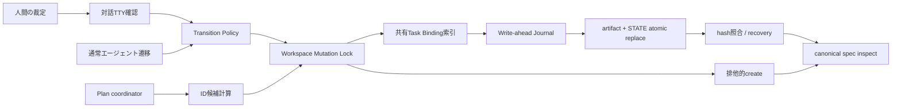
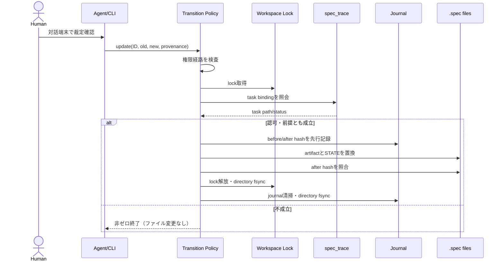

# SDD-DSN-005 仕様変更の完全性境界（裁定・遷移・採番）

## 背景 / 課題

BitzSDDの変更系CLIには、互いに独立して見える3つの完全性欠陥がある。

1. `spec_update.py --by-human` は呼出者の自己申告だけで人間専用遷移を許可し、
   直接実行とエージェント代行を監査証跡から区別できない（SI-SDD-022）。
2. `spec_update.py` は遷移表だけを検査し、要件と実装タスクの関係を遷移前に検査しないため、
   孤児要件や未完了要件を一度保存してから `spec_inspect.py` が検出する（SI-SDD-023）。
3. `spec_scaffold.py` の `max + 1` は現在のworktreeしか観測できず、並行ブランチ間で同じIDを
   払い出す。さらに同一worktree内にも `exists()` と `write_text()` の間に競合窓がある
   （SI-SDD-024）。

（v2.0 追補）さらに v1.1 の実装リリース当日、第4の欠陥が実運用で顕在化した。

4. 人間裁定必須遷移の正規経路を TTY 対話確認（1実行1ID×完全一致再入力）だけに限定した結果、
   CORE 要件26件の一括 promoted 昇格が frontmatter 手編集で迂回され、STATE 記録ゼロのまま
   全ゲートを PASS して main へマージされた（PR #107→#108 で revert。検出漏れは SI-SDD-026、
   経路の再設計は SI-SDD-027）。正直な代行経路の不在が、最悪の迂回（無記録手編集）を
   誘発することが実証された。

3件を「仕様成果物への書込みを許可する境界」の一つの設計として扱う。目的は、変更前に
局所的な不整合を拒否し、変更後に誰のどの裁定で書き込まれたかを追跡可能にし、
単一プロセスでは解決できないcross-branch競合を運用と統合ゲートで安全側に止めることである。

## 軽量ドメインモデル

| 概念 | 責務 / 不変条件 |
|---|---|
| Specification Artifact | requirement / spec-issue / task / design。frontmatterのIDとstatusを持つ |
| Transition Policy | artifact種別、現在status、遷移先から必要権限と局所前提を決定する |
| Decision Provenance | 対話確認された人間裁定必須遷移を構造化eventとして表す |
| Task Binding | 所有workspace内taskの`implements`から要件への関係とtask statusを提供する読取モデル |
| Mutation Transaction | event ID、before/after hash、provenance、commit状態を持つ回復単位 |
| Workspace Mutation Lock | 同一workspaceへの変更CLIを直列化し、lost updateを防ぐ |
| Allocation Candidate | workspace・artifact種別・prefix・番号から生成される新規ID候補 |
| Integration Audit | workspace全体の重複ID、孤児、幽霊、staleを事後に検査する最後の砦 |

保存先は既存のMarkdownファイルと `STATE.md` のままとする。DB、ネットワークサービス、
リポジトリ外の認証情報ストアは追加しない。

## 設計判断

### 1. 人間裁定必須遷移は対話確認または可視化された代行を受理する（SI-SDD-022 / SI-SDD-027 で改訂）

契約語彙を次のように分ける。

- **人間裁定必須遷移**: draft→approved等、人間の判断なしに成立させてはならない遷移。
- **対話確認経路**: 人間裁定必須遷移を人間が直接適用するBitzSDD CLI経路（v1.1では唯一の経路）。
- **代行可視化経路**: 人間の裁定を、その所在参照つきでエージェントが代行適用するCLI経路
  （v2.0で追加。SI-SDD-027）。
- **エージェント許容遷移**: lifecycle上、エージェントが無人実行できる遷移。

```text
spec update <workspace> <ID> --to <status> \
  --interactive-decision --actor <decision-operator>
```

- 人間裁定必須遷移で `--interactive-decision` を使う場合、stdinとstderrの両方がTTYであることを要求する。
- 対象ID・旧status・新statusを表示し、`<ID> <old>-><new>` の完全一致再入力を要求する。
- 非TTY、EOF、不一致、空のactorでは認可エラー（exit 3）とし、対象ファイルとSTATEを変更しない。
- actorは1〜128 Unicode code point、改行・ASCII制御文字なしとし、後述の構造化eventへ
  JSON encodingして保存する。
- STATEの人間向け行では「対話入力確認済み（実行者未検証）」と表示し、機械eventのprovenanceは
  `interactive-confirmation-unverified` とする。

TTY確認は本人認証ではなく、CLIが保証するのは遷移表と明示的な対話入力だけである。
エージェントもPTYを確保できるため、OSユーザーや端末を人間本人だと推定しない。
「人間が裁定したこと」はBitzSDD単独では機械証明不能であり、Codex / Claude Code等ホストの
approval・sandbox・監査規律に残る。この残余リスクを後継要件、CLI help、STATE表示へ明記し、
旧CORE-FR-005の「構造的に人間性を強制する」という過大な主張を継承しない。

#### 1b. 代行可視化経路（v2.0 追加。SI-SDD-027）

v1.1 は「検証不能な `--on-behalf-of` は自己申告能力になる」として代行経路を却下したが、
この判断は比較対象を誤っていた。実運用で発生した比較は「人間の直接TTY実行 vs 代行」ではなく
「正直に記録された代行 vs 無記録の手編集」であり、後者が実際に選択され全ゲートを通過した
（背景4）。TTY確認自体が本人認証でない以上（前節）、ゲートの実価値は証跡の正直さと
エージェント単独実行への摩擦にある。よって**無条件の代行は引き続き却下**しつつ、
**裁定の所在参照（decision-ref）を必須とする可視化された代行**を第2の経路として設ける。

```text
spec update <workspace> <ID...> --to <status> \
  --on-behalf-of <human> --decision-ref <参照> --actor <実行エージェント>
```

- **必須3項**: `--on-behalf-of`（裁定した人間）、`--decision-ref`（裁定の所在）、
  `--actor`（実行主体＝エージェント名）。いずれか欠落は `authorization-required`（exit 3）。
  actor / on-behalf-of には対話経路と同じ長さ・制御文字検査を適用する。
- **decision-ref の要求水準**: 1〜512文字・制御文字なし。リポジトリ相対パス
  （任意で `#fragment` 付き。例: `.spec/spec-issues/SI-SDD-027.md`）または `https://` URL。
  パス形式は update 時に**ファイルの実在を必須**とし（非実在は exit 3）、URL 形式は
  形式検査のみとする。裁定の**真正性**（その裁定が本当に当該遷移を許可したか）は機械検証せず、
  残余リスクとして要件・CLI help・STATE 表示に明記する。
- **provenance**: 構造化 event の kind を `agent-proxy-unverified` とし、`on_behalf_of` /
  `decision_ref` フィールドを追加する。schema_version は 2 へ上げ、inspect は v1 / v2 の両方を
  受理し、v2 では kind に応じた必須フィールドを検査する。STATE 表示行は
  `(<actor> on behalf of <human>; 代行実行・実行者未検証・裁定参照: <ref>)` とし、
  対話確認経路（`対話入力確認済み`）と一見で区別できるようにする。
- **バッチ**: 複数 ID を1呼出しで受理する（26件事故の直接原因はバッチ経路の不在）。
  workspace lock を1回取得し、ID ごとに独立した transaction を直列適用する。失敗時は
  fail-fast とし、適用済み分は有効（STATE 記録済み）・未適用分を診断に列挙する。
  複数 artifact の all-or-nothing は journal 設計を複雑化するため採らない。
  同一呼出しの event 群は同じ decision_ref を共有する。
- **適用範囲**: 全人間裁定必須遷移に開く（推奨）。一部遷移だけ TTY 限定を残すと、
  その遷移に同じ迂回圧力が再発するため。対話確認経路は第一級経路として維持し廃止しない。
- **抑止・可視化**: `spec_status.py` / `sdd_report.py` が経路別（対話 / 代行）の遷移数を
  集計表示する。Promotion Gate チェックリストへ「代行遷移の decision-ref を人間が確認」を
  追加し、裁定参照の形骸化を運用側で検査する。
- **inspect の継続検査**: パス形式 decision-ref の参照先が後日消失した場合は WARN とする
  （ファイル移動で壊れ得るため FAIL にしない。裁定時点の実在は update が保証済み）。

エージェント実行面からの人間裁定必須遷移は、この代行可視化経路によって初めて可能になる。
ホストが workspace・ID・old/new・human・有効期限・nonce に束縛した検証可能な receipt を
提供した場合に adapter 契約と一回消費を設計する方針（v1.1）は、将来の強化案として維持する。

誤認を招く`--by-human`は廃止し、互換aliasも設けない。`--actor`だけで対話経路を主張する
現行形式も、人間裁定必須遷移では拒否する。
エージェント許容遷移では既存互換のため `--actor` を維持するが、同じ長さ・制御文字検査を適用する。
旧STATE行はlegacy eventとして読取専用で保持し、遡及変更しない。

### 2. 遷移前提を共有タスク索引から検査する（SI-SDD-023）

`sdd-core/scripts/` にstdlibのみの純粋な読取モジュール `spec_trace.py` を置き、
task frontmatterから次を返す。キーはID単独でなく、解決済みworkspace rootとの組とする。

```text
(workspace root, requirement ID) -> [{path, status, implements}]
```

`spec_update.py` と `spec_inspect.py` はこの関係抽出を共有する。前者は1遷移を受理する直前の
admission control、後者はworkspace全体の孤児・幽霊・staleを検出するintegration auditを担当する。
判定時点と報告範囲は異なるが、`implements` の解釈は二重実装しない。

要件のlifecycleを進めるtaskは要件と同じworkspaceに1件以上置くことを新しい制約とする。
cross-workspace taskは追加の実装トレースとして許可するが、それだけでは所有workspaceのstatusを
遷移させない。これにより単一workspace引数の`spec update`を維持し、モノリポの探索範囲を暗黙に
拡張しない。現行データにはroot要件をsub-workspace taskが参照する例があるため、導入前に
「各active要件にlocal lifecycle taskがある」ことをcanonical inspectで確認する。

要件遷移の前提は次のとおりとする。

| 遷移 | 追加前提 | 拒否時の診断 |
|---|---|---|
| `approved → implementing` | 対象要件を`implements`するtaskが1件以上ある | taskが無いこととscaffoldコマンド例 |
| `implementing → verified` | 対象要件のtaskが1件以上あり、全件`done` | 未完了taskの相対pathとstatus |

前提検査はstatus書換えとSTATE追記より前に完了させる。失敗時は前提エラー（exit 4）とし、
どちらのファイルも変更しない。taskの存在だけでは全検証greenやstaleゼロを証明しないため、
verifiedの最終判断には従来どおりcanonicalな
`spec inspect --workspace . plugins/* --check-only` とテスト証跡を必要とする。

`--allow-orphan` の脱出口は設けない。sdd-coreの軽量レーンも「1taskで可」であり、task自体の省略を
許可していない。既存の孤児データは導入前検査で解消し、ツールに恒久的な迂回路を残さない。

`spec_inspect.py`にも「verified / promoted要件はlocal taskが1件以上あり、全件done」を追加し、
手編集・競合・旧版CLIによる迂回を統合ゲートで検出する。

### 3. 変更CLIをworkspace transactionとして回復可能にする（SI-SDD-022 / 023）

`spec_update.py` と `spec_scaffold.py` は同じworkspace mutation lockを使う。event ID、PID、
process start time、hostname、開始時刻、対象コマンド、path、artifact / STATE hashを持つ
完全なowner JSONをtempへ書いてfsyncし、atomic no-replace primitiveで
`.spec/.mutation-lock`へ公開する。公開前に停止すればtempが残るだけでlockとはみなさない。
対応platformでno-replace publishを提供できなければfail-closedとする。時間経過だけで自動解除しない。

競合時は診断`mutation-conflict`で停止する。対話入力はlock前に行ってよいが、lock取得後にstatus・
task索引・採番候補を必ず再読込し、確認時のold/newまたは取得時hashと異なれば適用せずlockを解放して
再確認を要求する。journalのold/newと対話確認値はbyte-for-byte一致させる。

statusとSTATEは別ファイルなので、単一の`os.replace`で同時に原子化できない。次のwrite-ahead
protocolを採る。

1. event IDを生成し、対象ID/path、old/new、provenance、artifact before/after hashとUTF-8 after payload、
   STATE before hash、STATEへ追記するeventを含むafter payload、schema version、
   RFC3339 timestampを組み立てる。STATE after hashはafter payload完成後に計算しjournalだけに持つ。
2. `.spec/.transactions/<event-id>.json` を`phase: PREPARED`で排他的createし、
   artifact / STATEの完全after payloadとhashを含めてfileと親directoryをfsyncする。
3. artifactとSTATEの新内容を各ディレクトリの一時ファイルへ書いてfsyncする。
4. 各replace直前に現在内容がbefore hashと一致することを再確認する。不一致は
   `recovery-ambiguous`で停止する。一致時だけartifact、次にSTATEを`os.replace`し、
   各親directoryもfsyncする。
5. 両方のafter hashを再読込確認し、journalを`APPLIED`、続いて`COMMITTED`へ
   temp+atomic replaceで更新して各段階をfsyncする。
6. `COMMITTED`永続化後、lockを削除して`.spec` directoryをfsyncする。その完了後にjournalを
   削除して`.transactions` directoryをfsyncする。journal削除をlock解放より先に永続化しない。

状態遷移の規範は次表とし、図や実装コメントと不一致の場合はこの表を正とする。

| 状態 | 永続化済み内容 | 次の操作 |
|---|---|---|
| lock only | 完全なowner JSON | PREPARED作成、またはowner死亡確認後の`--recover-lock` |
| PREPARED | before/after payload・hash | CAS再確認後にartifact、STATEを適用 |
| APPLIED | 両対象のafter hash一致 | COMMITTEDを永続化 |
| COMMITTED | transaction成功確定 | lock削除＋`.spec` fsync |
| unlocked | lock解放の永続化完了 | journal削除＋`.transactions` fsync |
| clean | lock・journalなし | 成功応答 |

file / directory durability処理は`spec_transaction.py`のplatform adapterへ閉じ込め、各対応OSで
「成功応答後にafter内容が永続化された」と確認できるprimitiveをテストする。必要なflush/
atomic replaceが利用できない環境では黙って弱い保証へ落とさず`durability-unsupported`で停止する。

STATEは従来の人間向けMarkdown行に加え、直後のHTML commentへcanonical JSON eventを
標準Base64で符号化した1行を保存する（Base64 alphabetはHTML comment終端`-->`を含まない）。
復号後のJSONを機械SSOT、人間向け行を表示層とする。eventは
`schema_version`、`event_id`、`timestamp`、workspace相対path、artifact ID、old/new、
provenance kind/actor、artifact before/after hashを持つ。自己参照を避けるためSTATE自身のhashは
埋込みeventへ含めず、journalがSTATE before/after hashと完全after payloadを持つ。
すべての文字列はJSON encoderを通し、制御文字検査後に保存する。canonical inspectはBase64、
JSON schema、event ID一意性、表示行との1対1対応、artifact statusとの遷移連鎖を検査する。
schema version 1の`hash_algorithm`は`sha256`とし、hash対象はBOMなしUTF-8で実際に書き込むbyte列そのもの
（改行正規化なし）とする。canonical JSONはUTF-8、key昇順、余分な空白なし、非ASCII文字を
Unicode escapeへ強制変換しない設定に固定する。Base64はRFC 4648標準alphabet、padding必須、
空白禁止とし、復号後の再符号化が元の文字列と一致しなければ`audit-corruption`とする。
このbyte契約はOS横断のgolden vectorを共有して検証する。

途中停止でjournalが残った場合、次のmutationとcanonical inspectは
`incomplete-transaction`でFAILする。復旧は次だけを許す。

```text
spec update <workspace> --recover <event-id>
spec update <workspace> --recover-lock
```

- artifact/STATEがともにbefore hashなら、未適用としてjournalとlockを除去する。
- artifactがafter、STATEがbeforeなら、journalに保存済みのSTATE after内容を適用してcommitを完了する。
- 両方afterなら、phaseを`COMMITTED`へ進めてlockを解放し、journalを清掃する。
- `COMMITTED` journalだけが残る場合はafter hashを確認してjournalを清掃する。
- lock公開後・journal作成前に停止した場合は`--recover-lock`を使い、完全なowner JSON、
  同一hostのPID/process start不一致（owner死亡）、before hash一致、journal不在をすべて確認して
  未開始lockを除去する。owner欠落・破損では自動清掃せずGit diffとworkspace owner確認を要求する。
- 上記以外、hash不一致、journal schema不正では自動推測せず
  `recovery-ambiguous`で停止し、Git diffとjournalを人間へ提示する。

成功応答した遷移の損失を0件とする保証は、対応filesystem上でdurable writeが成功した後の
process停止・OS停止・電源断を対象とし、媒体自体の破損・消失は対象外とする。未完了更新は
次回mutationまたはcanonical inspectで必ず検出する。
障害注入テストはlock公開、journal各phase、各temp書込み、各replace、各fsyncの境界、
COMMITTED後のlock削除・directory fsync・journal削除・directory fsync、2プロセス競合、
非協調writerによるbefore hash変化を対象にする。すべての対応writerは同じworkspace lockへ参加し、
status / STATEの手編集と旧版CLIの並行実行を禁止する。それでもlockを無視したwriterがhash再確認と
replaceの間へ割り込む競合は完全排除できず、その未commit内容はGit差分や最終hashから復元できない。
この経路は機械保証外の残余リスクとして明記する。

脅威モデルはrepository書込み権限者を信頼する。event連鎖とhashは事故・部分更新の検出用であり、
STATE、artifact、journalを一括して整合的に再生成できる敵対的writerへの改ざん耐性は主張しない。
その検知境界はGit履歴、レビュー、remoteの保護設定とし、署名済みCI attest等へのanchorが必要なら
別要件で扱う。

安定診断語彙は `authorization-required` / `precondition-failed` / `mutation-conflict` /
`incomplete-transaction` / `recovery-ambiguous` / `audit-corruption` /
`durability-unsupported` とし、人間向け文言とは別にJSON診断から取得可能にする。
lifecycleに再試行可否、確認コマンド、復旧責任者（workspace owner）、エスカレーション条件を記載する。

### 4. 採番はPlanで直列化し、生成と統合を別の防御層にする（SI-SDD-024）

cross-branchで共有されないローカルCLIは、中央サービスなしに全ブランチ横断の連番を予約できない。
したがって次の3層で扱う。

1. **Planの直列化**: accepted issueから要件・taskを採番する作業はcoordinatorの単一ブランチで行う。
   採番コミットを統合してから、そのcommitを共通baseとして実装worktreeを分岐する。
   実装中の並列エージェントは新しい正式IDを採番せず、発見事項をbranch-localなspec-issue候補として
   coordinatorへ戻す。この規律をlifecycleとsdd-gitのworktree接続点に記載する。
2. **同一worktree内の排他生成**: `spec_scaffold.py` はworkspace lock取得後に候補を再計算し、
   scaffold用journalへ`dest before = absent`、完全なUTF-8 after payloadとhashをPREPAREDで記録する。
   payloadをtempへ完全書込み・fsyncした後、platform adapterのatomic no-replaceで正式pathへ公開する。
   候補pathが競合した場合は既存内容を上書きせずexit 1で停止し、呼出側に再実行を求める。
   競合後の自動再採番は、呼出者が採番結果を確認できないまま別IDを作るため行わない。
   recoveryは「dest absentなら未公開としてtemp/journalを清掃」「dest hashがafterならcommit完了」
   「destが別hashならambiguous停止」の3分類とし、部分ファイルを正式pathへ残さない。
3. **target head照合**: PRは最新target headをfetchしたうえで更新し、追加ID集合を
   target側の全IDと比較するpreflightを通す。baseが最新でない、同じIDがtargetに存在する、
   accepted issueのorigin成果物が競合解消で消失した場合はmerge不可とする。結果には検査対象の
   target commit SHAを記録し、merge queueまたはrequired checkがmerge直前のtarget SHAと
   完全一致させる。target更新時は判定を失効し、fetch/rebase後に再検査する。
   target SHAを証明できない環境はfail-closedとする。
4. **統合時の最後の砦**: 重複ID判定のSSOTは既に実装済みの`spec_inspect.py`とする。
   canonicalな一括`--check-only`をPR/merge前の必須ゲートにし、requirement・designを含む
   workspace内重複の回帰テストを補強する。`release_check.py`へ同じ走査を重複実装しない。

中央予約を採らない以上、古いtarget refや誤ったconflict解消による残余リスクはゼロにならない。
lifecycleの「採番衝突は構造的にゼロ」という表現は廃止し、「Plan直列化とmerge gateで検知する」
へ改める。`--number` の明示指定は衝突修復に維持するが、lockと排他的createを迂回しない。

### 5. CLI依存と処理順



クリティカルパスは以下とする。



デプロイ単位は現行どおりsdd-coreスキル内のPython CLIであり、別サービスを追加しない。
性能要件はworkspace内Markdownの線形走査で十分で、キャッシュや永続索引は採用しない。

## 公開CLIと互換性

| 項目 | 互換性 |
|---|---|
| エージェント許容遷移 | 既存CLIを維持。task前提を満たさない呼出しだけ新たに失敗 |
| `--by-human` | 人間性を保証する誤解を避けるため廃止 |
| `--interactive-decision` | 対話入力だけを保証する置換CLI |
| `--on-behalf-of` / `--decision-ref` | 加算CLI（v2.0）。裁定所在参照つきの代行可視化経路 |
| エージェントによる人間裁定の代行 | decision-ref 必須の可視化経路でのみ可（v2.0で改訂）。無条件代行は引き続き不可 |
| `--recover` / JSON診断 | 加算CLI |
| STATEの新規行 | schema付きeventを加算。旧行はlegacyとして読取可能なまま |
| `spec scaffold` | 正常系の採番と出力を維持。競合時だけ安全側停止 |
| `spec inspect` | task完了・未完了transaction・target head照合を加算 |

`--by-human` を削除するため、実装リリースはsdd-coreスキルと
bitz-sddプラグインのsemver majorとする。移行案内には通常シェル、Claude Code、Codex、
Antigravity 2.0ごとに対話端末への引継ぎ例を載せる。根拠のないSaaS級性能目標は置かず、
現行モノリポ規模のfixtureで遷移前提検査の実行時間を回帰計測する。

## 代替案と却下理由

- **TTY確認を本人認証とみなす**: エージェントもPTYを確保できるため却下。誤操作防止に限定する。
- **自由記述の人間裁定代行**: v1.1 で却下したが、SI-SDD-027 の裁定により **decision-ref 必須の
  可視化代行に限って撤回**（設計判断1b）。無条件の `--on-behalf-of`（参照なしの自己申告）は
  引き続き却下。v1.1 の「fail-closed で代行ゼロ」は、無記録手編集という検出不能な迂回を
  誘発した実績（背景4）により、比較対象を誤った過剰防御だったと判定した。
- **TTY 限定を維持して迂回の事後検出だけ足す**: SI-SDD-026 の検出強化は必要だが、それだけでは
  迂回の発生源（正規経路の運用コスト）が残るため、経路追加と組み合わせる。
- **`--actor` を人間性の証明に使う**: 任意文字列で偽装できるため却下。
- **`--allow-orphan`**: 軽量レーンにも1taskが必要で、恒久迂回路の根拠がないため却下。
- **`spec_update.py` から毎回full inspectを起動する**: 遷移局所条件とworkspace全体監査を混同し、
  cross-workspace文脈やレポート副作用を持ち込むため却下。
- **IDレンジ予約・中央採番サービス**: オフライン配布、stdlibのみ、Git管理という既存設計に対して
  費用が大きく、新たな可用性・認証・失効問題を生むため却下。
- **lockfileでcross-branch採番を同期する**: branchごとに複製され共有ロックにならないため却下。
- **release_checkへ重複ID走査を追加する**: spec_inspectとの二重実装になるため却下。

## 既存契約からの継承

本変更は既存greenをredにし得るため、同一IDの意味変更ではなく後継要件をDesign Gate後に
bitz-sdd workspaceへ起票し、旧契約は人間裁定でsupersedeする。

| issue | 既存契約 | 後継要件の役割（IDはGate後にscaffold） | 主な検証 |
|---|---|---|---|
| SI-SDD-022 | CORE-FR-005 | 対話入力の強制、構造化event、機械保証と人間裁定規律の境界 | 旧flag拒否、対話確認、入力注入拒否 |
| SI-SDD-022 / 023 | CORE-FR-005 | workspace transaction、排他、journal recovery | 各書込み境界の障害注入、2process競合 |
| SI-SDD-023 | CORE-FR-005 | local lifecycle task前提とintegration audit | taskなし拒否、未完了拒否、手編集検出 |
| SI-SDD-024 | CORE-FR-004 | Plan直列採番、target head照合、排他的create | local race、古いbase、duplicate/origin消失 |

CORE-FR-004/005はルートworkspaceのlegacy契約である。後継SDD要件がapprovedとなり、後継テストが
greenになった段階で、`superseded_by`を相互に結び人間裁定でdeprecatedへ遷移する。
影響集合は要件起票前にcanonicalな`--impact CORE-FR-004` / `CORE-FR-005`で再計算する。

## 影響範囲・実装順序

1. 後継要件を起票し、旧CORE-FR-004/005とのsupersede計画を確定する。
2. **Release A（高優先度、major）**: workspace transactionを独立要件・独立taskで実装し、
   障害注入と復旧だけを先に検収する。
3. Release A内の次taskで`spec_trace.py`、local lifecycle task前提、integration auditを実装する。
4. Release A内の最後のtaskで`spec_update.py`をtransaction基盤へ載せ、
   `--interactive-decision`と局所前提を有効化する。3環境の移行例を更新し、CORE-FR-005を後継化する。
5. **Release B（中優先度、minor）**: `spec_scaffold.py`を同じtransaction基盤＋atomic no-replaceへ
   載せ、target head照合とsdd-git接続を実装してCORE-FR-004を後継化する。
6. **Release C（高優先度、minor。v2.0 追加 = SI-SDD-027）**: 代行可視化経路を実装する。
   - 契約の載せ方（Design Gate 裁定点）:
     - **案A**: SDD-FR-143 全体を後継 SDD-FR-145 へ supersede（認可節を改訂し
       transaction 節を継承）。CORE-FR-005→143/144 の前例に忠実だが文書量が大きい。
     - **案B（推奨）**: 認可経路契約を新規 SDD-FR-145 として起票し、SDD-FR-143 は
       認可節を「対話確認経路を要求した場合」へ限定する major bump（2.0）とする。
       1要件1関心事（認可=145、transaction・監査=143）になり、SI-SDD-026 の bump 対象
       （143 の監査節）とも衝突しない。既存 unit-test は全件 green のまま。
   - 実装対象: `spec_update.py`（経路追加・バッチ・decision-ref 検査）、
     `spec_transaction.py`（event schema v2）、`spec_inspect.py`（v2 検査・参照先 WARN）、
     `spec_status.py` / `sdd_report.py`（経路別集計）、`references/lifecycle.md`
     （権限マトリクス・記録語彙・Promotion Gate チェックリスト）、対応 unit-test。
   - semver: 加算 CLI のため bitz-sdd **minor**（既存経路の挙動不変。破壊なし）。
   - 順序: Release C を SI-SDD-026（迂回の事後検出）より先に実施する。026 は改訂後の
     契約（案Bなら 143 v2.0）を対象に裁定・実装する。

Release Aを先に出す理由は、裁定証跡と遷移前提の高優先度修正を採番改善から分離するためである。
一方、transaction基盤をRelease Aから外す小案（lock＋逐次二重書込み）は、成功応答した遷移で
statusと監査が乖離し得るため、権限監査の後継要件を満たさず却下する。transaction実装は
`spec_transaction.py`一箇所へ閉じ込め、各利用CLIに独自状態機械を持たせない。

対象は主に次へ限定する。

- `skills/sdd-core/scripts/spec_update.py`
- `skills/sdd-core/scripts/spec_scaffold.py`
- `skills/sdd-core/scripts/spec_inspect.py`
- `skills/sdd-core/scripts/spec_trace.py`（新規）
- `skills/sdd-core/scripts/spec_transaction.py`（新規）
- `skills/sdd-core/SKILL.md`、`references/lifecycle.md`
- `skills/sdd-git/SKILL.md`
- `tests/test_spec_update.py`、`tests/test_spec_scaffold.py`、`tests/test_spec_inspect.py`
- bitz-sddの3マニフェストとmarketplace

## ロールバック

Release Aは「transaction基盤」「共有索引」「遷移前提」「対話確認」を同一majorとして戻し、
Release Bは「排他生成」「target head gate」を独立して戻せるようにする。
Release C（代行可視化経路）は加算のため独立して revert でき、STATE に残った
`agent-proxy-unverified` event（schema v2）は legacy として読取保持する（遡及変更しない。
revert 後の inspect は v2 event を既知 legacy として受理する版に留めるか、revert 範囲から
inspect の v2 受理を除外する）。
各release内では機能フラグで新旧write pathを混在させない。
ロールバックしても新STATE行は履歴として保持し、旧ツールは人間向けMarkdown行を読める。
新しい外部データストアやデータ移行はない。downgrade前に新majorのrecover/inspectで
journal 0件、lock不在、artifact/STATE hash整合、canonical inspectの対象変更由来エラー0件を確認する。
未完了transactionが1件でもあれば旧版起動を禁止し、先に新majorで復旧する。
major版を撤回する場合は直前majorへ固定し、旧`--by-human`の自己申告契約が戻ることを明示する。
媒体喪失への永続バックアップはBitzSDD CLIの責務外とし、workspace ownerがGit commitと
組織のremote / backup方針で担保する。復元試験はcheckoutしたworkspaceへのcanonical inspectとする。

## Design Gate 入力

- 人間裁定: 2026-07-27、SI-SDD-022 / 023 / 024をaccepted。
- ルート契約裁定: 2026-07-27、SI-CORE-035をaccepted。
- Design Gate: 2026-07-27、ユーザーが本設計（v1.1）を承認し実装継続を指示。
- 人間裁定: 2026-07-27、SI-SDD-027をaccepted（対話確認経路で記録済み）。
- **v2.0（代行可視化経路）の Design Gate: 裁定待ち**。裁定点:
  1. 代行可視化経路の採用（v1.1 裁定点2「host receipt なき代行は設けない」の部分撤回。
     無条件代行の却下は維持し、decision-ref 必須の可視化代行のみ許可する）。
  2. decision-ref の要求水準（パス形式は update 時実在必須・URL は形式検査のみ・
     真正性は機械検証しない残余リスクとして明記）。
  3. 適用範囲は全人間裁定必須遷移とする（推奨。一部限定の代替あり — 設計判断1b）。
  4. バッチ受理（1裁定参照×複数 ID、fail-fast 逐次 transaction）。
  5. 契約の載せ方は案B（SDD-FR-145 新設＋SDD-FR-143 major bump）を推奨（Release C 節）。
  6. event schema_version 2 への昇格（v1 併存受理）。
  7. semver は bitz-sdd minor。SI-SDD-026 より先に実施する。
- 本設計の裁定点:
  1. CLI保証を「遷移表＋明示的な対話入力」に限定し、人間性の認証はできない残余リスクを明記する。
  2. 誤認を招く`--by-human`を廃止して`--interactive-decision`へ置換し、
     検証可能なhost receiptが無い代行経路は設けない。
  3. status・STATE更新はworkspace lock＋write-ahead journal＋hash照合復旧で一貫化する。
  4. task前提は要件所有workspace内のlifecycle taskを正とする。
  5. taskなし／未完了taskありの要件遷移に脱出口を設けない。
  6. cross-branch採番はPlan直列化＋target head照合＋排他的create＋canonical inspectで守り、
     中央予約は導入せず残余リスクを明記する。
  7. `--by-human`廃止をsemver majorとして扱い、高優先度Release Aと中優先度Release Bを分ける。
  8. repository書込み権限者とlock参加writerを信頼し、非協調writerの最終競合窓は保証外とする。
