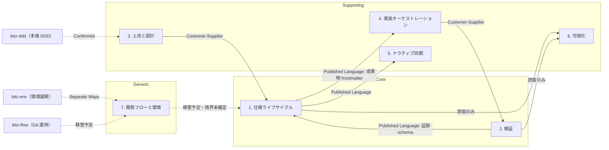

# ドメインモデル — bitz-sdd

> SDD-REV-006 の GP-003（Design 層の後付け）による初版。bitz-ddd の `ddd-model` 手法に従い、
> ドメインストーリー（SDD-DSN-006〜008）を Pass 1 の入力とする。
> **ドメインをモデル化し、ファイル配置をモデル化しない**（保存形式はモデルに従わせる）。
>
> 既存の SDD-DSN-005「軽量ドメインモデル」（8概念）は遷移・裁定サブドメインだけを覆っていた。
> 本モデルはプラグイン全体を対象とし、SDD-DSN-005 を包含・再解釈する。
>
> **bitz-flow との境界（sdd-git の移管）は意図的に確定させない**。bitz-flow の設計が
> 並行進行中のため、コンテキストマップ上は「移管予定」として明示するに留める（人間裁定）。

## Pass 1 — 上流成果物からの明示的導出

ドメインストーリー3本の Work Items から、そのまま概念を起こす（同義語を発明しない）。

| Work Item（ストーリーの語彙） | 概念 | 種別 | 出典 |
|---|---|---|---|
| 仕様変更提案（spec-issue） | SpecIssue | Entity | SDD-DSN-006 / 008 |
| 要件（requirement） | Requirement | Entity | SDD-DSN-006 / 007 |
| タスク（task） | Task | Entity | SDD-DSN-006 |
| 検証手段（verification_method） | VerificationMethod | Value Object | SDD-DSN-007 |
| 検証証跡 | VerificationEvidence | Entity | SDD-DSN-006 / 007 |
| 検査レポート | IntegrationAudit | 読取モデル | SDD-DSN-006 |
| 裁定 | Decision | Entity | SDD-DSN-008 |
| 裁定記録（decision-ref） | DecisionReference | Value Object | SDD-DSN-008 |
| 判定（green / red） | Verdict | Value Object | SDD-DSN-007 |

## Pass 2 — 機能 × エンティティの CRUD マトリクスによる暗黙概念の洗い出し

C=生成 / R=参照 / U=更新 / D=廃止（削除はしない — 履歴として残す）

| 機能（スキル・ツール） | SpecIssue | Requirement | Task | Evidence | Decision | DesignArtifact | ReviewSynthesis |
|---|---|---|---|---|---|---|---|
| sdd-issue | C U | R | — | — | — | — | — |
| sdd-core（spec_scaffold） | C | C | C | — | — | C | — |
| sdd-core（spec_update） | U | U | U | — | C | U | — |
| sdd-core（spec_inspect） | R | R | R | **R** | R | R | — |
| sdd-implement | R | R | C U | — | — | R | — |
| sdd-test（spec_verify） | — | R | — | **C U** | — | — | — |
| sdd-review | C | R | — | — | — | R | C U |
| sdd-report / sdd-plan | R | R | R | R | R | R | R |
| sdd-docs | — | R | — | — | — | R U | — |

### 洗い出された暗黙概念（追加要素には根拠を必ず記録）

| 概念 | 根拠 | 現状 |
|---|---|---|
| **GatePassage（ゲート通過）** | Discovery / Design / Promotion の各 Gate は「通過した」という事実を持つはずだが、**CRUD するどの機能にも現れない** | **存在しない**。SDD-DSN-006 のステップ10 が実行されないことを誰も検知できない根本原因（SI-SDD-028） |
| **ReviewFinding（レビュー指摘）** | sdd-review は ReviewSynthesis を C U するが、その中の個々の指摘は独立した概念になっていない | synthesis の内部データに埋もれ、追跡先を持てない。SDD-REV-004 の P1 が消えた構造的理由（SI-SDD-031） |
| **TraceabilityLink（トレース関係）** | 要件⇄タスク⇄テスト⇄証跡の関係を、spec_inspect が毎回ファイル走査から**再計算**している | 概念として存在せず、実体は正規表現による推定。走査対象を増やすたびに誤検知の調整が要る（SDD-FR-146〜148 の経緯） |
| **Workspace（ワークスペース）** | すべての機能が暗黙に「どのワークスペースか」を引数で受け取る | 概念としては存在するが集約ではなく、横断解決は `--workspace` の実行時オプションに閉じている |

## 戦術設計 — 集約と不変条件

### 集約1: SpecIssue（仕様変更提案）

- **ルート**: SpecIssue（`SI-<NS>-NNN`）
- **不変条件**: `open → accepted / rejected` の遷移は人間裁定を要する。提案は削除せず履歴として残す。
- **含むもの**: 予備判定（推薦）、追跡先（実装した要件 ID・PR）

### 集約2: Requirement（要件）

- **ルート**: Requirement（`<NS>-FR|NFR|CON-NNN`）
- **不変条件**:
  - `approved` 以降は `VerificationMethod` を必ず持つ
  - `draft → approved` / `任意 → deprecated` は人間裁定を要する
  - `verified / promoted` は、実装する Task が1件以上 done であること
  - 本文の変更は人間専権（エージェントは提案しかできない）
- **含むもの**: EARS 受入基準、`VerificationMethod`（VO）、改訂履歴

### 集約3: Task（タスク）

- **ルート**: Task（`<NS>-TSK-NNN`）
- **不変条件**: `implements` が実在する要件を指す。`boundary` の外へ書き込まない。
  `depends_on` に循環が無い。

### 集約4: VerificationEvidence（検証証跡）

- **ルート**: VerificationEvidence（1実行 = 1インスタンス）
- **不変条件**:
  - 安定情報（commit・終了コード・件数・tool）と観測値（実行時間）を分離する
  - 同一 commit・同一 command_id は同一インスタンス（冪等）
  - 秘密値・環境固有パス・raw 出力を保持しない
  - **参照する要件がすべて実在する**
- **未確立の不変条件**: 「証跡の検証手段が、覆う要件の `VerificationMethod` と一致する」
  — 現状これを強制する主体がいない（下記「境界のまたがり」を参照）

### 集約5: Decision（裁定）

- **ルート**: Decision（STATE の構造化 event）
- **不変条件**: 人間裁定必須遷移は、対話確認経路または代行可視化経路のいずれかを伴う。
  代行時は `DecisionReference` が実在するパスまたは URL を指す。
  provenance は真正性を主張しない（`*-unverified`）。

### Value Object

| VO | 値 | 不変条件 |
|---|---|---|
| `VerificationMethod` | pbt / example-test / unit-test / benchmark / sast / dep-audit / load-test / manual-check | 統制語彙の外を許さない。`benchmark` / `load-test` は数値閾値の明記を要する |
| `Verdict` | green / red | 証跡から導出する。人間の主張から作らない |
| `DecisionReference` | ワークスペース相対パス または URL | 参照先が実在すること |
| `Boundary` | パスの集合 | タスクが書き込んでよい範囲 |

## 戦略設計 — 境界づけられたコンテキストとサブドメイン分類

14スキルを、現在の機能単位ではなく**ケイパビリティ**に沿って7つの境界へ分ける。

| # | コンテキスト | 含むスキル | 分類 | ケイパビリティ | 整合性 |
|---|---|---|---|---|---|
| 1 | **仕様ライフサイクル** | sdd-core, sdd-issue | **Core** | 仕様成果物の一生を統べる（採番・遷移・権限・ゲート） | Strong（権限と遷移は不変条件を持つ） |
| 2 | **検証** | sdd-test | **Core** | 主張を機械の出力で置き換える | Strong（証跡と要件の一致は不変条件） |
| 3 | **上流と設計** | sdd-discovery, sdd-design, sdd-data, sdd-ops, sdd-review | Supporting | 何をなぜ作るかを決め、多観点で検分する | Eventual（結論は改訂される前提） |
| 4 | **実装オーケストレーション** | sdd-implement | Supporting | 契約を実装単位へ分解し、委譲先を決める | Eventual |
| 5 | **ナラティブ同期** | sdd-docs | Supporting | `.spec`（正）を人間の読み物へ展開し逆反映する | Eventual（mtime による収束） |
| 6 | **可視化** | sdd-plan, sdd-report | Supporting | 現況を集計し次の一手を提示する（読み取り専用） | Eventual（読取モデル） |
| 7 | **開発フローと環境** | sdd-git, sdd-doctor | **Generic** | Git 運用と前提診断。解決済みの問題であり自前で持たない | TBD |

### サブドメイン分類の根拠

- **Core（1・2）に投資する** — vision.md の差別化要素のうち「EARS 要件 + 機械検証」と
  「権限分離のライフサイクル」がここに集中する。買えないし、ここが弱ければプロダクトが成立しない。
- **ナラティブ同期を Core にしない** — vision.md は `.spec` ⇄ `docs` 同期を差別化要素に挙げるが、
  **同期が無くても規律は成立する**。実測でも bitz-sdd 自身のワークスペースは `docs/` を持たず、
  それでも要件67件が回っている。差別化の源泉は「`.spec` が単一の正である」という規律であり、
  同期はその展開手段。よって Supporting。
- **開発フローと環境を Generic とする** — Git 運用は解決済みの問題であり、
  scope.md の宣言どおり bitz-flow へ委ねる方向。sdd-doctor と同型の doctor は
  bitz-ddd / bitz-env / bitz-flow にも存在し、横断パターンであって差別化要素ではない。

### コンテキストマップ

| 関係 | 型 | 理由 |
|---|---|---|
| 上流と設計 → 仕様ライフサイクル | Customer-Supplier | 設計の結論が要件になる。上流が供給側 |
| 仕様ライフサイクル → 実装 / 同期 | Published Language | 成果物 frontmatter 書式が公開契約 |
| 検証 → 仕様ライフサイクル | Published Language | 証跡 schema が公開契約 |
| bitz-ddd → 上流と設計 | Conformist | bitz-sdd は軽量デフォルトに留め、本格 DDD の語彙へ合わせる |
| bitz-flow → 開発フロー | 移管予定・**未確定** | 並行設計中。決定は最終合わせで行う |

## モデルから見えた構造的な問題

本モデリングは既知の指摘を再発見するだけでなく、**なぜそれが起きたか**を境界の言葉で説明する。

### (1) 検証コンテキストが Core なのに、判定の実体が仕様ライフサイクル側にある

証跡は sdd-test（`spec_verify.py`）が書き、判定は sdd-core（`spec_inspect.py`）が行う。
**「証跡の検証手段が要件の宣言と一致する」という不変条件を持つ主体がどちらにも無い。**
これが SI-SDD-030（突合欠落）の構造的な理由であり、実装の抜けではなく境界の引き方の問題。

**設計上の答え**: 不変条件は集約4（VerificationEvidence）ではなく**検証コンテキストの
ドメインサービス**が持つ。判定機能を sdd-core から検証コンテキストへ寄せるか、
`spec_inspect` が検証コンテキストの公開言語（証跡 schema）に従属する Conformist であることを
明示するか、いずれかを選ぶ必要がある。

### (2) Gate に対応する概念が無い

Discovery / Design / Promotion の各 Gate は手順としては定義されているが、
**「通過した」という事実を表す成果物が存在しない**（Pass 2 で判明）。
だから「Promotion Gate が一度も実行されていない」ことを機械が検知できず、
promoted 0 件のまま63件が滞留した（SI-SDD-028）。

**設計上の答え**: `GatePassage` を独立したエンティティとして導入する。
最低限、対象・日付・裁定者・確認した `DecisionReference` の集合を持つ。
これがあれば「未通過の滞留」が集計可能になる。

### (3) ReviewFinding が独立していないため追跡先を持てない

レビュー指摘は synthesis の内部データであり、独立したエンティティではない。
だから「この指摘は spec-issue のどれで追跡されているか」を表現する場所が無く、
SDD-REV-004 の P1 は「spec-issue 化を推奨」と書かれたまま消えた（SI-SDD-031）。

**設計上の答え**: `ReviewFinding` を独立させ、`tracked_by`（SpecIssue への参照）を
必須属性にする。SDD-REV-006 では手作業で追跡表を作ったが、モデルとして持つべき。

### (4) Specification Artifact を単一概念にしたことが遷移ポリシーを複雑にした

SDD-DSN-005 の軽量モデルは requirement / spec-issue / task / design を
`Specification Artifact` の一語で括った。しかし**4者はライフサイクルも権限も語彙も異なる**
（`open→accepted` と `draft→approved` は別物）。単一概念にしたため、遷移ポリシーが
種別ごとの分岐の塊になっている。

**設計上の答え**: 種別ごとに別集約とし、共通するのは **ID 採番** と **Decision の記録**だけに絞る。
本モデルの集約1〜3はその方針で分けている。

### (5) `manual-check` はユビキタス言語の矛盾語

`VerificationMethod` の統制語彙にありながら、検証コンテキストに対応する成果物を生まない
（証跡が原理的に生じない）。「検証しない検証手段」が語彙に存在することが、
42.5%という比率と、二重の検査免除を許した（SI-SDD-029）。

**設計上の答え**: `manual-check` を `VerificationMethod` から外し、
**「検証手段を持たない要件」**として別に扱うか、実施記録を成果物として定義して
証跡の一種に格上げするか、どちらかに倒す。中間状態が最も危険。

### (6) sdd-usecase（SI-SDD-013）の置き場

ユースケースはジョブ（Discovery）から要件（仕様ライフサイクル）への橋渡しであり、
**コンテキスト3「上流と設計」に属する**。仕様ライフサイクルへ入れると、
Core の語彙にユースケースという別語彙が混ざり境界が濁る。

**設計上の答え**: 新スキルを作るなら コンテキスト3 に置き、
仕様ライフサイクルとは Customer-Supplier（上流が供給側）で接続する。
15個目のスキルを増やす前に本モデルの境界を人間が裁定することが前提。

## Design Gate 裁定結果（2026-07-29・対話裁定）

6件すべて裁定済み。裁定記録は `.spec/reports/decision-2026-07-29-design-gate.md`。

| # | 論点 | 裁定 | 性質 |
|---|---|---|---|
| 1 | 判定機能をどちらのコンテキストへ寄せるか | **sdd-test へ移設**（検証コンテキストが持つ） | 破壊的。SI-CORE-038 が前提 |
| 2 | `GatePassage` を導入するか | **導入する** | 加法的 |
| 3 | `ReviewFinding` の独立と `tracked_by` 必須化 | **独立させ必須にする** | 成果物 schema 変更 |
| 4 | 集約分割に伴う遷移ポリシーの再構成 | **種別ごとに分割する（段階的）** | 破壊的 |
| 5 | `manual-check` の扱い | **実施記録を証跡へ格上げする** | 破壊的（統制語彙） |
| 6 | sdd-usecase の配置 | **コンテキスト3「上流と設計」** | 配置の確定のみ |

裁定1 は本モデルの推奨（案A: 証跡 schema に手段を持たせ `spec_inspect` を Conformist 化）
ではなく、**境界を正す案B が選ばれた**。結果として `scripts/spec` ラッパーの制約
（sdd-core の4ツール必須解決）が実装前提へ引き上がり、SI-CORE-038 が先行条件になる。

裁定4・5 は破壊的変更を伴う。**依存宣言 `bitz-sdd>=2.0` は上限が無く major bump を
止めないため**、移行計画は人間が明示的に持つ（裁定記録の「破壊的変更の波及」節）。

- **bitz-flow との境界（sdd-git 移管）は本 Gate の対象外**（人間裁定・保留）。
  bitz-flow の設計完了後の最終合わせで確定する。
