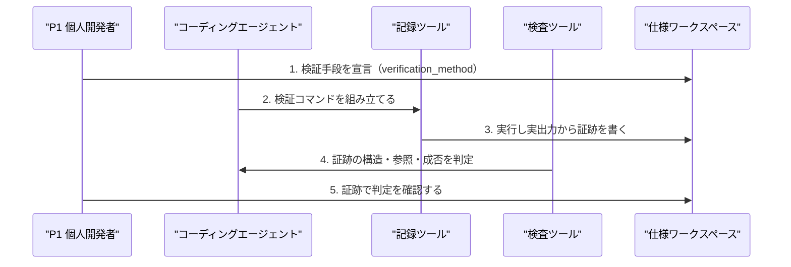

# ドメインストーリー: P1 個人開発者 — エージェントの申告を機械的に検収する

## 概要

P1 が、エージェントの「テストして動きました」という申告を鵜呑みにせず、機械の出力で
検収するまでの一本道。J2（自己申告を鵜呑みにせず品質を担保したい）に対応し、
ジャーニー段階は SDD-DSN-006 のステップ7〜9を掘り下げたもの。
bitz-sdd の Values 第1「検証が自己申告に勝つ」を体現する中核ジョブ。

## Actors

| Actor | 種別 | 出典 | このストーリーでの役割 |
|---|---|---|---|
| P1 個人開発者 | Persona | personas.md P1 | 検収する主体。機械の出力だけを根拠にする |
| コーディングエージェント | Persona（served） | personas.md P3 | 検証を実行し証跡を残す。合否を主張する立場にはない |
| 記録ツール | System | `spec_verify.py` | 検証コマンドを実行し実出力から証跡を作る |
| 検査ツール | System | `spec_inspect.py` | 証跡と要件の整合を判定する |

## Work Items

| Work Item | 用語 | 対応エンティティ（あれば） | 説明 |
|---|---|---|---|
| 検証手段 | verification_method | Specification Artifact の属性 | 要件が宣言する検証のやり方 |
| 検証コマンド | 検証コマンド | — | 実際に走らせる具体的なコマンド |
| 検証証跡 | 検証証跡 | Verification Evidence | commit・終了コード・件数。安定情報と観測値を分離する |
| 判定 | green / red | — | 証跡に基づく合否 |

## Main Flow（ハッピーパスのみ・番号付き）

1. P1 が要件に **検証手段** を宣言させる（`unit-test` など） → 仕様ワークスペース  _(根拠: J2「機械的に検収したい」)_
2. エージェントが **検証コマンド** を組み立てる → 記録ツール  _(根拠: J2)_
3. **記録ツール** がコマンドを実行し、実出力から **検証証跡** を書く → 仕様ワークスペース  _(根拠: J2。人手が数値を書き写す余地を無くす)_
4. **検査ツール** が証跡を読み、壊れた証跡・参照切れ・失敗した実行を判定する → エージェント  _(根拠: J2)_
5. P1 が **判定** を証跡で確認する（エージェントの言葉ではなく） → 仕様ワークスペース  _(根拠: Values「検証が自己申告に勝つ」)_

## Mermaid 図（番号を Main Flow と一致させる）

## 例外シナリオ（最大3件、ジャーニーのペイン由来）

### 宣言と実測が食い違う

ステップ1で `benchmark` を宣言した要件に、ステップ3で `pytest` の証跡を紐づけても
ステップ4は通ってしまう。**証跡が宣言どおりの検証手段で得られたかを誰も見ていない**
（SI-SDD-030）。要件は検証手段を1つ宣言するのに、証跡は1回の実行が複数要件を覆うため、
カーディナリティが一致していないことが原因。

### 検証手段が manual-check の場合

ステップ2〜4が成立しない。実施記録の形式が未定義であり、実施したか否かを機械も人間も
判定できない。全体の42.5%がこの状態にある（SI-SDD-029）。

### 実行時間だけが違う再実行

同じ commit・同じ結果でも実行時間は揺れる。観測値を安定情報から分離してあるため
差分は生じない（SDD-FR-151）。この例外は設計で解消済み。

## Open Questions

- [ ] ステップ4が「宣言どおりの検証手段だったか」を判定しないまま、
      機械検収を名乗ってよいか — SI-SDD-030。
- [ ] manual-check の要件について、ステップ3に相当する記録をどう定義するか — SI-SDD-029。
