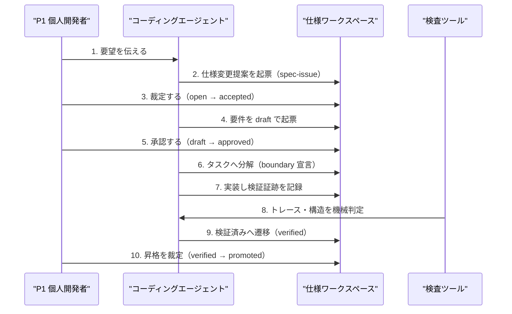

# ドメインストーリー: P1 個人開発者 — 要件を検証済みまで通しきる

## 概要

主要ペルソナ P1（個人開発者・ドッグフーダー）が、思いついた変更を `.spec/` の要件として
起票し、実装・検証を経て「検証済み」に到達させるまでの一本道。J1（トレースされた状態で
進めたい）に対応し、ジャーニー段階は「日常の機能追加」。bitz-sdd の中核フローであり、
他のストーリーはこの流れの一部を掘り下げたものになる。

## Actors

| Actor | 種別 | 出典 | このストーリーでの役割 |
|---|---|---|---|
| P1 個人開発者 | Persona | personas.md P1 | 主役。要件を承認し、裁定を下す唯一の主体 |
| コーディングエージェント | Persona（served） | personas.md P3 | 起票・実装・検証を代行する。裁定はできない |
| 仕様ワークスペース | System | `.spec/` | 要件・タスク・証跡の保管と権限の強制 |
| 検査ツール | System | `spec_inspect.py` | 構造とトレースを機械判定する |

## Work Items

| Work Item | 用語 | 対応エンティティ（あれば） | 説明 |
|---|---|---|---|
| 要望 | 要望 | — | まだ形になっていない変更の意図 |
| 仕様変更提案 | spec-issue | Specification Artifact | 要件化を検討する対象として受理された提案 |
| 要件 | requirement | Specification Artifact | EARS 受入基準と検証手段を持つ契約 |
| タスク | task | Specification Artifact | 要件を実装する単位。boundary を宣言する |
| 検証結果 | 検証証跡 | Verification Evidence | 実行の終了コードと件数。green 判定の正 |
| 検査レポート | inspection-report | Integration Audit | 孤児・幽霊・未参照の機械判定 |

## Main Flow（ハッピーパスのみ・番号付き）

1. P1 が **要望** をエージェントへ伝える → コーディングエージェント  _(根拠: J1「トレースされた状態で進めたい」)_
2. エージェントが **仕様変更提案** を起票する → 仕様ワークスペース  _(根拠: 権限マトリクス。エージェントは提案できるが契約を書き換えられない)_
3. P1 が提案を **裁定**（accept）する → 仕様ワークスペース  _(根拠: J4「暴走される不安から解放されたい」。裁定は人間専権)_
4. エージェントが **要件** を draft で起票する → 仕様ワークスペース  _(根拠: J1)_
5. P1 が要件を **承認**（draft → approved）する → 仕様ワークスペース  _(根拠: 権限マトリクス。意図に合っているかは機械化できない)_
6. エージェントが **タスク** へ分解し boundary を宣言する → 仕様ワークスペース  _(根拠: J1「あとで乖離しないように」)_
7. エージェントが実装し、**検証結果** を記録する → 仕様ワークスペース  _(根拠: J2「機械的に検収したい」)_
8. **検査ツール** がトレースと構造を判定する → エージェント  _(根拠: J2)_
9. エージェントが要件を **検証済み**（verified）にする → 仕様ワークスペース  _(根拠: 機械判定が green なら遷移してよい)_
10. P1 が **昇格**（verified → promoted）を裁定し、知見を docs へ還流する → 仕様ワークスペース  _(根拠: J5「再現可能な形で他者に示したい」)_

## Mermaid 図（番号を Main Flow と一致させる）

## 例外シナリオ（最大3件、ジャーニーのペイン由来）

### 裁定者が現れない

ステップ3・5・10 は人間専権だが、P1 は1人でありレビュー待ちが滞留する。実測では
**ステップ10（昇格）が全ワークスペースで一度も実行されていない**（promoted 0 件）。
一本道の終端が実質存在しないまま、ステップ9で止まった要件が積み上がる。

### 検証が red で戻る

ステップ8で幽霊参照・孤児要件・未参照が出た場合、ステップ6〜7へ戻る。テストを黙って
弱めることは失敗プロトコルで禁じられている（`failure-protocol.md`）。

### 提案が却下される

ステップ3で reject されると要件化へ進まない。提案自体は履歴として残し、削除しない。

## Open Questions

- [ ] ステップ10（昇格）が実行されないまま滞留することを、どこで誰が検知するか — SI-SDD-028。
- [ ] ステップ3・5・10 をエージェントが代行した場合（代行可視化経路）、
      裁定の真正性はステップ10 でしか確認されない。ステップ10 自体が動いていない現状では
      検証の連鎖が閉じない。
