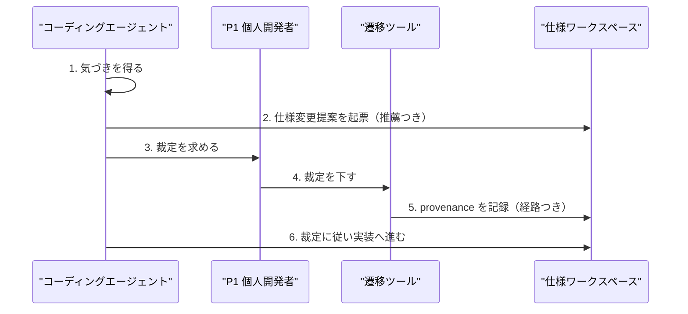

# ドメインストーリー: P3 エージェント — 仕様変更を提案し人間の裁定を得る

## 概要

served ペルソナ P3（規律の受け手であるエージェント）が、作業中に見つけた仕様の問題を
提案として起票し、人間の裁定を得て契約を変えるまでの一本道。J1・J4 に対応する。
**エージェントは契約を実装できるが書き換えられない**という憲法第4原則（権限分離）が
実際にどう働くかを描く。SDD-DSN-006 のステップ2〜5を、エージェント側の視点で掘り下げたもの。

## Actors

| Actor | 種別 | 出典 | このストーリーでの役割 |
|---|---|---|---|
| コーディングエージェント | Persona（served） | personas.md P3 | 主役。提案はできるが裁定はできない |
| P1 個人開発者 | Persona | personas.md P1 | 裁定を下す唯一の主体 |
| 仕様ワークスペース | System | `.spec/` | 権限マトリクスを機械的に強制する |
| 遷移ツール | System | `spec_update.py` | 権限のない遷移を拒否する |

## Work Items

| Work Item | 用語 | 対応エンティティ（あれば） | 説明 |
|---|---|---|---|
| 気づき | 気づき | — | 作業中に見つけた仕様の矛盾・欠落 |
| 仕様変更提案 | spec-issue | Specification Artifact | 予備判定（推薦）を伴う提案 |
| 裁定 | 裁定 | Decision Provenance | 人間専権の状態遷移 |
| 裁定記録 | decision-ref | — | 裁定の所在を指す参照。代行時は必須 |

## Main Flow（ハッピーパスのみ・番号付き）

1. エージェントが作業中に **気づき** を得る → コーディングエージェント  _(根拠: J1。乖離は実装中に見つかることが多い)_
2. エージェントが重複を確認し **仕様変更提案** を起票する（推薦つき） → 仕様ワークスペース  _(根拠: 権限マトリクス「spec-issues 起票は誰でも可」)_
3. エージェントが **裁定** を人間へ求める → P1 個人開発者  _(根拠: J4「暴走される不安から解放されたい」)_
4. P1 が判断材料を確認し裁定を下す → 遷移ツール  _(根拠: 憲法第4原則「仕様の変更権は常に人間が持つ」)_
5. **遷移ツール** が経路（対話確認 / 代行可視化）に応じて provenance を記録する → 仕様ワークスペース  _(根拠: 裁定の真正性は機械検証しないと明示するため)_
6. エージェントが裁定に従い実装へ進む → 仕様ワークスペース  _(根拠: J1)_

## Mermaid 図（番号を Main Flow と一致させる）

## 例外シナリオ（最大3件、ジャーニーのペイン由来）

### 人間が応答しない

ステップ3で裁定が返らない場合、エージェントは代行可視化経路で推薦案を採用し、
裁定記録を残して先へ進める。**この経路の担保は SDD-DSN-006 のステップ10（昇格）で
人間が裁定記録を辿ることだけ**であり、そのステップが動いていない現状では
「提案・裁定記録・実装・検証をすべてエージェントが回す」状態になる（SI-SDD-028）。

### 権限のない遷移を試みる

ステップ4を経ずにエージェントが `approved` へ遷移させようとすると、遷移ツールが拒否する。
権限マトリクスはコードで強制されており、プロンプト指示だけに依存しない。

### 提案が既存提案と重複する

ステップ2で重複を確認し、既存提案へ追記するか却下する。提案の乱立は
次アクション提案を占有し、裁定の滞留を招く。

## Open Questions

- [ ] 代行可視化経路の裁定記録を、いつ誰が検分するのか — SI-SDD-028。
- [ ] エージェントが提案し、エージェントが裁定を代行し、エージェントが実装・検証する場合、
      権限分離は形式的にしか成立していない。この非対称を設計としてどう扱うか。
