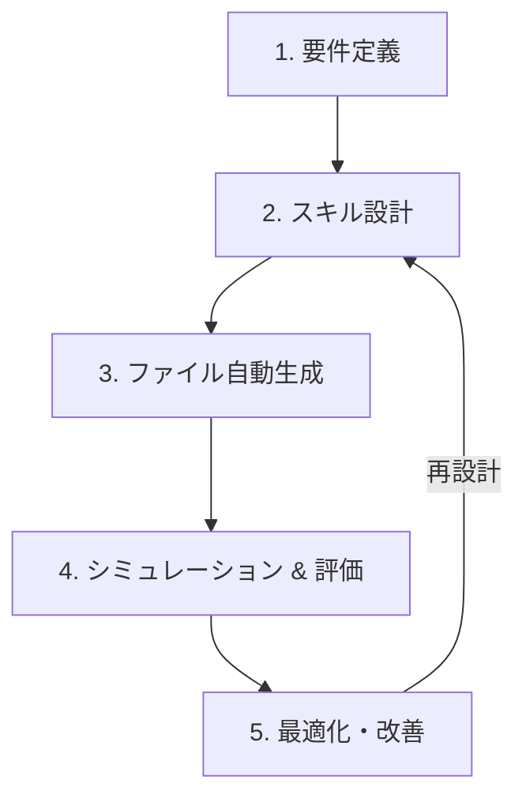

# Antigravity 2.0 特化型 `skill-creator` 設計提案

本ドキュメントは、Anthropicの `skill-creator` を参考にしつつ、Antigravity 2.0 のカスタマイズ仕様（Skills/Rules）に最適化した日本語の「スキル作成支援ツール（メタスキル）」の設計提案です。

---

## 1. コンセプトと目的

Antigravity 2.0 における **Skill** は、エージェントの指示や特定のワークフローを拡張するための強力な仕組みです。しかし、効果的なスキルを作成するためには、以下のような特有の仕様やベストプラクティスを遵守する必要があります。

*   **トリガー条件の最適化**: YAMLフロントマターの `name` と `description` に基づく正確なトリガー設定。
*   **トークン節約と行数制限**: `SKILL.md` の本文を500行以内に抑えるルール。
*   **段階的開示（Progressive Disclosure）**: 詳細な仕様やドキュメントを `references/` サブディレクトリに分割する設計。

本 `skill-creator` は、これらのルールを遵守した高品質なカスタムスキルを、ユーザーとの対話を通じて**自動設計・生成・評価**することを目的とします。

---

## 2. スキル作成ワークフロー

`skill-creator` は、以下の5つのフェーズでユーザーのスキル開発を伴走します。



### ① 要件定義（ヒアリング）
*   ユーザーが自動化または拡張したい開発タスク・ルールをヒアリングします。
*   「それは本当に Skill として定義すべきか（または単一の Rule (AGENTS.md) やスクリプトで済むか）」を判定します。

### ② スキル設計（プロンプト・構成案の作成）
*   **トリガー設計**: エージェントが適切なタイミングでスキルを読み込めるよう、YAMLフロントマターの `description` を推敲します。
*   **段階的開示設計**: メインの `SKILL.md` に記載するルールと、`references/` に配置する参照ドキュメントの切り分けを行います（500行制限対策）。

### ③ ファイル自動生成
*   指定されたカスタマイズルート（例: プロジェクトローカルの `.agents` ディレクトリなど）に、以下の標準構成でファイルを自動配置します。
    *   `.agents/skills/<skill_name>/SKILL.md` (YAMLメタデータと主要指示)
    *   `.agents/skills/<skill_name>/references/` (追加資料、スキーマ、API仕様など)
    *   `.agents/skills/<skill_name>/examples/` (適用例、入力・出力サンプル)
    *   `.agents/skills/<skill_name>/scripts/` (補助スクリプト)
*   標準外のディレクトリに作成する場合は、`skills.json` を自動更新して登録します。

### ④ シミュレーション & 評価 (Eval)
*   作成したスキルが「意図通りにトリガーされるか」「指示が競合していないか」を擬似プロンプトを用いてテストします。
*   ユーザー環境に合わせた簡易的な評価テストケースを生成します。

### ⑤ 最適化・改善
*   評価フェーズで検知した課題（例: メイン指示の肥大化、トリガー条件の曖昧さ）に基づき、ファイルを自動修正します。

---

## 3. Antigravity 2.0 に特化した独自機能

### 3.1. 500行制限＆段階的開示（Progressive Disclosure）チェッカー
*   **自動行数チェック**: `SKILL.md` を生成または編集する際、本文が500行を超えていないかを自動判定します。
*   **分割提案**: 500行を超えている場合、どのセクションを `references/` ディレクトリに移行すべきかを自動で分類し、リンク（`file:///...`）付きの Markdown に再構成します。

### 3.2. フロントマターバリデーター
*   YAMLフロントマターに `name` と `description` が正しく記述されているかを厳密に検証します。
*   エージェントが誤認識しやすい曖昧な `description` を検知し、より明確なトリガーフレーズへの書き換えを提案します。

### 3.3. 共有スキルの保護警告
*   複数人で共有するプロジェクト内スキルを編集・上書きしようとする際、Antigravityの行動指針に従い「変更前にユーザーの明示的な確認を促す警告」を挟みます。

---

## 4. 開発・デプロイ構成案

ご提案いただいた「`src` フォルダで開発し、インストーラーを使って `.agents/skills/` へインストールする」構成案に基づき、以下のような構成とフローを設計します。

### 4.1. ディレクトリ構成

開発時のリポジトリ構成は以下の通りとします。

```
BitzSkills/ (リポジトリルート)
├── src/
│   └── skills/
│       └── skill-creator/
│           ├── SKILL.md                  # メタスキル本体（指示書）
│           ├── references/
│           │   ├── templates.md          # 新規スキルのテンプレート集
│           │   └── schemas.md            # 定義用スキーマ
│           └── examples/
│               └── step_by_step.md       # スキル作成のステップ・バイ・ステップ例
├── install.ts                            # インストール実行スクリプト (TypeScript)
├── package.json                          # Node.js依存関係・実行スクリプト定義
├── tsconfig.json                         # TypeScript設定ファイル
├── README.md                             # プロジェクトの説明書
└── .agents/ (インストール先 - ローカルでの動作確認用)
    └── skills/
        └── skill-creator/                # インストーラーによって配置される実体
```

### 4.2. インストーラーの役割と仕様
インストーラースクリプト（`install.ts`）は、単なるファイルのコピーだけでなく、以下のバリデーションを自動実行してからインストールを行います。

1.  **YAMLフロントマター検証**:
    *   `src/skills/` 配下の各スキルの `SKILL.md` に、必須の `name` と `description` が正しい形式で含まれているかをチェック（js-yaml などのライブラリを使用）。
2.  **500行制限チェック**:
    *   `SKILL.md` の本文（フロントマターを除く部分）が 500 行以内であるかを計測し、超えている場合は警告またはビルドエラーを出力。
3.  **コピー・配置処理**:
    *   バリデーションを通過した場合、プロジェクト内の `.agents/skills/` ディレクトリに必要なファイルを同期（コピー）します（fs-extra や node-fs などを使用）。

---

## 5. ご検討いただきたい点（ディスカッション）

1.  **パッケージマネージャーおよび実行環境**:
    *   Node.js + `tsx` (または `ts-node`) を使用して `install.ts` を直接実行する構成と、`npm run install-skills` のようなショートカットコマンドを定義する構成を想定しています。普段ご使用されているパッケージマネージャー（npm, pnpm, yarn, bun など）のご指定はありますか。
2.  **インストーラー実行時の追加機能**:
    *   インストールと同時に、もし非標準ディレクトリがある場合に `.agents/skills.json` を自動更新するような制御もインストーラー側に組み込みますか。


